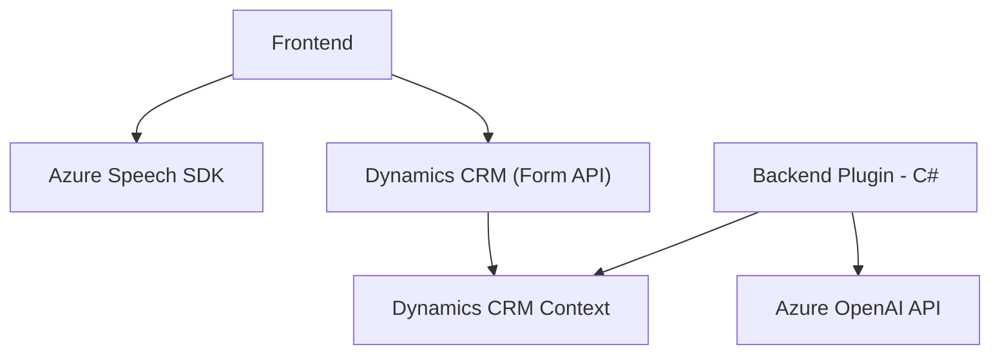

### Breve resumen técnico
El repositorio describe una solución integral que combina frontend en JavaScript con plugins en C# para Microsoft Dynamics 365. Su propósito principal es procesar formularios de entrada en Dynamics CRM, transformando datos mediante Azure Speech SDK y Azure OpenAI. El frontend facilita la interacción por voz, mientras que los plugins en C# llevan a cabo transformaciones avanzadas con capacidades de IA.

---

### Descripción de arquitectura
La arquitectura es **modular**, siguiendo principios de separación de responsabilidades. Se organiza en tres partes principales:
1. **Frontend:** Facilita interacción con formularios por voz y síntesis de audio text-to-speech desde datos visibles del CRM, utilizando Azure Speech SDK.
2. **Integración Backend:** Plugins en C# operan dentro de Dynamics 365 para transformaciones text-to-structure con OpenAI mediante llamadas a servicios HTTP.
3. **APIs y SDKs externas:** Azure Speech SDK y OpenAI funcionan como componentes externos cruciales, integrados en el flujo.

Esta arquitectura sigue un patrón de **n capas**, con separación entre presentación (frontend), lógica de negocio (plugins y procesamiento IA) y servicios externos (integración Azure).

---

### Tecnologías usadas
1. **Frontend (JS):**
   - **Azure Speech SDK:** Para síntesis de voz y reconocimiento de voz.
   - **JavaScript:** Estructura modular con funciones independientes para maximizar reutilización y separación lógica.
   - **Dynamics CRM APIs:** Para manipulación de formularios en la interfaz de usuario.
   
2. **Backend (C#):**
   - **Azure OpenAI API:** Para procesar datos de entrada y convertirlos en JSON estructurado.
   - **Dynamics 365 SDK:** Para implementar plugins (`IPlugin`), recepción de datos y manipulación del contexto de ejecución.
   - **HttpClient:** Para realizar llamadas HTTP al servicio de OpenAI.

3. **Patrones utilizados:**
   - **Integración SDK/API:** Modularización mediante encapsulación de las interacciones con SDKs (Azure Speech SDK y OpenAI API).
   - **Modularidad:** Separación de funciones en frontend y backend para mejorar mantenibilidad.
   - **Plugin Design Pattern:** En uso para la extensión de Dynamics CRM mediante `IPlugin`.

---

### Dependencias externas y componentes
1. **Azure Speech SDK:** Integrado dinamicamente en el frontend para reconocimiento de voz y síntesis.
2. **OpenAI GPT API:** Utilizado en backend para transformación de texto.
3. **Dynamics 365 SDK:** Proporciona acceso contextual y manipulación de datos en tiempo de ejecución dentro del CRM.
4. **APIs de Dynamics 365 Web:** `Xrm.WebApi` para manipulación directa de formularios y datos.
5. **Librerías adicionales:**
   - `Newtonsoft.Json.Linq`: Para análisis JSON avanzado en C#.
   - `System.Net.Http`: Para comunicación HTTP en el plugin backend.

---

### Diagrama Mermaid válido para GitHub

---

### Conclusión final
La solución presentada se integra totalmente con Microsoft Dynamics CRM para facilitar tanto entradas por voz como transformaciones textuales avanzadas con IA. Utiliza Azure Speech SDK y OpenAI como servicios externos y aplica principios arquitectónicos de modularidad y separación. Sin embargo, para una mejora continua, sería útil implementar abstracciones para manejar configuraciones externas desacopladas del código y mejorar el testeo unitario de módulos individuales.