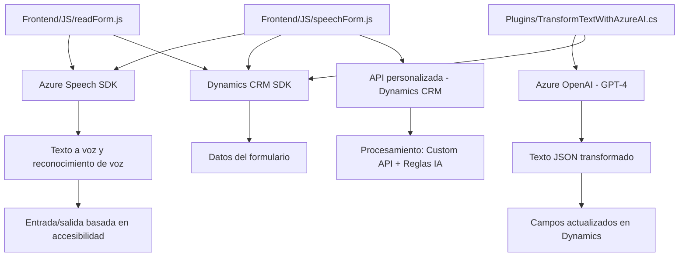

### Breve resumen técnico:

Los archivos analizados forman parte de una solución que integra el reconocimiento y la síntesis de voz con el uso de un SDK externo (Azure Speech SDK) y un servicio de inteligencia artificial (Azure OpenAI). Está orientada a la accesibilidad y la automatización dentro de formularios de Microsoft Dynamics 365, además de dar soporte para manipulación automatizada de datos basados en instrucciones de IA.

---

### Descripción de arquitectura:

1. **Tipo de solución**:
   - Combina un frontend escrito en JavaScript con plugins .NET como parte de una plataforma extendida para Microsoft Dynamics 365. 
   - Tiene elementos típicos de una **API cliente** (frontend) y **extensiones servidor** (plugin).
   - Proporciona capacidades de reconocimiento de voz, síntesis y análisis basado en inteligencia artificial.

2. **Tipo de arquitectura**:
   - Principalmente, la solución sigue una arquitectura **cliente-servidor**. 
   - En el frontend (JavaScript), existe una estructura de capas funcionales que usa funciones modulares (similar a n-capas).
   - Los plugins .NET para Dynamics CRM implementan **arquitectura basada en eventos** usando el patrón Plugin de Dynamics (IPlugin).
   - El sistema también adopta principios de integración con servicios externos, lo que sugiere un enfoque basado en **arquitectura en microservicios** para la interacción entre el cliente y los servicios Azure Speech/OpenAI y Dynamics Web API.

3. **Dependencias presentes**:
   - **Azure Speech SDK** para sintetizar texto en audio en tiempo real y para reconocimiento de voz.
   - **Microsoft Dynamics 365 SDK** para manipulación de datos de formulario, interacción con entidades y extensiones de funcionalidad.
   - **Azure OpenAI (GPT-4)** para la transformación y análisis de texto basado en inteligencia artificial.
   - **Newtonsoft.Json** (en el plugin de .NET) para la manipulación avanzada de JSON y API responses.

---

### Tecnologías usadas:

- **Frontend (JavaScript)**:
  - Lenguaje: JavaScript ES6+.
  - Framework externo: Azure Speech SDK.
  - Microsoft Dynamics API para formularios (`executionContext`, `formContext`).

- **Backend (Plugin, C#)**:
  - Lenguaje: C# (.NET Framework).
  - Framework: Microsoft Dynamics CRM SDK.
  - Externos: Azure OpenAI para análisis IA, Newtonsoft.Json para manejo JSON.

- **Patrones observados**: Modularidad, arquitectura basada en eventos, integración de servicios externos, cliente-servidor.

---

### Diagrama **Mermaid** compatible con **GitHub Markdown**:

---

### Conclusión Final:

La solución está diseñada para operar dentro del marco de Dynamics CRM y agregar capacidades de voz, IA y transformación de datos textuales. Presenta una arquitectura **cliente-servidor** con modularidad en el frontend y un enfoque de plugins en el backend. Las tecnologías empleadas son sólidas, y se han implementado patrones como la integración de servicios, modularidad y procesamiento asíncrono para garantizar la interoperabilidad eficiente entre las diferentes capas de la solución.

Esta herramienta es ideal para organizaciones que trabajan con Dynamics 365 y buscan mejorar la accesibilidad, automatización y capacidad de análisis a través de inteligencia artificial. El diagrama presenta una visión de los principales componentes y su interacción.