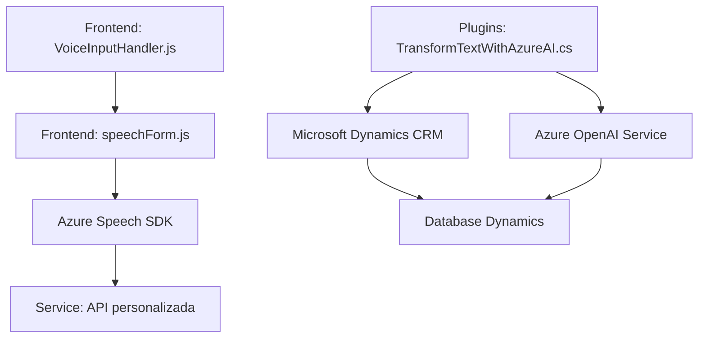

### Breve resumen técnico:
El repositorio contiene diferentes componentes que cumplen roles distintos. Los archivos analizados tienen funcionalidades relacionadas con procesamiento de formularios, integración de servicios de voz (Azure Speech SDK) y generación de datos estructurados utilizando Azure OpenAI. Estas tareas están orientadas a la interacción con interfaces de usuario y a la automatización de dinámicas de un CRM basado en Microsoft Dynamics.

---

### Descripción de arquitectura:
La solución parece estar construida con una arquitectura **modular de capas**, donde cada archivo cumple una responsabilidad específica:
1. **Aplicación Frontend (VoiceInputHandler.js, speechForm.js)**:
   - Implementa input desde voz y procesamiento de formularios en interfaces web, integrándose con APIs necesarias. Esto apunta a una arquitectura centrada en un diseño **cliente-servidor** y estandariza herramientas de SDKs dinámicos.
   - Se utiliza el patrón de diseño **Service Layer** para encapsular dependencias como Azure Speech SDK y se muestran concepciones adaptativas.

2. **Plugins (TransformTextWithAzureAI.cs)**:
   - Un plugin implementado en `.NET` extiende Dynamics CRM usando la arquitectura de **integración por plugins**. Este componente pertenece al backend y sirve como un microservicio para procesar textos utilizando Azure OpenAI.

El diseño muestra modularidad en la relación entre frontend y backend. Si bien no hay evidencias de comunicación directa entre ellos en los archivos presentados, los elementos de ambos componentes probablemente se integran utilizando servicios de API REST o similares. El repositorio sugiere una **arquitectura orientada a servicios** (SOA), pero no específicamente una arquitectura de microservicios, dado que no se observa evidencia directa de contenedorización ni desacoplamiento explícito en el backend.

---

### Tecnologías usadas:
1. **Frontend**:
   - **Azure Speech SDK**: Para síntesis de voz y reconocimiento de comandos por voz.
   - **JavaScript**: Motor y lógica principal.
   - **DOM API**: Para manipulación interactiva del contenido HTML.
   - **API personalizada**: Integración opcional para procesar comandos.

2. **Backend**:
   - **Microsoft Dynamics CRM SDK**: Provee extensibilidad mediante desarrollo de plugins.
   - **Azure OpenAI Service (GPT o similar)**: Para transformación automática de textos en estructuras JSON.
   - **.NET Framework/Core**: Base del desarrollo para plugins en C#.
   - **HTTP API**: Comunicación con servicios externos (Azure).

3. **General**:
   - **Patrón Service Layer**: Modulación de acceso y comunicación con APIs externas.
   - **Adapter Pattern**: Adaptación de comandos hablados mediante mapeos estructurados.
   - **Factory Pattern**: Para inicialización de configuradores SDK y objetos HTTP.

---

### Diagrama Mermaid:

### Conclusión final:
1. **Tipo de solución**: Este repositorio forma parte de un ecosistema modular para una plataforma que utiliza Microsoft Dynamics CRM como base. Los archivos pueden encontrarse en un sistema extensible con interacción frontend-backend, procesando datos de formularios, entrada por voz y lógica externalizada vía APIs.
2. **Tipo de arquitectura**: La combinación de dinámicas frontend y backend, junto a integración de servicios, sugiere un diseño modular con capas. Hay elementos de integración por servicios externos, pero no evidencia clara de un enfoque de microservicios estrictos.
3. **Recomendación**: Si planea expandirse, considerar contenedorización para los plugins y escalabilidad para servicios como OpenAI.