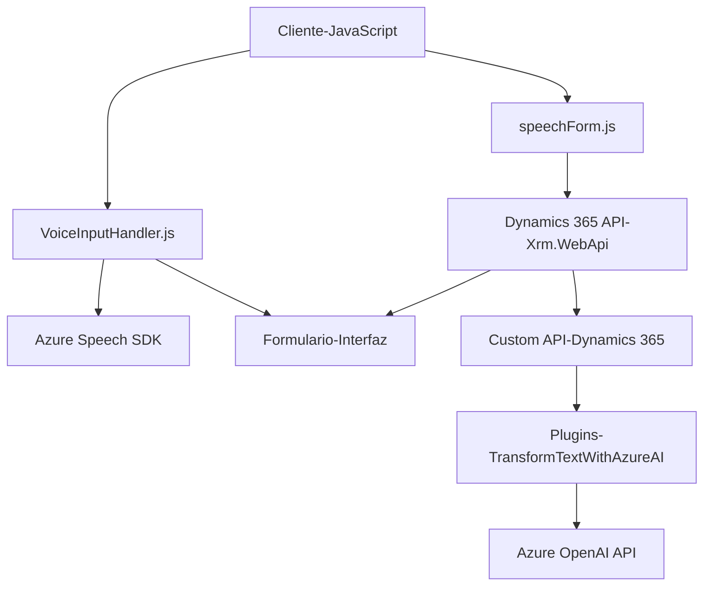

### Análisis del repositorio

#### Resumen técnico
El repositorio contiene tres archivos principales que denotan una solución tecnológica para integrar funcionalidades de reconocimiento y síntesis de voz, acompañado de transformaciones mediante IA, y optimización de formularios en un entorno de **Dynamics 365 CRM**. Utiliza componentes de frontend (JavaScript) y backend (.NET para plugins) con conexión a servicios externos.

---

#### Descripción de arquitectura
La solución tiene una arquitectura híbrida:
1. **Cliente/Servidor**: El frontend (archivos JavaScript dentro de la carpeta `FRONTEND/JS`) y el backend (`Plugins/TransformTextWithAzureAI.cs`) implementan la integración con Dynamics CRM.
2. **Service-Oriented Architecture (SOA)**: Utiliza tres servicios principales:
   - **Dynamics 365 API**: Para la gestión de datos en formularios del entorno CRM.
   - **Azure Speech SDK**: Para reconocimiento y síntesis de voz en el frontend.
   - **Azure OpenAI API**: Para transformar texto a estructuras JSON siguiendo normas especificadas.
3. **N capas**: La lógica está dividida en diferentes niveles: interacción cliente, integraciones externas, procesamiento con IA y gestión de datos.

---

#### Tecnologías usadas
- **Frontend (JavaScript)**
  - Framework: Estándar ECMAScript (JavaScript).
  - **Azure Speech SDK**: Para integración de voz (reconocimiento y síntesis).
  - MS Dynamics API (`Xrm.WebApi`): Para comunicación con CRM.
- **Backend (.NET)**
  - Lenguaje: C# (con .NET Framework propio de Dynamics).
  - Servicios adicionales:
    - **Azure OpenAI Services API**: Para procesamiento de texto inteligente usando IA.
  - Bibliotecas de soporte:
    - `Newtonsoft.Json` y `System.Text.Json` para manejar y procesar objetos JSON en APIs externas.
    - `System.Net.Http` para llamadas RESTful.

---

#### Dependencias/Componentes externos
Incluye las siguientes dependencias y servicios:
1. **Azure Speech SDK**: Para reconocimiento y síntesis de voz (integración directamente desde un script externo).
2. **Microsoft Dynamics 365 API**: Comunicación con formularios y datos del CRM.
3. **Azure OpenAI API**: Para transformación avanzada de texto inteligente.
4. **Plugins de Dynamics CRM (`TransformTextWithAzureAI.cs`)**: Integración directa mediante `IPlugin` para gestionar eventos del CRM.
5. **Frameworks y librerías .NET**: JSON y HTTP request handling (`Newtonsoft.Json`, `System.Linq`, etc.).

---

#### Diagrama Mermaid válido para GitHub

---

### Conclusión final
El repositorio se enfoca en una solución integrada para formularios de Dynamics 365 CRM, incorporando funcionalidades avanzadas como reconocimiento/síntesis de voz, transformación IA de texto y personalización de APIs. El diseño se basa en una arquitectura orientada a servicios (SOA) con una implementación de múltiples capas dentro de un entorno CRM y fuerte dependencia de servicios externos alojados en Azure.

Es ideal para escenarios en los que el reconocimiento de voz se utiliza para aumentar la productividad y optimizar la interacción humano-computadora en soluciones empresariales. La arquitectura es modular y utiliza patrones claros de encapsulación y separación de responsabilidades, lo que facilita escalabilidad y mantenimiento.