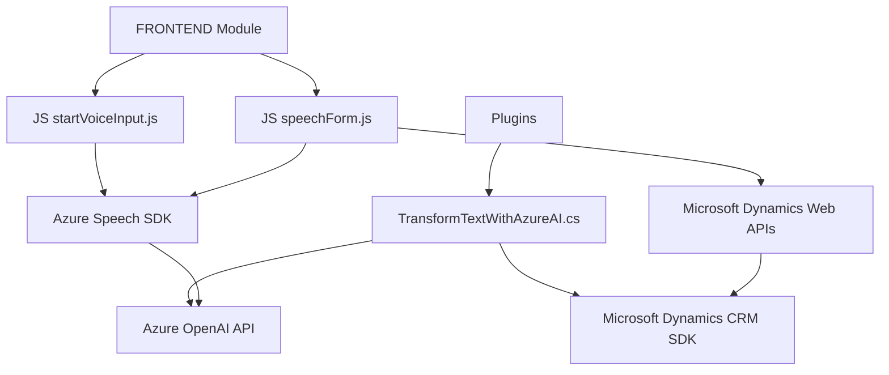

# Análisis técnico y arquitectónico

## **Breve resumen técnico**
El repositorio implementa una solución integral relacionada con la funcionalidad de manejo de formularios dinámicos en Microsoft Dynamics CRM, integrando servicios avanzados como reconocimiento de voz, síntesis de voz y transformación de texto mediante Azure AI. Los archivos de este proyecto están estructurados en un frontend basado en JavaScript y un backend bajo .NET. Utiliza tecnologías como **Azure Speech SDK**, **Azure OpenAI**, y **Microsoft Dynamics CRM SDK (Xrm)** para su arquitectura.

---

## **Descripción de la arquitectura**

### Tipo de solución:
La solución corresponde a una **aplicación de negocio basada en Microsoft Dynamics CRM**, donde el frontend tiene interacción con formularios dinámicos y el backend amplifica la funcionalidad mediante complementos (plugins). No se evidencia un desacoplamiento extremo como en una arquitectura de microservicios; más bien se asemeja a una combinación de una arquitectura **n-capas** y un enfoque **event-driven** para manejar entradas de usuario y procesamiento de datos.

### Patrón estructural:
- **Frontend orientado a eventos**: El frontend está diseñado modularmente y utiliza eventos para iniciar acciones específicas como reconocimiento de voz o síntesis de texto a voz.
- **Backend basado en plugins**: Extiende la funcionalidad estándar de Dynamics CRM mediante plugins, siguiendo el Plugin Pattern.
- **Integración con APIs externas**: Dependencia del Azure Speech SDK y Azure OpenAI para la funcionalidad de IA.
- **Modularidad y responsabilidad única**: El código exhibe un marcado enfoque en funciones que están diseñadas para realizar tareas específicas con principios del SRP.

### Arquitectura general:
La solución puede ser clasificada como una **arquitectura n-capas**, ya que hay una capa de interacción (frontend) y una capa de negocio (backend con plugins) que operan de manera separada. Además, existe interacción con servicios externos mediante APIs (Azure Speech SDK y OpenAI), lo que habilita una conexión **SOA (Service Oriented Architecture)**.

---

## **Tecnologías, frameworks y patrones usados**
### **Frontend:**
- **JavaScript**:
  - Modularidad con funciones específicas siguiendo el principio de responsabilidad única.
  - Integración directa con el SDK de Azure Speech para tareas de reconocimiento y síntesis.
  - Event-driven architecture: Operaciones como el inicio de reconocimiento de voz o síntesis de datos se disparan mediante controladores de eventos.
- **Microsoft Dynamics Web APIs**:
  - Manipulación de formularios y datos dinámicos.
  - Envío de solicitudes HTTP para operaciones relacionadas con registro y entidad.

### **Backend:**
- **C# (Microsoft Dynamics Plugins)**:
  - Extensión de funcionalidad básica de Dynamics mediante el Plugin Pattern.
- **Azure OpenAI APIs**:
  - Consumo mediante servicios REST para realizar transformaciones más avanzadas de texto, aplicando normas semánticas (JSON).
- **Microsoft Dynamics CRM SDK**:
  - Uso de interfaces (`IPlugin`, `IOrganizationService`) para el contexto de CRM y manipulación de datos.
- **Librerías complementarias**:
  - `System.Text.Json` para operaciones relacionadas con JSON.
  - `Newtonsoft.Json` para procesamiento adicional de datos JSON.

---

## **Dependencias o componentes externos presentes**
- **Azure Speech SDK**:
  - Para tareas de reconocimiento y síntesis de voz en frontend.
- **Azure OpenAI APIs**:
  - Para transformación avanzada de texto en el backend.
- **Microsoft Dynamics CRM SDK**:
  - Manejo de formularios y operaciones asociadas con entidades.
- **Microsoft Dynamics Web APIs**:
  - En el frontend, para manipular atributos y campos del formulario.
- **Bibliotecas para manejo de JSON**:
  - Serialización y deserialización en `speechForm.js` (frontend) y `TransformTextWithAzureAI.cs` (backend).

---

## **Diagrama en formato Mermaid**
El siguiente diagrama refleja la interacción entre los componentes principales del repositorio y los servicios externos:

---

## **Conclusión final**
Este repositorio implementa una solución tecnológica avanzada orientada a la interacción y manejo de formularios dinámicos en **Microsoft Dynamics CRM**. Utiliza servicios de inteligencia artificial de Azure para tareas como reconocimiento de voz, síntesis de voz y procesamiento de datos, mientras que su arquitectura modular y estructurada es ideal para entornos n-capas con integración SOA. Aunque el diseño y las dependencias son sólidas, existe margen de mejora en aspectos como seguridad (manejo de claves API) y desacoplamiento (manejo de reglas dinámicas mediante configuración externa o bases de datos).