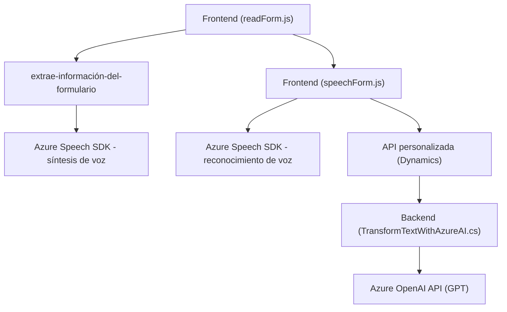

### Breve Resumen Técnico
El repositorio parece ser parte de una solución de software empresarial que integra Dynamics CRM con servicios de Azure. Se enfoca en procesamiento de voz y texto mediante Azure Speech SDK y Azure OpenAI GPT, con funcionalidades de interacción dinámica con formularios y plugins alojados en Dynamics 365.

### Descripción de Arquitectura
La arquitectura sigue un enfoque híbrido:
- **Frontend**: Código JavaScript en módulos, diseñado para interactuar con formularios y realizar síntesis/reconocimiento de voz.
- **Backend (Plugin)**: Extensiones personalizadas escritas en C# usando Microsoft Dynamics SDK. Procesa texto ingresado con reglas predefinidas usando Azure OpenAI.
- **Dependencia de servicios externos**: Usa Azure Speech Services y Azure OpenAI, delegando procesamiento intensivo (voz y texto) a la nube.

La solución aplica principios de arquitectura de **microservicios**:
1. Modularización robusta en frontend y backend.
2. Integración de APIs (Azure y Dynamics CRM).
3. Desacoplamiento del procesamiento crítico hacia servicios externos.

Combina patrones como **adaptador de API** (ejemplo: conexión entre código JS y Azure Speech SDK) y **plugin design** en C#.

### Tecnologías Usadas
1. **Lenguajes**:
   - **JavaScript**: Para manejo de formularios HTML y lógica de frontend.
   - **C#**: Backend orientado a plugins para CRM.
2. **Frameworks/Servicios**:
   - **Azure Speech SDK**: Para síntesis y reconocimiento de voz.
   - **Azure OpenAI**: Procesamiento complejo de texto (GPT).
   - **Dynamics 365 SDK**: Para extensibilidad en plataforma CRM con plugins.
3. **Patrones**:
   - Modularidad (funcionamiento diferenciado por funciones/métodos).
   - Integración de servicios cloud (Azure APIs) y sistemas CRM.
   - Event-driven para dinámicas entre UI y procesamiento asincrónico.

### Dependencias o Componentes Externos
1. **Servicios cloud**:
   - Azure Speech Services (SDK): Para manejo de voz.
   - Azure OpenAI API: Transformación de texto avanzado.
2. **API del ecosistema CRM**:
   - Microsoft Dynamics 365 SDK (manipulación de datos en formularios y entidades).
3. **Librerías de terceros**:
   - `Newtonsoft.Json`: Serialización/deserialización en C#.
   - `System.Net.Http`: Llamadas API en plugins.

---

### Diagrama Mermaid

---

### Conclusión Final
La solución representa una integración sofisticada entre plataformas cloud y un sistema CRM empresarial. Los módulos de JS manejan interacciones UI dinámicas en tiempo real y delegan procesamiento crítico de voz a Azure Speech SDK. Por otro lado, el backend (plugin) extiende el CRM con capacidades de transformación de texto, utilizando el poder de la inteligencia artificial a través de Azure OpenAI. Esto apunta a una arquitectura robusta basada en principios modernos de microservicios y modularidad, adecuada para operaciones empresariales y extensibilidad a futuro.