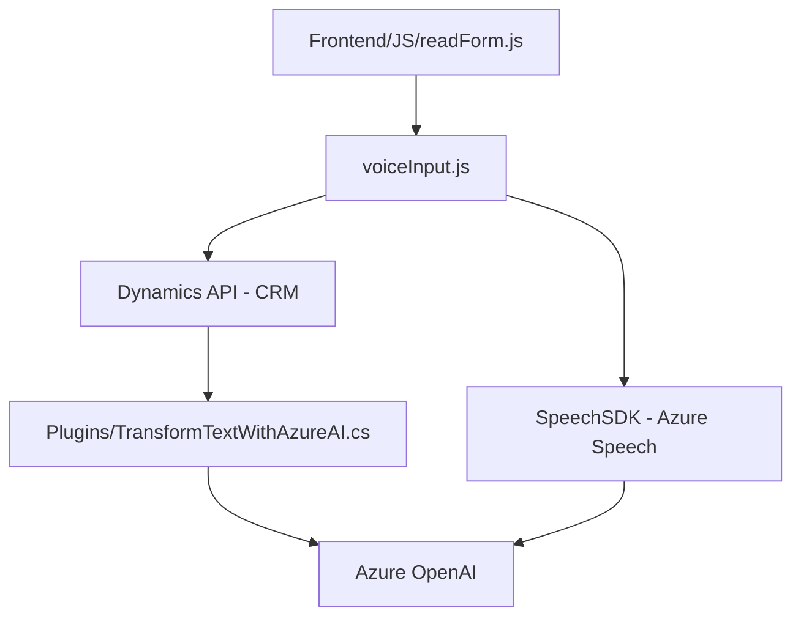

### Breve resumen técnico

El repositorio describe múltiples archivos técnicos que están integrados para ofrecer funcionalidades relacionadas con la interacción entre un sistema de formularios, Azure Speech SDK y Azure OpenAI dentro de un entorno Dynamics CRM. Los objetivos clave incluyen reconocimiento y síntesis de voz, procesamiento de datos visibles de formularios y transformación de texto mediante inteligencia artificial.

---

### Descripción de arquitectura

La solución presentada combina **Front-End JavaScript**, **Plug-ins de CRM (.NET)** y servicios en la nube. El diseño general encaja dentro de una arquitectura **n capas**, con una capa de presentación (frontend JS), una capa lógica (plugins CRM y procesamiento del texto) y una capa de servicios externos (Azure Speech SDK y Azure OpenAI). 

Algunos patrones destacados son:

1. **Service Layer**: En el frontend, las funciones gestionan de manera modular la interacción entre el formulario y los servicios API.
2. **Dynamic Loader**: En el código JS, el SDK de Azure Speech se carga dinámicamente.
3. **HTTP Integration**: Los plugins .NET integran lógica CRM con servicios externos.
4. **Desacoplamiento**: Los plug-ins y frontend tienen responsabilidades claramente separadas y cohesionadas.

---

### Tecnologías usadas

1. **Frontend:**
   - **Lenguaje:** JavaScript.
   - **Frameworks/Librerías:** Azure Speech SDK cargado dinámicamente.
   - **API:** Uso de `Xrm.WebApi` para llamadas a Dynamics 365.
   - **Estilo funcional:** Modularidad con funciones dedicadas.

2. **Backend/Núcleo:**
   - **Lenguaje:** C# para los plugins de Dynamics CRM.
   - **Frameworks/Librerías:** 
     - `Newtonsoft.Json.Linq` y `System.Text.Json` para manejo JSON.
     - Integración directa mediante `HttpClient`.
   - **Servicio externo:** Consumo de Azure OpenAI y síntesis de voz mediante Azure.

3. **Servicios Externos:**
   - **Azure Speech SDK:** Reconocimiento y síntesis de voz.
   - **Azure OpenAI:** Transformación de texto.

4. **Entorno CRM:**
   - **Microsoft Dynamics CRM:** Plugins y modelo de datos basados en la API de Dynamics.

---

### Diagrama **Mermaid** válido para **GitHub Markdown**

---

### Conclusión final

La solución implementada es una herramienta sofisticada dentro de un **entorno CRM** que permite integrar formularios y capacidades avanzadas de reconocimiento y transformación de datos basados en voz e inteligencia artificial. Con la ayuda de **Azure Speech SDK** y **Azure OpenAI**, se automatizan tareas complejas del usuario, como la interacción con formularios e integración de entrada/salida de voz con datos procesados.

#### Puntos destacados:
1. **Arquitectura moderna:** Patrones como Service Layer y un enfoque modular, junto a servicios externos, componen una solución escalable y mantenible.
2. **Tecnología robusta:** Uso de tecnologías avanzadas como Azure Speech SDK y OpenAI, integrándolas eficientemente con Dynamics CRM.
3. **Seguridad:** La inclusión directa de credenciales como `apiKey` dentro del código es un potencial punto débil y debería ser gestionado con mejores prácticas, como el uso de Azure Key Vault para proteger los secretos sensibles.
4. **Diagrama visual claro:** El flujo de trabajo tecnológico está correctamente representado.