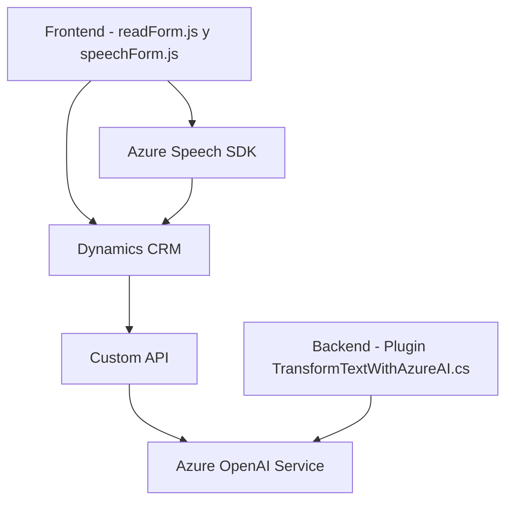

### Breve Resumen Técnico
El repositorio contiene componentes que habilitan funcionalidades de interacción con voz y procesamiento inteligente de texto en un sistema CRM (Microsoft Dynamics CRM). Se utiliza **Azure Speech SDK** para síntesis y transcripción de voz, combinándolo con **Azure OpenAI** para transformación de texto y **Custom APIs** para interacciones extendidas.

### Descripción de Arquitectura
La arquitectura del sistema es **multicapa modular**, con una mezcla de **capas cliente-servidor** y **plugins para lógica extendida**. El frontend procesa datos visuales y realiza integración directa con Azure Speech SDK para manejar inputs/outputs de voz en tiempo real. En el backend se emplea **plugins de Dynamics CRM** para transformación inteligente de texto utilizando Azure OpenAI. La orquestación entre cliente y API denota un enfoque **n capas**, con uso de servicios externos.

### Tecnologías Usadas
1. **Frontend**: JavaScript para la lógica del cliente, integrando Azure Speech SDK y APIs de Dynamics CRM.
2. **Backend**: C# para implementación de plugins en Dynamics CRM, utilizando Azure OpenAI y .NET SDK.
3. **Servicios Externos**:
   - **Azure Speech SDK**: Para síntesis y transcripción de voz.
   - **Azure OpenAI**: Para procesamiento avanzado de texto.
   - **Custom APIs**: Punto de contacto para extender funcionalidad en Dynamics CRM.

### Diagrama Mermaid Válido para GitHub

### Conclusión Final
Este sistema representa una solución **integrada para Dynamics CRM** que aprovecha servicios cognitivos de Azure para síntesis, transcripción y transformación de texto en formularios. Su diseño sigue principios de modularidad y reutilización, con integración directa en un entorno cliente-servidor. La arquitectura es una combinación de **n capas** en su diseño, que permite que cada componente se especialice en tareas específicas, manteniendo una interacción eficiente con servicios externos y APIs.