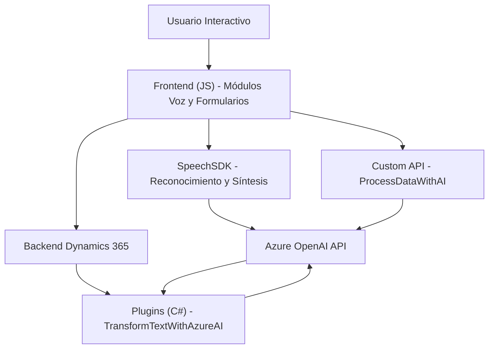

### Breve resumen técnico

El repositorio contiene una solución que integra funcionalidades de síntesis de voz y reconocimiento de voz con una base de datos o formularios interactivos, probablemente como extensiones para trabajar con **Microsoft Dynamics 365 CRM**. Complementa estas interacciones con servicios externos de IA mediante **Azure Cognitive Services Speech SDK** y **Azure OpenAI** para procesar datos de texto hablado o configurarlo en formularios. Además, utiliza plugins en C# para extender las capacidades de Dynamics 365, creando una arquitectura híbrida que mezcla procesamiento externo y almacenamiento interno.

---

### Descripción de arquitectura

La arquitectura sigue un enfoque modular, donde diferentes componentes (JavaScript frontend y C# plugins) están organizados como capas que interactúan con APIs externas y servicios del CRM en el backend. Predominan patrones **Event-Driven** y **Integración API**, configurados para manejar procesamiento asincrónico y dinámico basado en eventos de reconocimiento de voz o interacciones del usuario.

El diseño correspondería a una arquitectura **n-capas**, donde los elementos clave son:
1. **Frontend**: Scripts JavaScript manejan interacción visual y conexión con componentes externos como Azure Speech SDK.
2. **Backend/Plugins**: Implementa lógica en C# que interactúa directamente con Dynamics 365 CRM y externaliza parte del procesamiento hacia Azure OpenAI.

---

### Tecnologías usadas

#### **Frontend**:
- **Azure Cognitive Services Speech SDK**: Para servicios de síntesis y reconocimiento de voz.
- **Dynamic Forms** (Dynamics 365): Manejo del contexto de formularios interactivos.
- **Custom APIs**: Consultas personalizadas para procesamiento de datos con IA.

#### **Backend**:
- **Microsoft Dynamics CRM SDK (`Microsoft.Xrm.Sdk`)**: Extiende capacidades del CRM.
- **Azure OpenAI**: Usa IA para transformar texto en JSON estructurado.
- **Newtonsoft.Json** y **System.Text.Json**: Gestión de serialización/deserialización de datos JSON.

#### **Patrones usados**:
- **Event-Driven**: Control basado en eventos de voz o formularios.
- **Callback Asincrónico**: Carga dinámica y ejecución de funciones después de que dependencias estén disponibles.
- **Modularización/Código limpio**: Separación funcional en módulos claros para procesamiento de voz, síntesis y configuración de formularios.
- **Integración Service-Oriented**: Uso de microservicios externos (Azure Speech y OpenAI).

---

### Diagrama Mermaid válido para GitHub Markdown

---

### Conclusión final

La solución en el repositorio representa una integración avanzada que combina tecnologías frontend y backend para interacción efectiva entre usuarios y servicios de IA. Es una arquitectura **n-capas**, con una fuerte dependencia de servicios externos, como Azure Speech SDK y OpenAI. Esto la hace adecuada para entornos comerciales personalizados, como CRM, donde la automatización y la extensibilidad con IA juegan un papel clave.

El diseño y la implementación están bien organizados, con una clara separación de responsabilidades entre módulos frontend y plugins backend. Sin embargo, aspectos como la dependencia de servicios en la nube podrían ser limitantes si no se configuran correctamente.