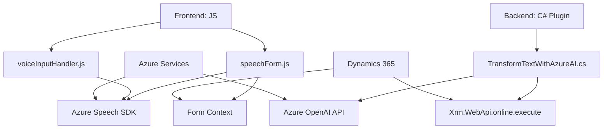

### Breve resumen técnico

El repositorio está relacionado con una solución que integra reconocimiento de voz, procesamiento de formularios dinámicos y transformación de texto utilizando servicios de Azure. Parece estar orientado a optimizar la interacción usuario-sistema en un entorno de negocio basado en Dynamics CRM, incorporando funcionalidades avanzadas como reconocimiento de voz y procesamiento con IA.

La estructura sugiere un sistema híbrido que integra varias tecnologías de Microsoft y una solución de interacción de voz para CRM.

---

### Descripción de arquitectura

La solución aplica una **arquitectura de n capas** dentro de un entorno Dynamics CRM, donde cada componente gestiona distintas responsabilidades:
1. **Capa de presentación (frontend)**: Archivos JS vinculados a forms dinámicos que manejan la entrada por voz y su procesamiento.
2. **Capa de lógica de negocio (backend)**: Plugins de Dynamics CRM (ej. `TransformTextWithAzureAI`) que interactúan con servicios externos (Azure OpenAI).
3. **Servicios externos**: SDK de Azure Speech y Azure OpenAI, que procesan voz y transforman textos.

Los archivos están diseñados para ser modulares y reutilizables, pero se evidencian dependencias marcadas con servicios de Azure y librerías específicas de Dynamics.

---

### Tecnologías usadas

1. **Frontend**:
   - **JavaScript** con dependencia del SDK de Azure Speech.
   - Interacción directa con APIs de Dynamics CRM.
   - Modularidad de funciones para procesamiento y carga dinámica.

2. **Backend**:
   - **C#** para la implementación de plugins en Dynamics CRM.
   - Integración con **Microsoft.Xrm.Sdk** y las APIs de Dynamics CRM.
   - Uso de **Azure OpenAI API** y HTTP para comunicación con servicios REST.
   - Serialización/deserialización de JSON empleando `System.Text.Json` y `Newtonsoft.Json.Linq`.

3. **Otros servicios**:
   - **Azure Speech SDK**: Reconocimiento de voz y síntesis.
   - **Azure OpenAI API (GPT-4)**: Respuesta inteligente y transformación de textos.

4. **Patrones arquitectónicos**:
   - **Plugin**: Backend construido sobre la implementación de `IPlugin`.
   - **Factory**: Manejo de servicios de Dynamics CRM para procesamiento.
   - **Event-driven architecture**: Procesamiento basado en callbacks y eventos en el frontend.
   - **Adaptador**: Traducción de datos del formulario hacia estructuras manejables por las APIs externas.

---

### Diagrama Mermaid (100 % compatible con GitHub Markdown)

---

### Conclusión final

La solución está orientada al manejo y optimización de interacción en formularios de Dynamics 365 mediante tecnologías modernas como reconocimiento de voz y procesamiento con IA. La arquitectura se basa en **n capas**, separando la lógica de presentación, servicios y procesamiento de datos. Destacan dependencias críticas en servicios de Dynamics y Azure, limitaciones propias del entorno empresarial y un diseño modular que soporta extensibilidad.

Se recomienda:
1. Asegurar la clave y región de Azure mediante un sistema seguro de configuración.
2. Ampliar la documentación sobre puntos de integración del frontend y backend.
3. Optimizar el uso de servicios en caso de latencia en los SDK externos.