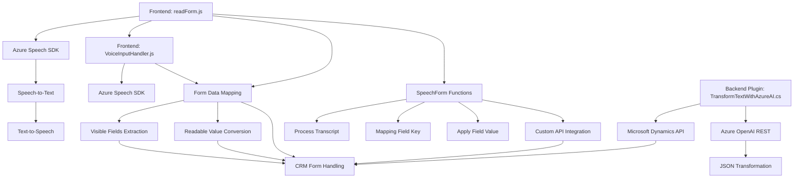

### Breve resumen técnico:
La solución descrita en los archivos del repositorio integra herramientas avanzadas de inteligencia artificial, reconocimiento de voz y un CRM (Microsoft Dynamics 365). Su objetivo principal es permitir que los usuarios interactúen con formularios para transcribir y sintetizar datos a voz. Además, incluye un plugin que aplica normas predefinidas, transformando texto con Azure OpenAI. Está diseñada bajo un enfoque modular, soportando fuerte integración con servicios externos (Azure Speech SDK y Azure OpenAI).

---

### Descripción de arquitectura:
La solución es híbrida, combinando elementos de una arquitectura **n-capas** y **event-driven** con componentes que interactúan de manera modular:
- _Frontend_: Procesamiento de datos dinámicos en formularios y reconocimiento/síntesis de voz.
- _Backend_: Implementación de un plugin de Dynamics 365 como microservicio para ejecutar transformaciones específicas de texto.
La interacción con servicios externos, como Azure Speech SDK y Azure OpenAI, fortalece su diseño hacia **cloud-based microservicios**.

---

### Tecnologías usadas:
1. **Azure Speech SDK**:
   - Reconocimiento y síntesis de voz en el navegador.
   - Configuración dinámica del SDK.
2. **Azure OpenAI API**:
   - Aplicación de inteligencia artificial para estructurar texto en JSON.
3. **Microsoft Dynamics 365 CRM**:
   - Interacción nativa con formularios y atributos.
4. **HTTP REST**:
   - Invocación programática a servicios externos.
5. **JavaScript**:
   - Funciones frontend para mapeo, procesamiento de datos visibles, y carga dinámica del SDK.
6. **C# (.NET Framework)**:
   - Plugin empresarial especializado implementado en Dynamics.
7. **Newtonsoft.Json**:
   - Biblioteca para el procesamiento de JSON en el plugin de C#.

---

### Diagrama Mermaid:

---

### Conclusión final:
La solución representa una arquitectura híbrida centrada en la integración de servicios externos en la nube y un sistema CRM, con mecanismos de procesamiento de datos dinámicos del frontend y plugins especializados para el backend. Es consistente con patrones modernos como servicios modulares, APIs externas, y diseño event-driven. Encaja perfectamente en escenarios empresariales que demanden interacción avanzada entre usuarios y formularios con soporte de inteligencia artificial de Azure.