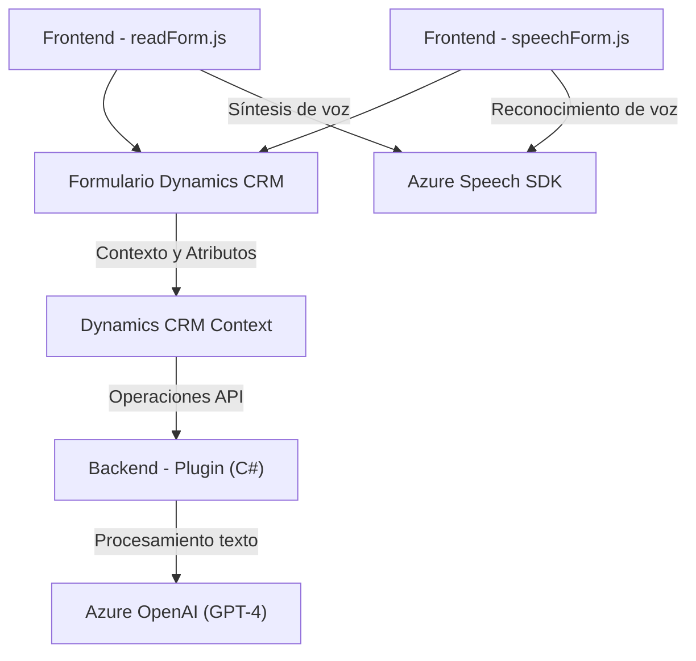

**Análisis Técnico:**

---

### Breve resumen técnico:
El repositorio contiene tres archivos representativos que, en conjunto, delinean una solución para integrar funcionalidades de reconocimiento y síntesis de voz junto con procesamiento de texto en un sistema CRM, específicamente Microsoft Dynamics. Los archivos examinados muestran una solución tanto de frontend (JavaScript) como de backend (C#) que utiliza servicios de Azure para extender las capacidades del CRM.

---

### Descripción de arquitectura:
La arquitectura combina **componentes monolíticos** dentro del framework de Dynamics CRM con integración **modular** de servicios externos de Azure. Específicamente:
1. **Frontend:** Simplifica la interacción del usuario en el navegador mediante procesamiento de formularios (lectura y modificación) actuando como un cliente en la arquitectura.
2. **Backend plugin:** Define un componente de servidor (Dynamics CRM Plugin en C#) que utiliza interfaces predeterminadas, delegando el procesamiento avanzado de texto a servicios REST de Azure OpenAI.

Dado el uso de servicios externos, la arquitectura parcial se alinea con el **modelo híbrido de integración** en sistemas monolíticos extensibles.

---

### Tecnologías usadas:
1. **Frontend:**
   - Lenguaje: JavaScript.
   - Framework externo: Dynamics CRM Form context API.
   - SDK: Azure Speech SDK.
   - Patrón: Modularidad y programación basada en eventos para manejar la carga dinámica del SDK.

2. **Backend (plugin):**
   - Lenguaje: C#.
   - Framework: Dynamics CRM Plugin Framework.
   - Servicio externo: Azure OpenAI (modelo GPT-4).
   - Librerías .NET Core para operaciones REST (`HttpClient`, `Json`).

3. **Servicios Azure:**
   - Azure Speech (para síntesis de voz y reconocimiento).
   - Azure OpenAI GPT-4 (procesamiento avanzado de texto).

---

### Dependencias o componentes externos:
- Azure Speech SDK (CDN externo con métodos de síntesis y reconocimiento de voz).
- Azure OpenAI GPT-4 (transformación de texto mediante normativas definidas).
- Microsoft Dynamics CRM (plataforma subyacente para extensiones).
- Xrm.WebApi.online (para operaciones CRUD relacionadas con datos de CRM).

---

### Diagrama Mermaid válido para GitHub:

---

### Conclusión final:
La solución combina módulos de frontend y backend que interactúan con servicios avanzados de Azure, ampliando las capacidades de Dynamics CRM. Esta arquitectura se basa en la modularidad dentro de un sistema CRM monolítico extensible, lo que permite incorporar funcionalidades avanzadas como síntesis y reconocimiento de voz, además de procesamiento de texto sobre la base de reglas dinámicas o IA.

#### Puntos fuertes:
- Modularidad y escalabilidad del código.
- Uso de servicios de Azure para procesos avanzados.
- Integración eficiente con Dynamics CRM.

#### Áreas de mejora:
- En el backend, credenciales y configuraciones relacionadas con la interacción con Azure OpenAI podrían externalizarse para mayor seguridad.
- Puede beneficiarse de pruebas automatizadas para validar el procesamiento del texto y la interacción con APIs externas.

La solución es adecuada para escenarios corporativos en los que se requiere automatizar y enriquecer datos en sistemas CRM con una experiencia de usuario simplificada.