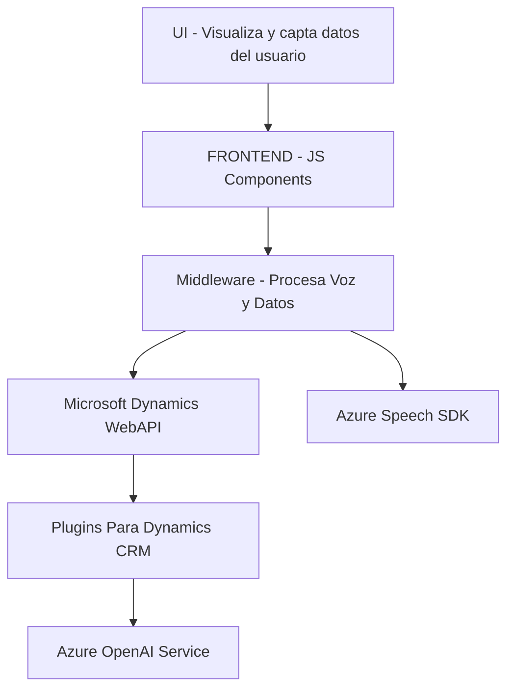

### Breve resumen técnico:
El repositorio descrito corresponde a una solución híbrida con componentes frontend y backend que se integran principalmente con **Azure Speech SDK** y **Azure OpenAI Service**. Está diseñada para trabajar en un entorno de **Microsoft Dynamics CRM**, enfocándose en la captura, procesamiento y síntesis de texto basado en datos de formularios y entrada de voz.

---

### Descripción de arquitectura:
La arquitectura de la solución tiene características de una **arquitectura en capas**. El software posee claramente tres grandes capas funcionales:

1. **Frontend (readForm.js, speechForm.js)**:
   - Capa de presentación que interactúa directamente con los usuarios mediante formularios y captura de voz.
   - Proporciona la lógica para transformar datos visibles en texto hablable (readForm.js) y reconocer texto hablado para rellenar formularios (speechForm.js).

2. **Middleware (SpeechInputHandler.js)**:
   - Capa de integración que conecta el frontend con APIs externas como Azure Speech SDK.
   - Implementa lógica modular: conversión de voz, mapeo de datos y asociación con campos de formularios.

3. **Backend Plugins (TransformTextWithAzureAI.cs)**:
   - Capa de negocio que extiende Microsoft Dynamics CRM mediante un plugin que ejecuta solicitudes HTTP hacia Azure OpenAI Service.
   - Toma texto input, lo transforma en datos estructurados (JSON) y lo regresa al contexto CRM.

Este diseño no se ajusta a una arquitectura estrictamente **hexagonal** o de **microservicios**, sino que sigue una estructura tradicional de **n capas**. Sin embargo, usa componentes modulares y servicios externos como SDKs y APIs para expandir las funcionalidades, lo que habilitaría una futura transición a microservicios si fuera necesario.

---

### Tecnologías usadas:
1. **Frontend**:
   - **JavaScript**: Principal lenguaje para las funcionalidades de frontend (readForm.js y speechForm.js).
   - **Azure Speech SDK**: Permite la implementación de síntesis y reconocimiento de voz directamente en cliente.
   
2. **Backend**:
   - **C#**: Lenguaje para desarrollar el plugin `TransformTextWithAzureAI` dentro del ecosistema de Dynamics CRM.
   - **Microsoft Dynamics CRM SDK**: Framework para extensiones CRM basadas en la interfaz `IPlugin`.
   - **Newtonsoft.Json**: Manejo de datos JSON en la lógica API del plugin.
   - **Azure OpenAI Service (GPT-4)**: Explotación de IA (GPT-4) para transformar texto en objetos JSON estructurados.

3. **Integración**:
   - **Xrm.WebApi.online.execute**: Función para enviar datos del frontend al backend o entre plugins de Dynamics 365.

---

### Dependencias o componentes externos:
1. **Azure Speech SDK**: Utilizada principalmente para la captura, reconocimiento y síntesis de voz directamente en el navegador.
2. **Azure OpenAI Service**: Utilizado para procesamiento avanzado de texto mediante un modelo GPT-4.
3. **Microsoft Dynamics 365 SDK**:
   - `Xrm.WebApi`: API exclusiva de Dynamics CRM para operaciones remotas con servicios y datos de formularios.
   - Plugins como `TransformTextWithAzureAI` extienden funcionalidad en el servidor de Dynamics CRM.
4. **JSON Serialization Libraries**:
   - **Newtonsoft.Json**: Popular para manipular objetos JSON en el backend.
   - **System.Text.Json**: Alternativa nativa utilizada para serializar datos.

---

### Diagrama Mermaid

---

### Conclusión final:
La solución integra funcionalidades específicas para formularios y voz en un entorno Dynamics 365, destacándose por:
- Uso de Azure Speech SDK en el frontend para síntesis y reconocimiento de voz.
- Uso de **Azure OpenAI Service** para transformar texto mediante IA en el backend.
- Arquitectura basada en **n capas**, integrando APIs externas y SDKs adaptados.
  
Si bien la solución actual está diseñada para funcionar dentro de Microsoft Dynamics CRM, es robusta y modular, lo que sugiere potencial para su migración a paradigmas como microservicios con mayores capacidades de escalabilidad y flexibilidad.