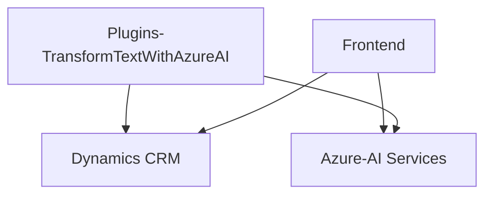

### Breve resumen técnico
El repositorio parece diseñar una solución que une un frontend interactivo con servicios externos como Microsoft Azure Speech SDK y una API de transformación de texto basada en Azure OpenAI dentro del contexto de Microsoft Dynamics CRM. La arquitectura de los archivos indica una solución híbrida que integra lógica en el frontend y funcionalidades adicionales mediante un Plugin en el backend.

---

### Descripción de arquitectura

La arquitectura combina un diseño **event-driven** en el frontend con un Plugin basado en el **Plugin Pattern** en el sistema de Microsoft Dynamics CRM. El frontend utiliza funciones modulares y depende de servicios externos como Azure Speech SDK para reconocimiento y síntesis de voz. Además, se conecta con Dynamics CRM para manejar formularios y realizar acciones específicas. 

El backend, específicamente el archivo del Plugin, utiliza los servicios de **Azure OpenAI API** dentro del flujo de ejecución de CRM, procesando solicitudes activadas según eventos en los formularios.

Por su naturaleza y estructura, la arquitectura se puede categorizar como **n-capas con integración externa**, dado que organiza la lógica en capas (frontend, backend, y servicios externos) y utiliza APIs como enlace entre ellas.

---

### Tecnologías utilizadas

**Frontend (JS):**
- **Dynamics CRM Context API**: Para acceder y manipular formularios.
- **Azure Speech SDK**: Reconocimiento de voz y síntesis de voz.
- **JavaScript ES6**: Con un enfoque implícito a modularidad y callbacks.

**Backend (Plugin - .NET):**
- **Microsoft Dynamics CRM SDK (`Microsoft.Xrm.Sdk`)**: Para interacción con el sistema CRM.
- **Azure OpenAI API**: Para procesamiento avanzado de texto.
- **Newtonsoft.Json**: Manipulación de JSON.
- **C#**: Lenguaje principal para la implementación del Plugin.

**Patrones**
1. **Callback-based Design**
2. **Modular Design**
3. **Event-Driven Patterns**
4. **API Gateway**: Comunicación con servicios externos.
5. **Single Responsibility Principle (SRP)**: Cada función y clase tiene un propósito único.
6. **Plugin Pattern**: Característico de la arquitectura de extensibilidad de Microsoft Dynamics CRM.

---

### Dependencias o componentes externos

La solución utiliza las siguientes componentes externas:
1. **Microsoft Azure Speech SDK**: Para reconocimiento y síntesis de voz.
2. **Microsoft Dynamics CRM Context API**: Para manipulación de datos de formularios.
3. **Azure OpenAI API**: Procesamiento avanzado de texto de entrada a través de un endpoint HTTP.
4. **Newtonsoft.Json** (Backend): Para una fácil manipulación de JSON.
5. **JavaScript** (Frontend): Para interacción en tiempo real con usuarios.
6. **Microsoft Dynamics Plugins**: Extensibilidad de Microsoft Dynamics CRM, típicamente configurada a nivel de eventos específicos como crear/actualizar registros.

---

### Diagrama Mermaid válido para GitHub

---

### Conclusión final

El sistema está diseñado como una solución de reconocimiento, procesamiento y síntesis de voz en el entorno de Microsoft Dynamics CRM. Usa una arquitectura modular n-capas con servicios externos (Speech SDK y AI processing via OpenAI).

Las decisiones técnicas favorecen la modularidad y la integración externa utilizando APIs. Sin embargo, este diseño puede tener ciertos desafíos, como posibles latencias debido a las dependencias de red o problemas en el manejo de errores de estos servicios externos.

Es adecuada para un caso en el que el objetivo es crear una experiencia interactiva e inteligente que combine voz, procesamiento de lenguaje y negocio en un entorno conocido como Dynamics CRM. Sin embargo, si la dependencia externa de Azure Speech SDK y Azure OpenAI falla, podría impactar negativamente en la funcionalidad. Existe espacio para mejorar la tolerancia a fallos y optimizar el rendimiento mediante la implementación de patrones como **caching** para resultados frecuentes o gestionar inputs de IA parcialmente en local.