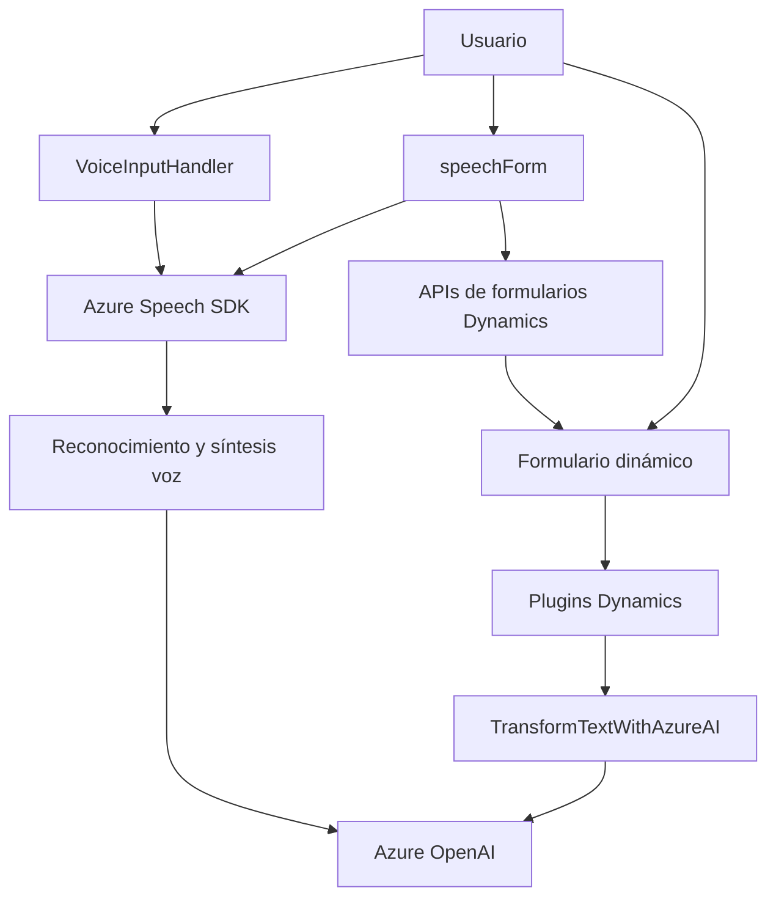

### Breve resumen técnico

El repositorio contiene archivos orientados a integrar funcionalidades de inteligencia artificial y APIs externas en un entorno Dynamics 365 CRM. Los archivos principales se dividen en dos categorías: gestión de interacción usuario-formulario (principalmente frontend con JavaScript) y procesamiento de texto avanzado mediante Azure OpenAI en un backend basado en plugins en C#. Ambos se interconectan con servicios externos como el Azure Speech SDK y Dynamics Web APIs para reconocimiento de voz, síntesis de texto y transformación de datos.

### Descripción de arquitectura

El proyecto tiene una arquitectura **de capas orientada a eventos**:
1. **Frontend (VoiceInputHandler.js y speechForm.js)**: Genera interacción directa con el usuario en formularios dinámicos de CRM, procesando texto y audio con Azure Speech SDK.
2. **Backend (TransformTextWithAzureAI.cs)**: Implementa un plugin que transforma texto mediante la API de Azure OpenAI (GPT) para otorgar inteligencia avanzada al sistema.
3. **Dependencias externas**: El sistema utiliza servicios de terceros (Azure Speech y Azure OpenAI) para ampliar sus capacidades.

### Tecnologías usadas

1. **Lenguajes:** JavaScript (para el frontend), C# (para el backend de Dynamics).
2. **Front-end Framework:** Manejo directo de APIs del navegador y Dynamics CRM.
3. **Backend Framework:** Microsoft Dynamics SDK para implementación de plugins.
4. **Dependencias externas:**
   - Azure Speech SDK: Para síntesis y reconocimiento de voz.
   - Azure OpenAI: Procesamiento avanzado de texto.
   - Dynamics Web API: Formulario dinámico API y llamadas a APIs personalizadas.

### Diagrama Mermaid

### Conclusión final

La solución funciona como una integración avanzada de inteligencia artificial con Microsoft Dynamics 365. A nivel arquitectónico, implementa una estructura de **n capas**, donde el frontend interactúa con el usuario a través de interfases dinámicas y el backend centraliza la lógica avanzada mediante plugins. El flujo incluye eventos asincrónicos para reconocer voz, procesar formularios interactivos y transformar textos. La dependencia en APIs externas (Azure Speech SDK, Azure OpenAI, Dynamics Web API) permite un sistema robusto que amplía capacidades mediante servicios cloud de alta disponibilidad.