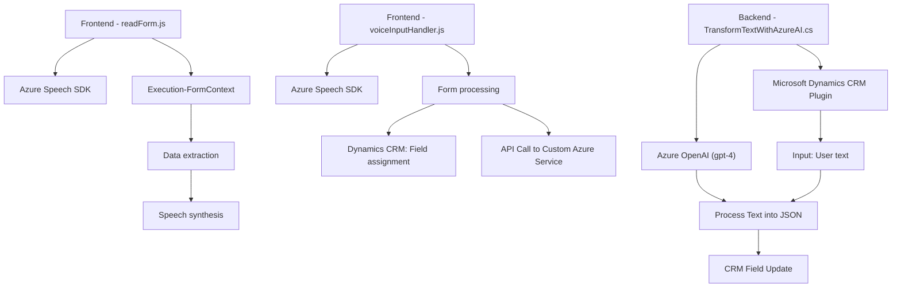

### Breve resumen técnico

Este repositorio implementa funcionalidades integradas con servicios externos (como Azure Speech SDK y Azure OpenAI) para:
1. Mejorar la interacción entre formularios (basados en Dynamics 365).
2. Utilizar síntesis y reconocimiento de voz interactivos.
3. Procesar texto y generarlo en formatos estructurados mediante AI/ML.

Contiene módulos de frontend en JavaScript para manipulación de formularios junto con un plugin backend en C# que procesa datos en Microsoft Dynamics CRM.

---

### Descripción de arquitectura

La solución utiliza una arquitectura **n capas**:
1. **Frontend (Interfaz usuario)**: Scripts JS interactúan con usuarios mediante integración con Azure Speech SDK para síntesis y reconocimiento de voz.
2. **Middleware (Formulario y procesamiento dinámico)**: Scripts procesan datos y los integran con el contexto de Microsoft Dynamics (como `formContext`).
3. **Backend (CRM Plugin)**: Plugin escrito en C# ejecuta lógicas específicas con datos provenientes del frontend (formulario de usuario) y los transforma usando Azure OpenAI.

Los archivos clave del repositorio actúan en esta forma:
- Scripts JS enfocados en input/output dinámico con voz.
- Plugin en C# para transformación avanzada de texto con reglas específicas.

---

### Tecnologías usadas

1. **Frontend**:
   - **JavaScript** para manipulación de DOM y ejecución de lógica interactiva.
   - **Azure Speech SDK** para síntesis y reconocimiento de voz.
2. **Backend**:
   - **C# .NET Framework** para implementación del plugin.
   - **Microsoft Dynamics CRM SDK** para interacción con formularios y servicios.
   - **Azure OpenAI Services (GPT-4)** para transformación de texto.
3. **Dependencias**:
   - JSON procesado por **System.Text.Json** o **Newtonsoft.Json**.

**Patrones de diseño identificados**:
- Callback pattern: Utilizado para control de eventos asincrónicos (principalmente en SDKs).
- Plugin pattern: Diseño específico para integración como extensión de Microsoft Dynamics.
- Modularidad y separación de responsabilidades: Cada archivo o componente se enfoca en un propósito definido.

---

### Diagrama Mermaid (válido para GitHub Markdown)

---

### Conclusión final

La solución en el repositorio está diseñada como una infraestructura **n capas**, donde:
- El frontend maneja interacciones dinámicas con el usuario mediante reconocimiento/síntesis de voz (Azure Speech SDK).
- El backend en C# implementa un plugin Microsoft Dynamics CRM que utiliza Azure OpenAI para procesar los datos y estructurarlos en formatos JSON.
  
Esta integración presenta tecnologías avanzadas de AI para mejorar flujos de trabajo sobre Dynamics 365.