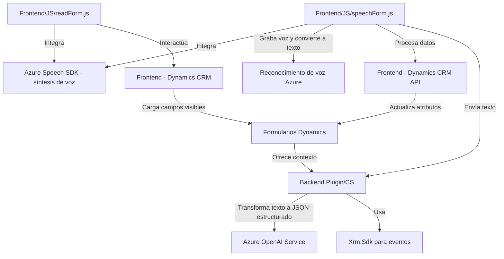

## **Análisis técnico completo del repositorio**

### **Breve resumen técnico**
El repositorio implementa funcionalidades para integrar servicios de Azure Speech SDK y Azure OpenAI dentro de un contexto de Dynamics 365 CRM. Contiene módulos para reconocimiento y síntesis de voz, procesamiento de datos dinámicos en formularios de CRM y transformación de texto mediante machine learning.

---

### **Descripción de la arquitectura**
La arquitectura del sistema está organizada como una solución modular en el contexto de Dynamics 365 con las siguientes características clave:
1. **Frontend/JS**: Contiene scripts que interactúan con los formularios de Dynamics CRM para sintetizar voz y controlar inputs y outputs.
2. **Plugin (.NET)**: Define lógica personalizada extendiendo la funcionalidad de Dynamics CRM mediante la implementación de eventos del sistema, integrando el servicio de Azure OpenAI.
3. **Service-oriented architecture (SOA)**: La integración con servicios tales como Azure Speech SDK y Azure OpenAI indica una comunicación basada en APIs externas.
4. **Patrón de modularidad**: Cada archivo tiene responsabilidades específicas y claramente delimitadas para mejorar la separación de preocupaciones.
5. **Eventos y asíncrono**: Utilización de callbacks y promesas para manejar operaciones como la carga del SDK y la comunicación con APIs externas.

---

### **Tecnologías usadas**
1. **Frontend/JavaScript:**
   - **Azure Speech SDK**: Procesamiento de voz (reconocimiento y síntesis).
   - **Dynamics CRM API (Xrm.WebApi)**: Consultas a entidades CRM y manipulación de formularios.
   - **JavaScript ES6**: Funciones modernas y manejo de promesas para flujo asíncrono.

2. **Backend/.NET C#:**
   - **Dynamics CRM Plugin SDK**: Extensiones específicas para eventos del sistema de CRM.
   - **Azure OpenAI Service**: Transformación de texto mediante machine learning.
   - **Newtonsoft.Json**: Manejo de datos JSON para serialización/deserialización.
   - **ASP.NET Core**: Potencial para ejecutar servicios web si se implementa como parte de una solución backend más amplia.
   - HTTP Client Libraries para comunicación con APIs externas.

3. **Architectural and Design Patterns**:
   - **Event-driven programming**: Aplicación de eventos en Dynamics CRM.
   - **Service integration**: Uso de servicios Azure para realizar tareas específicas como IA para transformación de texto y reconocimiento/síntesis de voz.
   - **Clean code practices**: Modularidad de funciones y clases.

---

### **Dependencias o componentes externos presentes**
1. **Azure Cognitive Services Speech SDK** para reconocimiento y síntesis de voz (`https://aka.ms/csspeech/jsbrowserpackageraw`).
2. **Azure OpenAI API** para generación de JSON estructurados.
3. **Dynamics CRM SDK (Xrm.WebApi)** para manipular formularios y realizar operaciones en el backend CRM.

---

### **Diagrama Mermaid**

---

### **Conclusión final**
El repositorio describe una solución integrada para mejorar la interacción con formularios en Dynamics CRM usando procesamiento de voz y machine learning para automatizar operaciones. La arquitectura combina un diseño modular en el frontend y una extensión del servidor basada en plugins con conexión a APIs externas de Azure. Esto permite una experiencia fluida para el usuario, facilitando tareas como llenado y lectura de formularios, y enriqueciendo los datos mediante IA.

Aunque funcional, la solución podría beneficiarse de:
- **Mejor manejo de credenciales**: Utilizar un sistema seguro para almacenar claves de API (como Azure KeyVault).
- **Un manejo más robusto de errores**: Implementar lógica avanzada para tratar fallos en el reconocimiento de voz o en la comunicación con Azure OpenAI.
- **Un enfoque más moderno para el backend**: Avanzar hacia una arquitectura más orientada al dominio, como la hexagonal, para aumentar la separación de responsabilidades.