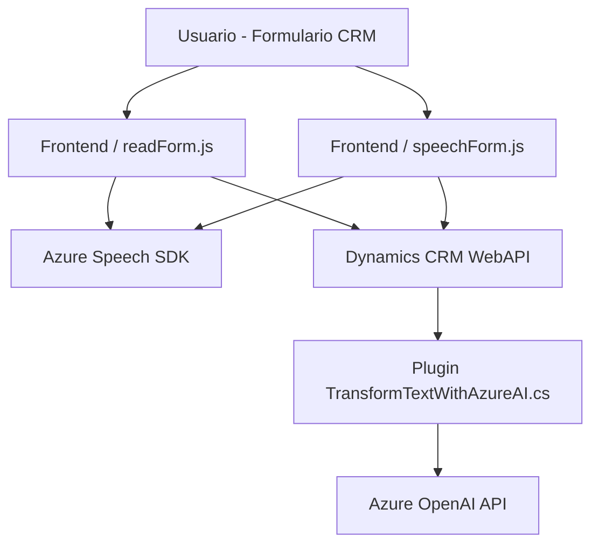

### Breve resumen técnico
El repositorio abarca principalmente tres componentes con distintas responsabilidades relacionadas con la integración de servicios de Azure y Microsoft Dynamics CRM:

1. Frontend: Scripts en JavaScript (`readForm.js` y `speechForm.js`) que permiten extraer datos visibles de formularios CRM, utilizar APIs personalizadas y el SDK de Azure Speech para síntesis/interpretación de voz.
2. Back-end Plugin: Código en C# (`TransformTextWithAzureAI.cs`) que extiende la funcionalidad nativa de Dynamics CRM mediante un plugin que interactúa con Azure OpenAI API para transformar texto basado en reglas.

Estos componentes combinados ofrecen una solución para aumentar la interactividad en aplicaciones CRM y mejorar la experiencia del usuario con reconocimiento y síntesis de voz.

---

### Descripción de arquitectura
La solución tiene rasgos de una **arquitectura n-tier con extensiones basada en eventos**:
1. **Frontend tier**: Scripts en JavaScript sirven como la capa de presentación y comunicación con el usuario. Permiten capturar datos del formulario y habilitar la síntesis/reconocimiento de voz, interactuando con el Dynamics CRM y servicios de Azure.
2. **Business Logic tier**: El plugin en C# implementa la transformación de texto con Azure OpenAI. Este se ejecuta en el nivel de negocio del CRM como extensión de plugin basada en eventos.
3. **Data Access tier**: Uso de `IOrganizationService` y consultas como `EntityCollection` que conectan el CRM con la capa de datos para la manipulación de campos.
4. **Microservicios externos**: Integración con Azure Cognitive Services Speech SDK y Azure OpenAI API, los cuales actúan como microservicios especializados para procesamiento de voz y contenido textual.

Aunque no es una arquitectura puramente de microservicios, utiliza componentes separados para procesar voz y texto mediante servicios externos, lo que lo acerca a un enfoque **híbrido**.

---

### Tecnologías usadas
1. **Frontend:**
   - **JavaScript**: Implementación modular.
   - **Azure Cognitive Services Speech SDK**: Trabajo con reconocimiento y síntesis de voz mediante APIs de Azure.
   - **HTML DOM Context**: Manipulación de formularios dinámicos en CRM.

2. **Backend Plugin (Dynamics CRM):**
   - **C#**: Uso del SDK de Microsoft.Xrm para implementar extensiones plugin.
   - **ASP.Net Integration**: Extensión orientada a eventos para el entorno CRM.
   - **Azure OpenAI API**: Consumo del servicio GPT via solicitudes HTTP POST.
   - **Newtonsoft.Json / System.Text.Json**: Parsing y construcción de payloads JSON.

3. **Patrones identificados:**
   - **Asynchronous Operations**: Promesas/async-await para llamadas al SDK y servicios Azure.
   - **Modularidad por funciones**: Cada tarea está dividida en métodos y servicios individuales.
   - **Plugin Event Listener**: Arquitectura evento-driven en Dynamics CRM.
   - **N-tier Architecture**: Separación de capas de negocio, presentación y datos.

---

### Diagrama Mermaid válido para GitHub

---

### Conclusión final
La solución ofrecida en este repositorio está diseñada para enriquecer la funcionalidad de aplicaciones CRM a través de integración con servicios de inteligencia artificial de Microsoft Azure (Speech y OpenAI). La arquitectura utiliza una combinación de Frontend interactivo, extensión de Backend mediante un plugin basado en eventos, y comunicación con microservicios externos. Esto muestra una clara separación de responsabilidades a través de un enfoque híbrido n-tier con extensiones específicas.

La implementación es modular y basada en patrones modernos como eventos, promesas y consumo de APIs RESTful, lo que garantiza adaptabilidad y escalabilidad en entornos empresariales basados en Dynamics CRM.