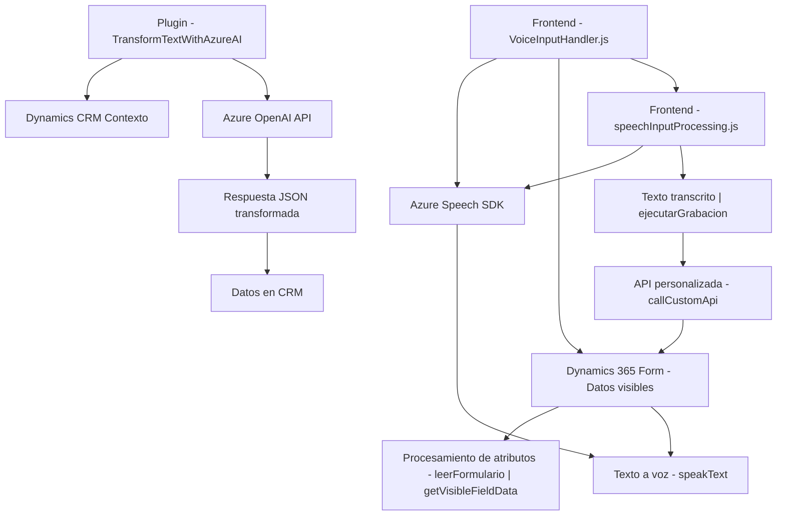

### Breve resumen técnico
El repositorio contiene elementos relacionados con una solución híbrida que integra frontend (JavaScript), APIs (Azure Speech SDK y Dynamics CRM), procesamiento de datos con inteligencia artificial (Azure OpenAI), y lógica de negocio mediante un plugin en .NET dentro del entorno de Dynamics CRM.

### Descripción de arquitectura
La solución está orientada a un modelo modular con componentes distribuidos que interactúan entre sí:

1. **Frontend (JavaScript)**: Implementa la interacción del usuario mediante voz y texto en formularios, utiliza **Azure Speech SDK** para sintetización y transcripción de voz, y realiza llamadas a APIs.
2. **Backend (Plugin en .NET)**: Implementa lógica de negocio personalizada en Dynamics CRM mediante el patrón plugin, interactuando con el contexto de Dynamics CRM y con **Azure OpenAI API** para procesar texto según reglas específicas.
3. **APIs Externas**:
   - **Azure Speech SDK**: Procesos de voz en el frontend.
   - **Azure OpenAI API**: Procesamiento avanzado de texto en el backend.
4. **Integración con Dynamics CRM**: El frontend y backend interactúan estrechamente con la plataforma CRM, incluyendo manipulación de formularios y datos de entidades.

La arquitectura general parece alinearse con un enfoque de n-capas:
- **Capa de presentación**: El frontend maneja la interacción directa con el usuario.
- **Capa de lógica de negocio**: Implementada principalmente en el backend y en el plugin.
- **Capa de integración con APIs externas**: Abarca tanto el frontend como el backend.

### Tecnologías usadas
1. **Lenguajes**: JavaScript (frontend), C# (.NET para el plugin).
2. **Frameworks y SDKs**:
   - **Azure Speech SDK**: Para voz a texto y texto a voz.
   - **Dynamics CRM SDK**: Para manipulación del contexto de CRM y lógica de negocio.
   - **Azure OpenAI API**: Para procesamiento de texto basado en IA.
3. **Librerías**:
   - **Newtonsoft.Json**: Serialización de JSON en .NET.
   - **System.Net.Http**: Interacciones HTTP en .NET.

### Dependencias o componentes externos
1. **Azure Speech SDK**: Cargado dinámicamente en los archivos JavaScript.
2. **Azure OpenAI API**: Consumida por el plugin para procesamiento de texto.
3. **Dynamics CRM Services**: Contexto de ejecución y datos del CRM.
4. **Navegador**: Interacción directa con DOM APIs, dependencias asociadas a Dynamics CRM en el frontend.

### Diagrama Mermaid

### Conclusión final
La solución demuestra un diseño modular y escalable que combina frontend con backend para integrar tecnologías avanzadas de inteligencia artificial y procesamiento de voz. Está orientada a una arquitectura **n-capas** con dependencias clave (SDK y APIs de Azure) y una integración sólida con Dynamics CRM. Se define claramente la responsabilidad de cada componente, lo que facilita el mantenimiento y la extensibilidad. Sin embargo, podría beneficiarse de la implementación de pruebas unitarias y de integración para asegurar la estabilidad de las interacciones entre los sistemas distribuidos.