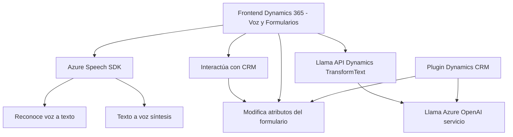

# Análisis Técnico

## Breve resumen técnico

El repositorio proporciona un conjunto de archivos relacionados con la interacción entre un frontend basado en Dynamics 365 y servicios de voz e inteligencia artificial proveídos por **Azure**. Los archivos analizados muestran una solución que procesa entrada de voz y transforma texto, integrando servicios externos como **Azure Speech SDK** y **Azure OpenAI**, además de utilizar APIs personalizadas en Microsoft Dynamics CRM.

---

## Descripción de arquitectura

La solución implementa una arquitectura basada en una interacción entre el **frontend** y **funcionalidades back-end**, ligadas a un estilo **n-capas** y eventualmente algunas características de **arquitectura por microservicios** (debido al uso de servicios externos como Azure Speech SDK y OpenAI). Consta de los siguientes componentes principales:

1. **Frontend:** 
   Útil para el manejo de formularios en Dynamics CRM, incluye funcionalidades de entrada por voz, síntesis de voz y transcripción usando Azure Speech SDK. También realiza llamadas a APIs externas (como Azure OpenAI y APIs personalizadas de Dynamics CRM) para transformar texto o transcripciones en datos estructurados.

2. **Plugins personalizados:**
   En concreto, `TransformTextWithAzureAI.cs` actúa como un plugin para Dynamics CRM. Utiliza la **interfaz IPlugin** para interceptar eventos del sistema y procesar texto mediante la API de Azure OpenAI, devolviendo resultados en JSON estructurado.

3. **Dependencias externas:** 
   La solución se apoya en los servicios de la nube proporcionados por **Azure Speech SDK** para sintetizar y reconocer voz, así como **Azure OpenAI** para el procesamiento inteligente de texto.

---

## Tecnologías usadas

### HTML / JS:
1. **Frontend/JS**:
   - **JavaScript**: Lenguaje principal para la lógica del frontend.
   - **Azure Speech SDK**: Cargado a través de una CDN y utilizado para sintetización y transcripción de voz.
   - **Dynamics 365 Web API**: Para manipular registros y atributos en los formularios de Dynamics CRM.

2. **Frameworks/Patrones**: 
   - Callbacks y Promesas para manejar la asincronía en cargos de SDK y llamadas a servicios.
   - Modularización para separar la lógica de lectura de formularios, aplicación de valores, y procesamiento de voz.

---

### Backend Dynamics CRM Plugins (.NET):
1. **Microsoft Dynamics CRM SDK**:
   - Plugin desarrollado en **C# .NET** utilizando el SDK de Dynamics para interceptar eventos en el contexto del CRM.

2. **Azure OpenAI**:
   - Interacción vía HTTP usando `HttpClient`.
   - Formateo de texto en JSON mediante inclusión de librerías como `System.Text.Json` y `Newtonsoft.Json`.

3. **Patrones utilizados:**
   - **Façade Pattern** aplicado en la encapsulación de la interacción con el servicio de Azure OpenAI.
   - **Acoplamiento indirecto** para integrar servicios de IA/voz en Dynamics CRM.

---

## Diagrama Mermaid válido para GitHub

---

## Conclusión final

La solución implementada en este repositorio claramente refleja una **aplicación integrada de Dynamics 365 con servicios de inteligencia artificial y voz**. Mediante el uso estratégico de patrones de modularización, callbacks y la arquitectura n-capas, este sistema facilita una experiencia de usuario modernizada para capturar y sintetizar información vocal en tiempo real.

Las tecnologías son modernas, con fuerte integración cloud (Azure Speech SDK, OpenAI) y atención al manejo de atributos CRM. Sin embargo, la seguridad debe ser considerada, particularmente para proteger credenciales/API keys embebidas. Además, la arquitectura se acerca a un diseño **híbrido**, con una base de **n capas**, pero con integración de servicios externos que ofrecen características propias de **microservicios**.