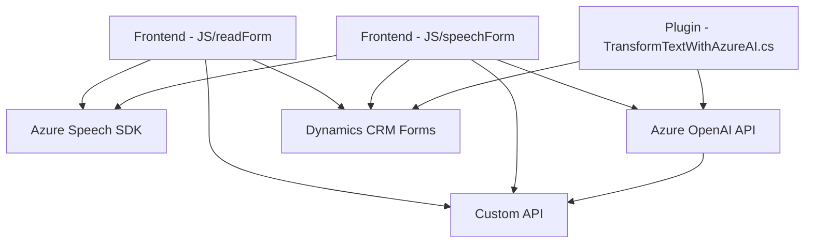

### Breve resumen técnico
Estos archivos forman parte de un sistema que integra servicios de Microsoft Azure, Dynamics CRM y Azure OpenAI. Los archivos están organizados como un sistema modular y extensible en una arquitectura orientada a servicios. Su propósito principal es interactuar con formularios, transformar textos con IA, y realizar síntesis/reconocimiento de voz utilizando el **Azure Speech SDK** dentro de Dynamics CRM.

---

### Descripción de arquitectura
El sistema utiliza una arquitectura **n-capas** orientada a modularidad. Cada funcionalidad se separa en capas según su responsabilidad:
- **Capa de presentación**: Archivos frontend (`readForm.js`, `speechForm.js`) que interactúan con el usuario mediante voz y formatean datos para los servicios backend.
- **Capa de negocio**: Plugins (`TransformTextWithAzureAI.cs`) integrados en Dynamics CRM para manejar lógica más compleja, como procesamiento de texto con Azure OpenAI.
- **Capa de servicios**: Servicios externos como Azure Speech SDK y Azure OpenAI realizando el procesamiento de voz y texto.
- **Integración API externa**: Manejo de peticiones HTTP para enviar datos a Azure y recepcionar respuestas.

Esta arquitectura facilita la encapsulación de la lógica del negocio y promueve el desacoplamiento funcional mediante la integración con servicios externos. Es adaptable para futuras extensiones, como nuevos servicios de AI o telemetry.

---

### Tecnologías usadas
1. **Frontend**:
   - **JavaScript**: Lógica principal para manipular formularios y manejo de voz con Azure Speech SDK.
   - **Azure Speech SDK**: Herramienta principal para servicios de síntesis y reconocimiento.
   - **DOM Manipulation**: Para dinámicamente cargar dependencias.

2. **Backend**:
   - **C# (.NET Framework)**: Plugins para Dynamics CRM (`TransformTextWithAzureAI.cs`).
   - **Azure OpenAI**: Procesamiento de texto y generación estructurada.
   - **Microsoft Dynamics CRM SDK**: Para interacción con el sistema CRM.
   - **HTTP Client**: Peticiones a servicios externos (API personalizada y Azure OpenAI).

3. **Patrones de diseño**:
   - **Modularidad**: Encapsulación de funciones y métodos según responsabilidades.
   - **Service Integration**: Llamadas explícitas a servicios externos (Speech y OpenAI).
   - **Plugin Pattern**: Extensibilidad para Dynamics CRM.
   - **Asynchronous Processing**: Uso de promesas para tareas asíncronas en JavaScript y C#.

---

### Diagrama Mermaid válido para GitHub Markdown

---

### Conclusión final
El repositorio implementa un **sistema cliente-servidor modular de tipo n-capas**, con integración directa a servicios externos de voz, AI y CRM. Los patrones de arquitectura empleados (modular, delegación, plugin) aseguran escalabilidad y modularidad, lo que lo hace ideal para plataformas empresariales que requieran procesamiento avanzado de datos y voz.

Las dependencias clave del proyecto son **Azure Speech SDK, Dynamics CRM SDK** y **Azure OpenAI API**, alineadas con el ecosistema Azure y sus capacidades de IA y servicios en la nube. Aunque la arquitectura actual parece sólida, la integración de sistemas distribuidos como microservicios podría mejorar la independencia entre el backend (Dynamics CRM) y los servicios de AI.