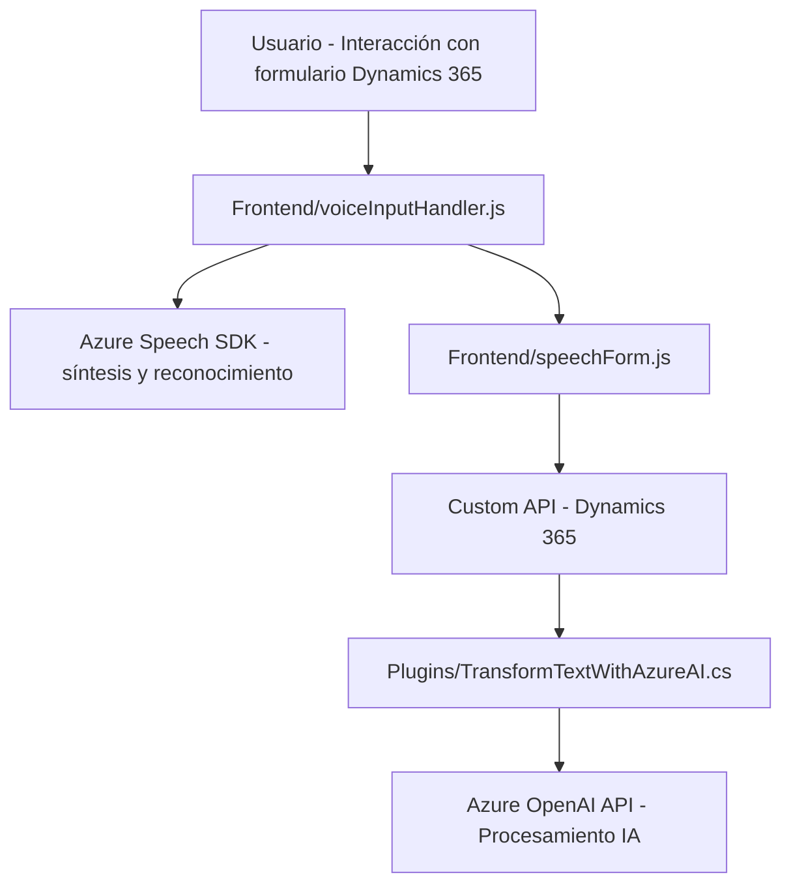

### Breve resumen técnico

El repositorio analiza múltiples componentes: uno orientado al **frontend JavaScript** para formularios dinámicos, otro que define un **plugin en C#** para Dynamics 365 que integra servicios de Azure OpenAI, y servicios relacionados con síntesis de voz y reconocimiento de comandos hablados usando **Azure Speech SDK**. Es una solución integrada que conecta el frontend de Dynamics 365 con servicios de procesamiento en la nube.

### Descripción de arquitectura

La solución tiene características híbridas que la aproximan a una **arquitectura en capas (n-layers)**. Se pueden identificar claramente las siguientes capas:
1. **Presentación (frontend):** Scripts que facilitan interacción entre usuarios y formularios en Dynamics 365.
2. **Lógica de negocio (backend):** Plugins en Dynamics CRM que transforman datos usando servicios de Azure OpenAI.
3. **Integración con servicios externos:** Componentes asociados a Azure Speech SDK y Azure OpenAI API para procesamiento inteligente de datos.

Cumple con la lógica y organización modular, permitiendo fácil escalabilidad y separación de responsabilidades.

### Tecnologías usadas

- **Frontend:**
  - **HTML y JavaScript:** Para implementación de lógica en formularios Dynamics 365.
  - **Azure Speech SDK:** Reconocimiento y síntesis de voz para integrar funcionalidad de voz con el sistema.

- **Backend (plugin en Dynamics 365):**
  - **C#:** Implementación de plugins utilizando la interfaz `IPlugin` de Dynamics CRM.
  - **Azure OpenAI API:** Transformación de texto en formato JSON según normas preconfiguradas.
  - **JSON (System.Text.Json y Newtonsoft):** Serialización y análisis estructural de datos.

### Diagrama Mermaid

### Conclusión final

La solución representa un sistema bien estructurado para maximizar el uso de formularios en Dynamics 365 mediante funcionalidades avanzadas como reconocimiento de voz y transformación inteligente de datos con inteligencia artificial. Utiliza tecnologías modernas como Azure Speech SDK y Azure OpenAI API para extender la funcionalidad de Dynamics 365, alineando diferentes componentes bajo una arquitectura de capas. Aunque cumple con principios esenciales de modularidad, se recomienda prevenir problemas de seguridad fortaleciendo la gestión de claves y credenciales (como se observa en el plugin).