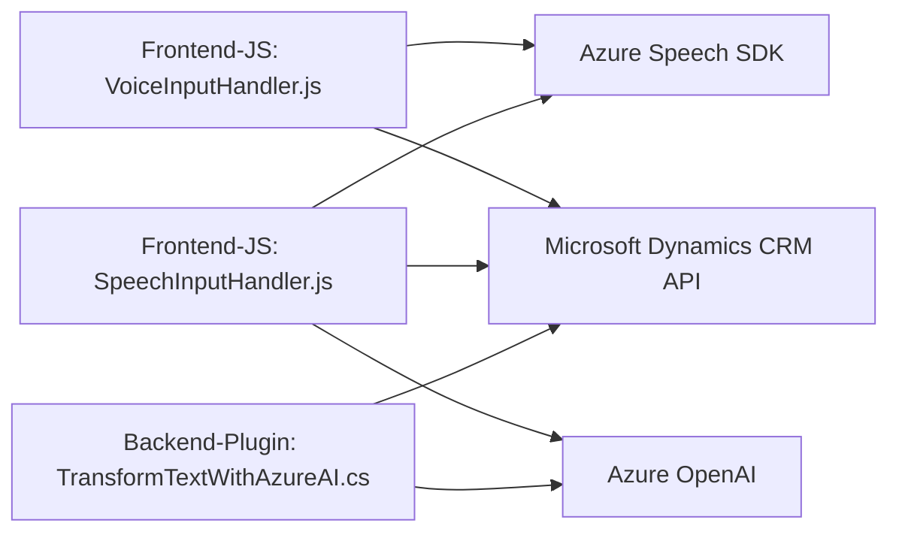

### **Breve resumen técnico**  
El repositorio parece estar enfocado en integrar funcionalidades basadas en accesibilidad (sintetización de voz y transcripción de audio) y automatización en un sistema CRM utilizando servicios de Microsoft Azure y Dynamics CRM. Los archivos `readForm.js`, `speechForm.js` y `TransformTextWithAzureAI.cs` comparten el objetivo de procesar entradas y salidas textuales para mejorar la experiencia del usuario y optimizar la interacción con formularios dinámicos.

---

### **Descripción de arquitectura**  
La solución refleja una **arquitectura de múltiples capas con integración de servicios externos**. Los scripts JavaScript (frontend) actúan como controladores entre el **usuario final** y el sistema CRM, mientras el plugin de Dynamics CRM procesa solicitudes avanzadas usando reglas externas. Toda la interacción está basada en **APIs externas** y la conectividad con **Microsoft Azure Speech SDK** y **Azure OpenAI**.

#### **Elementos identificados:**
1. **Frontend (JS):**
   - Se configura como una vista/controlador que interactúa directamente con el usuario.
   - Gestiona entrada/salida de datos (manejo de formularios) y consume servicios de síntesis y transcripción de voz.
   
2. **Plugin del Backend (Dynamics CRM):**
   - Está diseñado como un servicio separado que realiza procesos acordes a la lógica empresarial usando la capacidad de Azure OpenAI.

3. **Arquitectura:**
   - Aunque es modular, no se trata de **microservicios** (toda la lógica parece depender directamente de Dynamics CRM con una estructura acoplada). 
   - El diseño general sigue un **patrón de n-capas**:  
     - Presentación (Frontend JS).  
     - Lógica de negocio (comunicaciones asincrónicas y sincronización con APIs).  
     - Persistencia/Servicios (Azure SDK).

---

### **Tecnologías usadas**
1. **Frontend (JS):**
   - **Native JS + Web DOM:** Para manipular datos visibles de formularios.
   - **Azure SDK (Speech):** Realiza tareas de síntesis de voz y transcripción.
   - **Dynamic lazy-loading:** Carga bajo demanda del SDK sólo cuando es necesario.
   
2. **Backend (Dynamics CRM Plugin):**
   - **C# .NET:** Lenguaje para implementar plugins.
   - **Azure OpenAI API:** Uso del servicio GPT-4o para procesamiento de texto.
   - **HttpClient:** Realización de peticiones HTTP en el plugin.
   - **Newtonsoft.Json/JSystem.Text.Json:** Para trabajar con datos JSON estructurados.

3. **CRM Platform:**  
   - **Microsoft Dynamics CRM:** Principales funcionalidades de actualización directa en el formulario.

#### **Patrones utilizados**
- Modularidad: Código bien estructurado con distintas funciones recursivas.
- Lazy Loading: Carga bajo demanda del SDK de Azure Speech.
- Event-driven: Uso de disparadores asincrónicos en reconocimiento por voz.
- DAO (Data Access Object): Acceso directo a estructuras de formulación para actualización de entradas.
- Service Integration: Servicios desacoplados en plugins para extender sistemas con lógica externalizada.

---

### **Diagrama Mermaid (100 % compatible con GitHub Markdown)**

---

### **Conclusión final**
Este repositorio implementa una solución centrada en accesibilidad y automatización, aprovechando servicios avanzados de Microsoft como Azure Speech y Azure OpenAI en combinación con una plataforma CRM robusta (Dynamics CRM). Su arquitectura de **n capas** asegura una separación clara de la lógica de presentación, negocio y persistencia, mientras los patrones como modularidad y carga dinámica optimizan su diseño. Aunque el código es funcional y reutilizable, podría beneficiarse del desacoplamiento adicional para abordar la restricción de dependencias direccionadas exclusivamente hacia Dynamics CRM.