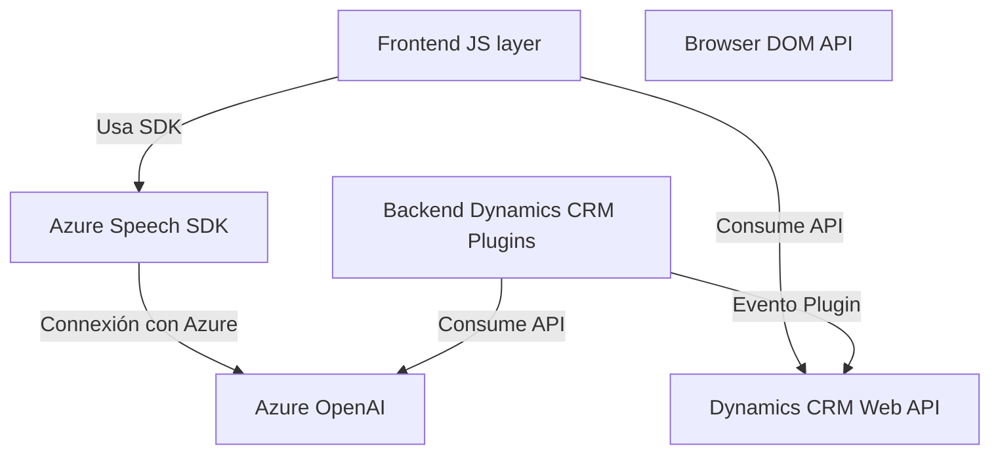

### Breve resumen técnico
El repositorio implementa un sistema combinado que integra procesamiento de datos de formularios, entrada de voz, y transformación de texto asistida por AI en un entorno centralizado basado en Microsoft Dynamics CRM. Involucra programación orientada a eventos, uso de APIs externas, y modularización del código en el frontend y backend.

---

### Descripción de arquitectura
La arquitectura es híbrida y se puede analizar de la siguiente manera:

- **Frontend:** El repositorio tiene un enfoque modular que utiliza programas JavaScript para interactuar con formularios en el frontend. Este sistema incluye un componente que usa el SDK de Azure Speech para entrada de voz y síntesis de texto.
- **Backend:** Utiliza una arquitectura basada en Plugins de Dynamics CRM. Aquí se ejecutan transformaciones de texto con Azure OpenAI aplicando reglas definidas.
  
La combinación de frontend y backend forma una arquitectura **n-capas**:
1. Capa de presentación (frontend).
2. Capa lógica de negocio (backend) mediante plugins.
3. Capa de servicios/operaciones externas (Azure Speech y Azure OpenAI).

---

### Tecnologías usadas
1. **Frontend:**
   - **JavaScript:** Para lógica y manipulación del DOM.
   - **Azure Speech SDK:** Manejo de voz para transcripción y síntesis.
   - **Dynamics CRM Web API:** Interacción con entidades CRM vía JavaScript.

2. **Backend:**
   - **Dynamics CRM SDK:** Para la implementación de plugins orientados a eventos.
   - **Azure OpenAI Service:** Para procesamiento avanzado de texto.
   - **C#:** Desarrollo de plugins.
   - **Newtonsoft.Json / System.Text.Json:** Gestión JSON.

---

### Diagram Mermaid válido para GitHub

---

### Conclusión final
Este sistema tiene una arquitectura bien distribuida centrada en la plataforma Dynamics CRM, con integración de servicios avanzados como Azure Speech y OpenAI para ofrecer transcripción, síntesis de voz, y transformación de texto. La modularidad y separación de responsabilidades entre el frontend y backend permiten ampliar la funcionalidad sin afectar los componentes existentes, asegurando escalabilidad y mantenimiento eficiente. Estilísticamente, el código sigue patrones estándar en la gestión asincrónica de datos y estructuración modular.