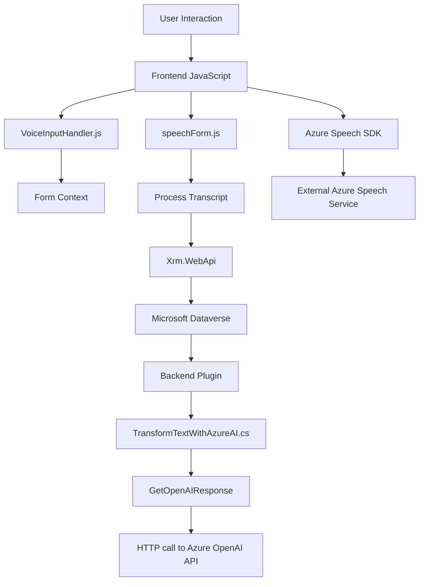

### Breve resumen técnico

El proyecto detallado en los archivos proporcionados representa una solución que integra **procesamiento del habla**, accesibilidad y operaciones con formularios de **Microsoft Dynamics CRM**. Utiliza el **Azure Speech SDK** para transformar texto en voz y voz en texto, y emplea el servicio **Azure OpenAI** para aplicar inteligencia artificial al procesamiento de datos de formularios. Los módulos están enfocados en mejorar la accesibilidad y automatizar tareas repetitivas.

---

### Descripción de arquitectura

La solución está organizada en una arquitectura **basada en capas** con lógica distribuida en los siguientes componentes:

1. **Frontend (JavaScript)**: Incluye los módulos que manejan la interacción con el usuario, como captura de voz, lectura del formulario, y envío de datos a APIs.
    - Funciones modulares organizadas para realizar tareas específicas (ej. síntesis de voz, reconocimiento, asignación de campos del formulario).
    - Dependencia directa del **Azure Speech SDK** para síntesis y reconocimiento de voz.
    - Uso del Xrm.WebApi para integrarse con Microsoft Dataverse.

2. **Backend (Plugin en .NET)**:
    - Implementación de un **plugin** para Dynamics CRM en C#.
    - Interacción directa con el **Azure OpenAI Service** mediante solicitudes HTTP para transformar texto con IA.
    - Extiende funcionalidad de Dynamics CRM mediante la **interfaz IPlugin**.

**Estructura arquitectónica**:
- **N capas**: El diseño incluye múltiples capas para separar responsabilidades:
  - Capa de presentación (frontend/JavaScript).
  - Lógica de negocio (plugin en C#).
  - Capa de datos representada por Dynamics CRM y servicios de Azure.

---

### Tecnologías usadas

1. **Frontend**:
   - Lenguaje: **JavaScript**.
   - Librerías externas:
     - **Azure Speech SDK**: Para síntesis y reconocimiento de voz.
     - **Xrm.WebApi**: API de Microsoft Dataverse para manejo de datos de formularios.
   - APIs externas:
     - Dynamics Dataverse (para operaciones CRUD).
     - Azure Speech API.

2. **Backend**:
   - Lenguaje: **C# (.NET)**.
   - Framework: **Microsoft Dynamics CRM SDK**.
   - Dependencias clave:
     - **Newtonsoft.Json.Linq**: Manipulación de JSON.
     - **Azure OpenAI Service**: Procesamiento de texto basado en IA.
   - APIs externas:
     - Dynamics Dataverse.
     - Azure OpenAI.

3. **Patrones de diseño**:
   - Modularidad: Separación de funciones específicas en JavaScript.
   - Lazy-loading: Inclusión dinámica del SDK de Azure Speech.
   - Factory Pattern: Creación del servicio principal `IOrganizationService` en C#.
   - Delegate Pattern: Uso de funciones de callback para procesar flujos asincrónicos.

---

### Diagrama **Mermaid**

---

### Conclusión final

Este repositorio implementa una solución orientada a accesibilidad, procesamiento de voz y automatización utilizando tecnologías modernas como **Azure Speech SDK**, **Azure OpenAI**, y **Microsoft Dynamics CRM SDK**. Es un sistema híbrido distribuido entre un **frontend con acceso a APIs externas** y un **plugin backend de Dynamics**, lo que lo califica como una solución de arquitectura **n capas**.

**Fortalezas**:
- Modularización clara.
- Integración con servicios externos como Azure Speech y OpenAI.
- Alto grado de automatización en tareas empresariales.

**Consideraciones**:
- Dependencias externas como los servicios de Azure aumentan la complejidad y posibles puntos de fallo.
- La solución requiere una infraestructura estable de Microsoft Dynamics CRM y conectividad confiable con los servicios de Azure.