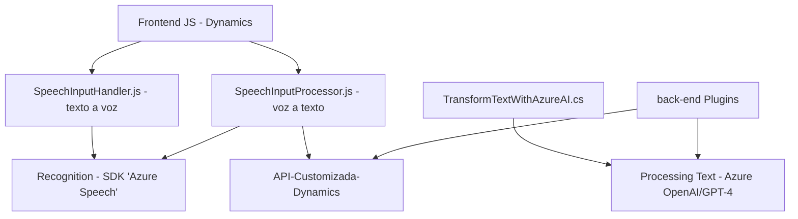

### Breve resumen técnico

El repositorio parece ser un sistema híbrido que integra una interfaz de usuario basada en JavaScript y funcionalidades extendidas en un CRM mediante plugins personalizados. Además, incorpora servicios avanzados como procesamiento de voz con Azure Speech SDK y transformación de texto vía Azure OpenAI. 

### Descripción de arquitectura

La solución sigue una arquitectura de varios componentes:
1. **Frontend**: Se utiliza para interactuar con los datos de formularios en Dynamics CRM mediante Azure Speech SDK. Las funcionalidades están divididas en dos archivos principales que se comunican con el backend y con servicios externos (Azure y CRM APIs).
2. **Backend/CRM Plugin**: Consiste en un plugin personalizado en .NET integrado en Microsoft Dynamics que utiliza Azure OpenAI GPT para transformar texto según ciertas normas dadas por el usuario.
3. **Servicios Externos**: Subcontrata servicios de Azure como Speech SDK para síntesis y reconocimiento de voz, y Azure OpenAI para procesamiento avanzado de texto.

La arquitectura es **monolítica basada en n capas**, dado que existe una clara separación de responsabilidades entre la capa de presentación (Frontend), capa de lógica de negocio (en el plugin de Dynamics y funciones del frontend) y servicios de datos externos asociados tanto a Dynamics CRM como a Azure. Sin embargo, la integración con APIs personalizadas y servicios como Azure indica un enfoque hacia arquitecturas más modernas y modulares.

### Tecnologías usadas

#### Lenguajes de programación:
- **Frontend**: JavaScript (para manipulación del DOM y dinámicas de reconocimiento y síntesis de voz).
- **Backend**: C# (plugins extendidos en Dynamics CRM).

#### Frameworks y APIs:
- **Microsoft Dynamics CRM**: Para la gestión de formularios y datos empresariales.
- **Azure Speech SDK**: Para reconocimiento de voz y síntesis de texto a través de funciones del navegador.
- **Azure OpenAI GPT-4**: Para procesar y transformar texto basado en IA.
  
#### Patrones utilizados:
- Modularity: Código funcional dividido en tareas claras.
- Event-driven programming: Uso de callbacks y funciones asíncronas en el frontend para manejar cargas de SDK y eventos.
- Plugin-based architecture: Robustez y extensibilidad mediante el estándar `IPlugin` de Dynamics CRM.

### Dependencias o componentes externos

1. **Azure Speech SDK**: Gestión de audio, configuración del idioma, y reconocimiento de entrada/salida.
2. **Azure OpenAI**: Manipulación de texto dinámico.
3. **API personalizada de Dynamics CRM**: Llamadas REST para procesamiento de datos más complejo.
4. **Microsoft Dynamics SDK**: Para formularios, atributos y API interna.

### Diagrama Mermaid

### Conclusión final

La solución es un sistema interactivo que integra funciones de reconocimiento y síntesis de voz para facilitar la entrada de datos y procesamiento automático en un entorno de Dynamics CRM. Su arquitectura híbrida con fronteras claras entre frontend y backend señala un sistema bien diseñado, aunque la ausencia de una arquitectura completamente descentralizada (como microservicios) sugiere una implementación monolítica de n capas. La solución es robusta y utiliza servicios avanzados como Azure, lo que garantiza escalabilidad y funcionalidades sofisticadas.

Es ideal para aplicaciones empresariales que requieran interacción por voz y generación dinámica de contenido en CRM. Sin embargo, para mayor flexibilidad y mantenimiento, se podría considerar un diseño más distribuido en el futuro.