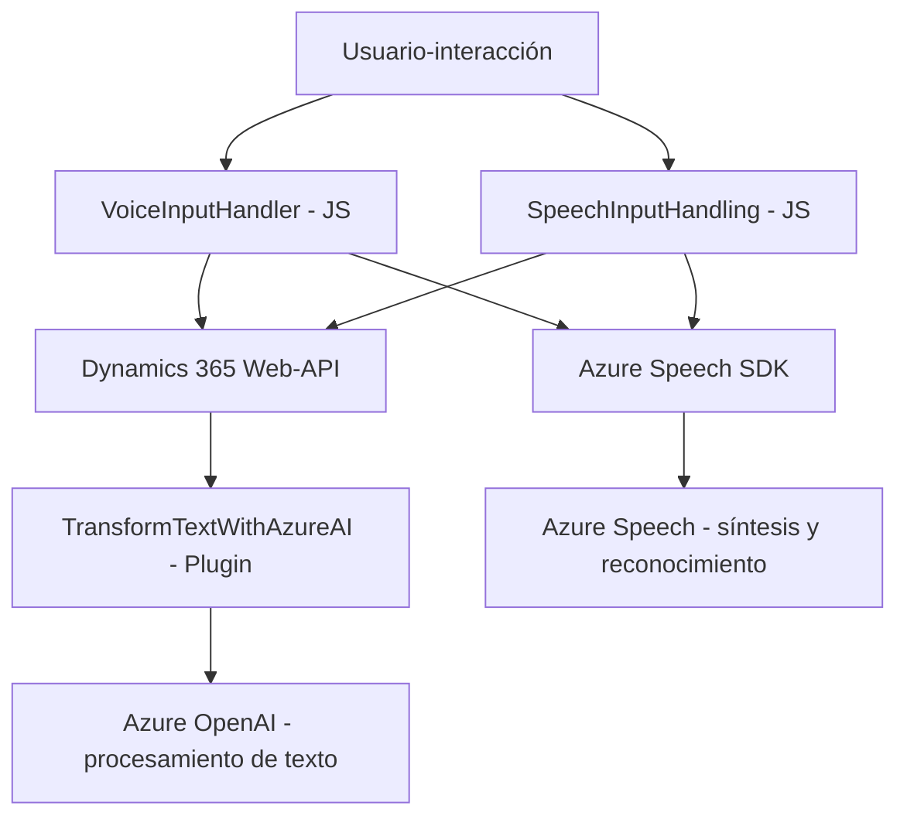

## Resumen técnico

El repositorio presenta tres archivos orientados a la interacción usuario-aplicación mediante voz, texto y servicios externos: 

1. **VoiceInputHandler.js** (Frontend) y **SpeechInputHandling.js** (Frontend): Gestión del reconocimiento de voz, síntesis de texto y la interacción con formularios de Dynamics 365. Consume Azure Speech SDK para funcionalidades de voz y realiza las actualizaciones en formularios.
2. **TransformTextWithAzureAI.cs** (Backend Plugin): Plugin de Dynamics CRM que utiliza Azure OpenAI para transformar texto en un JSON estructurado según normas predefinidas. 

---

## Descripción de arquitectura

El sistema combina:
- **Aplicación cliente (Frontend):** Procesa voz y texto en el navegador con integración a Dynamics 365 y Azure Speech SDK.
- **Plugin servidor (Backend):** Ejecuta lógica avanzada en el servidor Dynamics CRM, consumiendo Azure OpenAI para procesamiento de texto.

Patrones observados:
1. **Arquitectura n-capas:** Separación clara del frontend (interacción con usuario/Dynamics) y backend (plugin en Dynamics CRM).
2. **Cliente-Servidor:** El frontend actúa como cliente para Azure Speech y envía/recibe datos procesados del backend (Dynamics CRM).
3. **Integración API externa:** Uso intensivo de servicios externos como Azure Speech SDK y Azure OpenAI mediante solicitudes HTTP dinámicas.
4. **Modularidad:** Funciones y clases altamente organizadas por responsabilidad específica.

---

## Tecnologías usadas

1. **Frontend:**
   - **Azure Speech SDK:** Reconocimiento y síntesis de voz.
   - **JavaScript (ES6):** Principal lenguaje para la lógica interactiva.
   - **Dynamics 365 Web API:** Gestión de formularios y entidades.
   
2. **Backend:**
   - **Dynamics CRM SDK (Microsoft.Xrm.Sdk):** Lógica del plugin.
   - **Azure OpenAI:** Procesamiento avanzado de texto.
   - **C# y .NET Framework:** Desarrollo del plugin, con manejo de servicios REST y JSON.

Additional libraries:
   - `System.Net.Http` (C#): Consumo de APIs.
   - `Newtonsoft.Json.Linq` / `System.Text.Json` (C#): Serialización JSON.

---

## Diagrama Mermaid

---

## Conclusión final

La solución integra capacidades de reconocimiento y síntesis de voz (Azure Speech SDK), junto con procesamiento avanzado de texto (Azure OpenAI) para enriquecer los formularios de Dynamics 365. Tiene una arquitectura **n-capas híbrida** que segrega las tareas entre el frontend y el backend, utilizando servicios externos para garantizar modularidad, escalabilidad y flexibilidad. Esto sugiere un sistema bien diseñado con un enfoque en la integración de APIs modernas.