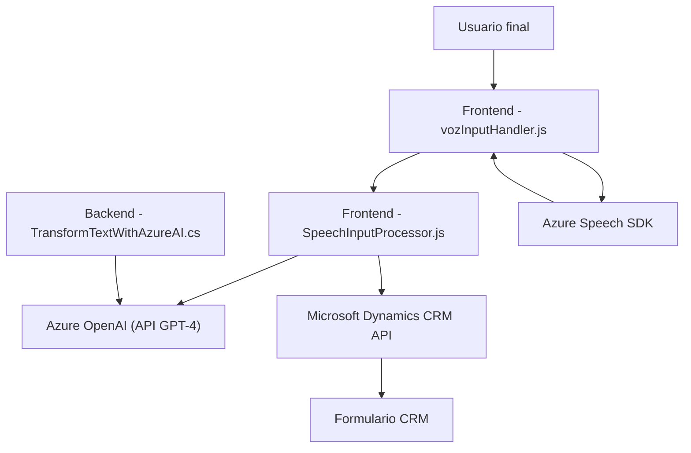

### Breve resumen técnico

Este repositorio implementa una solución que integra procesamiento de formularios dinámicos con capacidades de reconocimiento de voz y síntesis de texto a voz, usando servicios de Azure Speech SDK y Azure OpenAI. Está diseñado para ser utilizado en un entorno que interactúa con Microsoft Dynamics CRM, permitiendo mejorar la accesibilidad y la interacción verbal con datos estructurados.

---

### Descripción de arquitectura

La solución tiene tres componentes principales:

1. **Front-End (JS Scripts)**: Encargado de la interacción dinámica con los formularios, procesamiento de voz (entrada y salida) y mapeo entre campos visibles y claves internas. Esto incluye las siguientes responsabilidades:
   - Procesar los datos visibles de los formularios y sintetizar texto en voz (vozInputHandler.js).
   - Realizar reconocimiento de voz, transcribir, interpretar, y aplicar acciones en el formulario o llamar APIs específicas (SpeechInputProcessor.js).

2. **Back-End (Dynamics Plugin)**: A nivel de servidor, un plugin mediante Microsoft Dynamics CRM SDK realiza transformaciones estructuradas de texto utilizando Azure OpenAI para lógica avanzada de análisis y procesamiento.

3. **Servicios Externos**:
   - **Azure Speech SDK**: Para la conversión de texto a voz y reconocimiento de voz.
   - **Azure OpenAI (ChatGPT - GPT-4)**: Para la transformación del texto en JSON estructurado según normas predefinidas y lógica avanzada por IA.

La arquitectura es **modular** y sigue una orientación **n capas** considerando la interacción de un front-end del sistema con manejo de formularios dinámicos y un back-end basado en plugins del CRM. La separación entre front-end y back-end introduce cierto desacoplamiento, pero dado que las capas dependen directamente unas de otras y no hay servicios completamente autónomos (como bases de datos separadas o despliegues independientes), no se trata de microservicios propiamente dichos.

---

### Tecnologías usadas

- **Frontend**:
  - Lenguaje: JavaScript.
  - Service SDK: Azure Speech SDK.
  - API de Microsoft Dynamics CRM.
  
- **Backend**:
  - Lenguajes: C# (.Net Framework para desarrollo de plugins).
  - Librerías: Newtonsoft.Json, System.Text.Json, System.Net.Http.
  - API: Microsoft Dynamics SDK.
  - Servicio de IA: Azure OpenAI (GPT-4) para transformación de texto.

- **Patrones de diseño y principios arquitectónicos**:
  - **MVC-like structure**: Interacción con el modelo de atributos del formulario y control de presentación (en front-end).
  - **Plugin Pattern**: Implementación estándar para Dynamics CRM Plugins.
  - **Mapper dinámico**: Mapeo entre nombres visibles y claves internas del formulario.
  - **Integración con servicios en la nube**: Uso de Azure APIs para voz e IA, con dependencias claras pero externas.

---

### Diagrama Mermaid válido para GitHub

---

### Conclusión final

La solución opera como una arquitectura modular de **n capas**, destacando la integración con servicios en la nube (Azure Speech SDK y Azure OpenAI) y APIs de Microsoft Dynamics CRM. Está diseñada para habilitar funcionalidad de accesibilidad y optimización en el manejo de datos de formularios dinámicos mediante entrada/salida de voz e inteligencia artificial.

Si bien los componentes tienen roles claramente definidos, la arquitectura está acoplada al ecosistema de Microsoft Dynamics 365, y las dependencias no permiten su despliegue como microservicios independientes. Tampoco está optimizada para cambios en los módulos internos sin afectar el resto de la aplicación.

Sugiero evaluar la seguridad del manejo de credenciales relacionadas con Azure SDK y OpenAI, ya que actualmente parecen expuestas. Una gestión más robusta de secretos debería implementarse utilizando herramientas de gestión de configuración y almacenamiento seguro. 