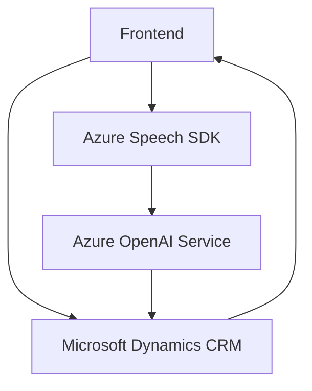

### Breve resumen técnico

El repositorio contiene código para implementar funcionalidades de interacción y procesamiento en un sistema CRM como **Microsoft Dynamics**, utilizando tecnologías de reconocimiento de voz (Azure Speech SDK) y transformación de texto en JSON estructurado (Azure OpenAI).  

Se compone principalmente de:  
- **Frontend:** Automatiza la interacción de entrada y salida de voz en formularios dinámicos utilizando voz sintetizada e interpretación hablada.  
- **Backend (Dynamics CRM Plugin):** Transformación de datos a partir de texto utilizando Azure OpenAI para generar estructuras procesables y almacenables en una plataforma CRM.

---

### Descripción de arquitectura 

La solución combina componentes de **arquitectura de capa** (con separación lógica en backend y frontend), patrones **modulares** para partes del frontend y un **plugin específico** en el backend. Cada capa interactúa de manera directa, vinculada con otras mediante servicios externos como **Azure Speech SDK** y **Azure OpenAI**.

- **Frontend (JavaScript):**
  - Permite entrada y salida de voz en formularios. Emplea módulos separados para la síntesis y reconocimiento de voz.
  - Utiliza principios modulares y una arquitectura basada en eventos.

- **Backend Plugin (Dynamics CRM):**
  - Plugin estándar de Dynamics CRM con integración de APIs externas.
  - Aprovecha un diseño API para conectar servicios de inteligencia artificial y enriquecer funcionalidades locales del CRM mediante la generación de JSON estructurado.

---

### Tecnologías usadas  

1. **Frontend:**  
   - JavaScript.  
   - **Azure Technologies:**
     - Azure Speech SDK para reconocimiento y síntesis de voz.  
     - Dinámico con carga condicionada del SDK desde una URL.  
   - Dynamics CRM Web API (`Xrm.WebApi`).  
  
2. **Backend:**  
   - **Microsoft Dynamics Plugin Framework:** Implementa interfase `IPlugin` para lógica embebida del CRM.  
   - **Azure OpenAI Service:** Consume APIs para procesar texto y generar JSON estructurado.  
   - Librerías auxiliares:
     - `System.Net.Http` para integraciones HTTP.
     - `Newtonsoft.Json.Linq` y `System.Text.Json` para manipulación JSON.  
  
3. **Diseño arquitectónico:**  
   - Event-driven en parte del Frontend.  
   - Modularidad: Separación en funciones independientes.
   - Integración directa con APIs externas.

---

### Diagrama Mermaid válido para GitHub Markdown  

---

### Conclusión final  

Esta solución representa una arquitectura híbrida que conecta una interfaz frontend modular (centrada en servicios y accesibilidad) con formularios dinámicos en **Microsoft Dynamics CRM**. El backend utiliza un plugin de Dynamics CRM que se integra con **Azure** para capacidades avanzadas de inteligencia artificial, siguiendo las mejores prácticas de los estándares de Microsoft.

El sistema destaca por:  
- Uso avanzado de servicios en la nube (Azure Speech y Azure OpenAI).  
- Diseño modular y orientado a eventos.  
- Dependencia de servicios externos para potenciar la accesibilidad (synthesis + speech recognition) y datos procesados por IA.  
