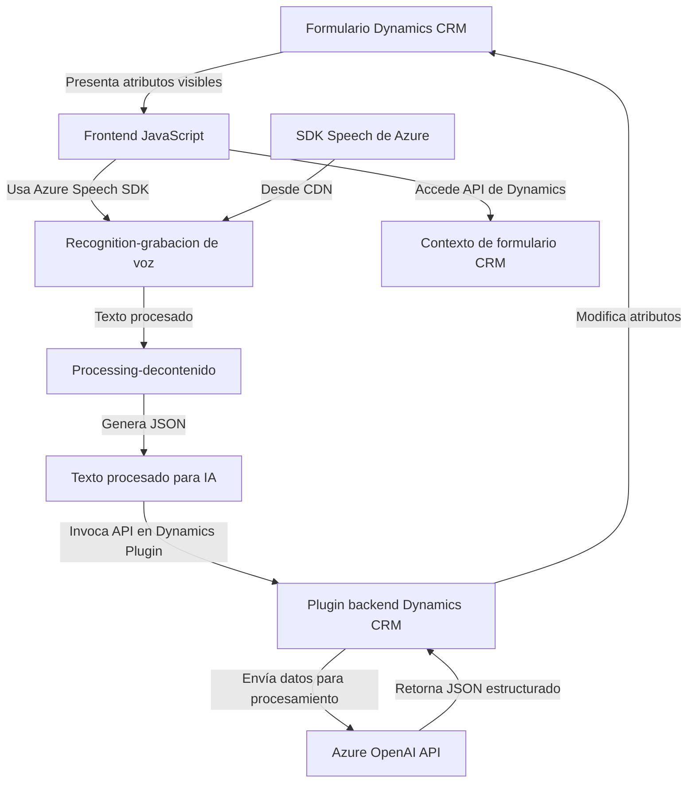

### Breve resumen técnico

El repositorio analiza tres módulos principales relacionados con el manejo de entradas de voz, la síntesis de texto en audio, y la transformación de texto con IA a través de la integración con servicios de **Azure**. La solución parece ser un sistema orientado a apoyar formularios y la interacción en **Microsoft Dynamics 365** mediante funcionalidades avanzadas de voz e IA.

---

### Descripción de arquitectura

La solución tiene una arquitectura híbrida con **patrones de integración** entre:
1. Frontend (JavaScript): Enfocado en interfaces de usuario y funcionalidad mediante voz.
2. Backend (C# Plugin): Extiende Microsoft Dynamics CRM para procesar datos estructurados con integración de servicios externos (Azure OpenAI).

La arquitectura refleja un **modelo de capas** con separación entre:
- Frontend: Procesa interacciones de formularios y voz.
- Backend: Se integra al sistema CRM y con Azure OpenAI para transformaciones de datos.

---

### Tecnologías usadas

1. **Frontend JS**:
   - Azure Speech SDK: para el reconocimiento y síntesis de voz.
   - Microsoft Dynamics 365 context API: para extraer y modificar datos de formularios.
   - Eventos asíncronos en browser.

2. **Backend C#**:
   - **Microsoft Dynamics CRM Plugin**: Extensión para interceptar eventos.
   - **Azure OpenAI**: Procesamiento avanzado de texto en JSON con integración REST.
   - Librerías .NET: `Microsoft.Xrm.Sdk`, `System.Net.Http`, y `System.Text.Json` para serialización y manejo de datos JSON.

---

### Dependencias o componentes externos

- **Servicios externos:**
  - Azure Speech SDK (frontend): Para reconocimiento y grabación de voz en tiempo real.
  - API de Azure OpenAI (backend): Para estructuración avanzada de texto en JSON.
  - Microsoft Dynamics 365 environment: Para operar con formularios y extender funcionalidad.

- **Librerías externas y CDNs**:
  - `https://aka.ms/csspeech/jsbrowserpackageraw`: Carga dinámica del SDK de Azure Speech.

---

### Diagrama **Mermaid**

Representa la interacción entre los componentes, tecnologías y servicios externos mencionados.

---

### Conclusión final

La solución implementada en el repositorio es un **sistema híbrido basado en capas** que une **tecnologías frontend y backend** para soportar funcionalidades avanzadas (reconocimiento de voz y respuestas IA) en formularios de Dynamics 365. La interacción es fluida entre:
1. **Frontend (JS)** para experiencias dinámicas y procesamiento inicial basado en eventos.
2. **Backend (C#)** que extiende funcionalidades del CRM con plugin de servicio externo (Azure OpenAI).