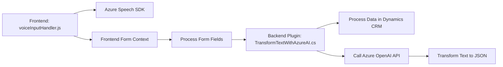

#### Breve resumen técnico
La solución contiene múltiples componentes distribuidos en archivos diferentes, cada uno dedicado a una funcionalidad específica. Combina frontend en JavaScript, un plugin en C# y la integración con servicios de Azure Speech SDK y Azure OpenAI GPT. Este enfoque permite reconocimiento de voz, síntesis de voz, procesamiento de formularios y transformación de texto mediante inteligencia artificial.

#### Descripción de arquitectura
La arquitectura de la solución está orientada a n-capas y utiliza un approach cliente-servidor tradicional. El frontend maneja la interacción del usuario y la comunicación con APIs, mientras que el backend ejecuta lógica más compleja a través de un plugin que procesa transformaciones utilizando Azure OpenAI. 

Se observa una alta modularidad tanto en frontend como en backend, siguiendo patrones como Modularización, Separación de Concerns y Plugin-based Design dentro de Dynamics CRM.

**Arquitectura:**
- **Frontend (JS)**: Actúa como interfaz cliente, manipulando formularios y comunicándose con servicios externos, como Azure Speech SDK y posiblemente el plugin backend.
- **Backend (`TransformTextWithAzureAI.cs`)**: Procesa en forma de plugin para Dynamics CRM y ejecuta transformaciones de datos con la API de Azure OpenAI GPT.
- **APIs externas**: Interacción con Azure APIs (Speech SDK y OpenAI GPT) para proporcionar funcionalidades relacionadas al reconocimiento/síntesis de voz y transformaciones con IA generativa.

#### Tecnologías usadas
1. **Frontend:** JavaScript, Azure Speech SDK, posiblemente integrado con un CRM (XRM/WebApi).
2. **Backend:** C#, Dynamics CRM SDK, Azure OpenAI API.
3. **Patrones:**
   - Modularización (frontend).
   - Plugin Architecture (backend de Dynamics CRM).
   - API-driven Design (interacción con Azure).
   - N-Capas: Separación clara entre frontend, servicios, y lógica de negocio (plugin CRM).

#### Dependencias o componentes externos
1. Azure Speech SDK (`https://aka.ms/csspeech/jsbrowserpackageraw`).
2. Dynamics CRM SDK para manipulación de datos en los formularios.
3. Azure OpenAI API para procesar texto y convertirlo en JSON.
4. HTTP Client para realizar solicitudes al servicio API.
5. NewtonSoft y System.Text.Json para manipulación JSON en el backend.

#### Diagram Mermaid válido para GitHub

#### Conclusión final
La solución implementa reconocimiento y síntesis de voz en un cliente web, mientras que transforma texto con IA en el backend para un CRM específico. Es altamente modular y extensible, aprovechando SDKs y APIs de Azure. Su arquitectura n-capas es adecuada para este tipo de aplicaciones, donde la separación de responsabilidades entre frontend, procesamiento de datos y comunicación con servicios externos es crucial para escalabilidad y mantenimiento.

Se recomiendan mejoras en el manejo de errores en los puntos de interacción con Azure y la protección de credenciales sensibles mediante vaults o sistemas de gestión de secretos. Además, la solución parece estar bien diseñada para su propósito y podría evolucionar hacia un enfoque enteramente basado en microservicios si se incluyera una separación más marcada del sistema CRM, convirtiéndose en una API independiente.