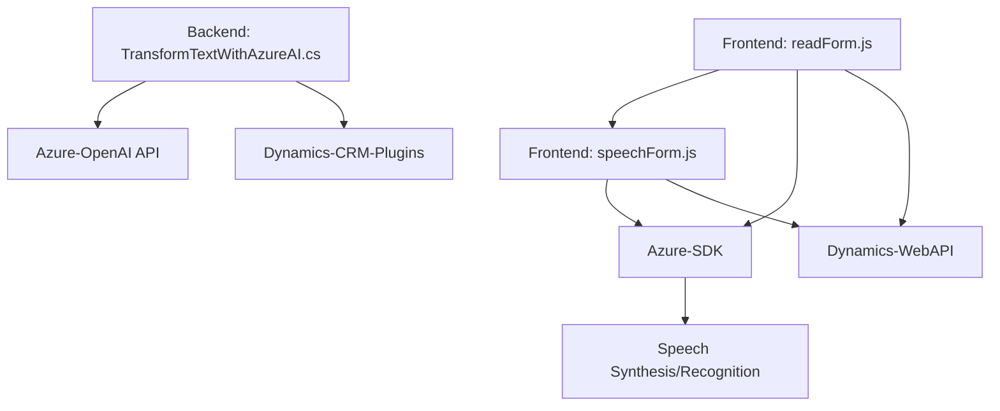

### Análisis Detallado del Repositorio

#### **1. Tipo de solución**
El repositorio está diseñado para integrar capacidades de **procesamiento y reconocimiento de voz**, así como transformación de texto mediante tecnologías avanzadas de IA en una plataforma CRM, específicamente Microsoft Dynamics 365. Los archivos proporcionados sugieren que esta solución incluye:

- **Backend Plugin**: El archivo `TransformTextWithAzureAI.cs` corresponde a un plugin para Dynamics CRM, asociado al modelado de datos y la ejecución de lógica personalizada.
- **Frontend Modules**: Los archivos `readForm.js` y `speechForm.js` implementan funcionalidades de lectura y reconocimiento de voz en formularios CRM mediante JavaScript. 

Conclusión: La solución abarca tanto **frontend (interacciones en formularios)** como **backend (lógica del plugin)**, con enfoque en **integración de servicios externos** para capacidades avanzadas mediante APIs.

---

#### **2. Tecnologías, frameworks y patrones**

##### **Tecnologías y frameworks:**
- **Front-End**:
  - **JavaScript ES6** para la lógica en el navegador.
  - **Azure Speech SDK**: Implementado dinámicamente desde un CDN para reconocimiento y síntesis de audio.
  - **Dynamics 365 SDK**: Interacciones con formularios y datos en un entorno CRM (ejemplo: `Xrm.WebApi`).
  
- **Back-End** (`C#`):
  - **Microsoft Dynamics SDK (`IPlugin`)**: Extensiones nativas para procesamiento de datos en el CRM.
  - **Azure OpenAI**: Servicio API para procesamiento de lenguaje natural mediante un modelo pre-entrenado como GPT-4.
  - **System.Net.Http**: Para interacción HTTP con servicios externos.
  - **System.Text.Json**: Manejo de JSON para serialización y deserialización.

##### **Patrones de diseño:**
1. **Modularización de funciones**: Tanto en los archivos frontend como en el backend, las funcionalidades están separadas en funciones específicas, facilitando la escalabilidad y el mantenimiento.
   
2. **Load-on-demand**:
   - **`ensureSpeechSDKLoaded`**: Patrón dinámico para cargar el SDK de Azure Speech solo cuando es necesario.

3. **Separation of Concerns**:
   - Los controles y la lógica de conversión, reconocimiento de voz y API externa se dividen en funciones y clases bien organizadas.

4. **Service-oriented Architecture (SOA)**: El sistema interactúa con APIs externas (Azure Speech SDK y Azure OpenAI) para encapsular y delegar funciones específicas.

5. **Plugin Architecture**: La extensión del backend utiliza el patrón de plugins para integrar lógica personalizada dentro de Dynamics CRM.

---

#### **3. Arquitectura**

Este repositorio sugiere una arquitectura **híbrida de n capas y SOA**, involucrando múltiples componentes:

1. **Frontend (Cliente)**:
   - Scripts que se ejecutan como parte del navegador en el entorno CRM.
   - Funciones para enviar y recibir datos, integradas con Azure SDK y las APIs de Dynamics.

2. **Backend (Servidor)**:
   - Plugin del backend que actúa como un microservicio para interactuar con Azure OpenAI y retornar datos procesados al CRM.
   - Se implementa una capa de integración con APIs externas.

3. **Integración basada en API**:
   - Uso de servicios REST (Azure OpenAI, Azure Speech SDK) como componentes externos centralizados para reconocimiento y síntesis de voz.

Conclusión: La solución plantea una arquitectura **modular** con componentes para cliente y backend que interactúan dinámicamente con APIs externas. No es un clásico monolito ni microservicio puro, ya que incluye elementos de ambos.

---

#### **4. Dependencias o componentes externos presentes**
1. **Azure Speech SDK**:
   - Reconocimiento y síntesis de voz.
   - Usado principalmente en el front-end (Javascript).

2. **Azure OpenAI GPT-4**:
   - Transformación avanzada de texto.
   - Accedido desde el backend `TransformTextWithAzureAI.cs`.

3. **Dynamics 365 Web/CRM API**:
   - Contexto de formulario y manipulación de datos.
   - Funciones como `Xrm.WebApi` y `IServiceProvider` se utilizan en ambos entornos.

4. **System.Text.Json**:
   - Serialización/deserialización para intercambio de datos con el servicio Azure OpenAI.

---

#### **5. Diagrama Mermaid**

---

#### **Conclusión**

La solución presentada en el repositorio combina módulos frontend y backend junto con servicios externos avanzados (**Azure Speech SDK y Azure OpenAI**). Esta integración sigue una arquitectura **n capas orientada a servicios (SOA)**, ofreciendo robustez, escalabilidad y una estructura modular.

Puntos fuertes:
- Manejo claro de responsabilidades entre front-end y back-end.
- Integración simplificada pero potente con APIs avanzadas (Azure Speech y OpenAI).

Mejoras potenciales:
- Refactorización del manejo de credenciales (por seguridad).
- Mayor robustez en la gestión de errores HTTP en las integraciones externas.

En general, el repositorio implementa una solución **moderna para CRM**, enfocada en extender sus capacidades a través de procesamiento de voz e IA avanzada.