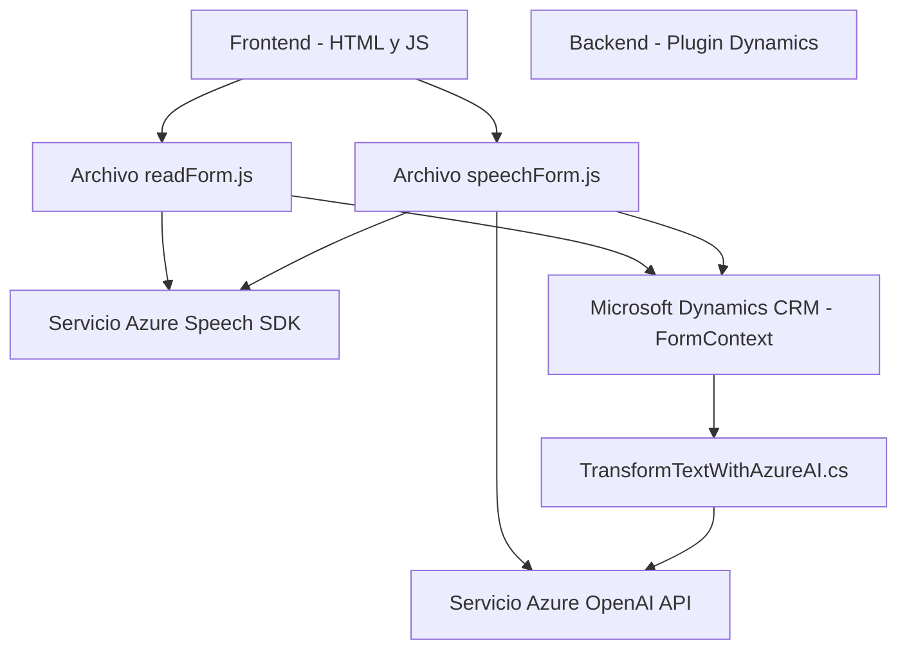

### Breve resumen técnico
El repositorio contiene una solución híbrida que mezcla funcionalidades de **frontend web** y **backend** para integrar dinámicamente Microsoft Dynamics CRM con servicios de inteligencia artificial y reconocimiento de voz ofrecidos por **Azure** (Azure Speech SDK y Azure OpenAI). Está formado por archivos para el frontend en JavaScript, que interactúan directamente con formularios web, y un plugin backend en C# que opera como componente dentro de Microsoft Dynamics.

---

### Descripción de la arquitectura
1. **Tipo de solución:** Es una **integración de servicios** entre una **web frontend** y un **backend plugin** con capas que comunican datos entre Dynamics CRM y servicios basados en la nube como Azure Speech SDK y Azure OpenAI.
   
2. **Arquitectura predominante:** Aunque sigue principios de **n capas** (frontend, plugin/backend y servicios externos), utiliza patrones de integración dinámica. El frontend implementa una lógica modular para interactuar directamente con formularios y realizar procesamiento en tiempo real. El backend actúa como un microcomponente que extiende el comportamiento del CRM.

---

### Tecnologías empleadas
1. **Frontend:**
   - **JavaScript**: Para lógica y manipulación de formularios.
   - **Azure Speech SDK**: Reconocimiento y síntesis de voz.
   - **Dynamics API**: Gestión sobre datos de los formularios del CRM.

2. **Backend:**
   - **C#/.NET**: Implementación del plugin dentro de Dynamics.
   - **Azure OpenAI API**: Enriquecimiento mediante modelos de Inteligencia Artificial.
   - **JSON/HTTP**: Comunicación entre servicios externos.

3. **General:**
   - **Patrones arquitectónicos**:
     - **Carga dinámica de SDKs**: El SDK de Azure Speech se carga solo cuando es necesario.
     - **Separación de responsabilidades**: Cada módulo tiene funciones específicas (procesamiento de voz y texto, actualización del formulario).

---

### Dependencias o componentes externos
- **SDKs**:
  - **Azure Speech SDK**: Realiza reconocimiento y síntesis de voz.
  - **Azure OpenAI API**: Procesa texto para transformaciones inteligentes.
- **Microsoft Dynamics Platform**:
  - Contextos como `executionContext` y `formContext` son esenciales para interactuar con los formularios de Dynamics.
- **Libraries in C#:**
  - **Newtonsoft.Json**: Para trabajar con JSON.
  - **System.Net.Http**: Para integraciones HTTP.
- **Frameworks**:
  - **Microsoft.Xrm.Sdk**: Proporciona soporte para plugins de Dynamics CRM.

---

### Diagrama Markdown válido para GitHub

---

### Conclusión final
Este repositorio define una solución flexible y extensible que integra herramientas avanzadas de **procesamiento de voz e inteligencia artificial** con un sistema de gestión empresarial como **Microsoft Dynamics CRM**. Combina una arquitectura **n capas** con patrones **modulares y dinámicos** en el frontend, mientras que el backend actúa como una extensión del CRM, consumiendo servicios de IA externos. La interacción entre estos sistemas refuerza la idea de conectividad en la nube para lograr una experiencia de usuario más rica y moderna.