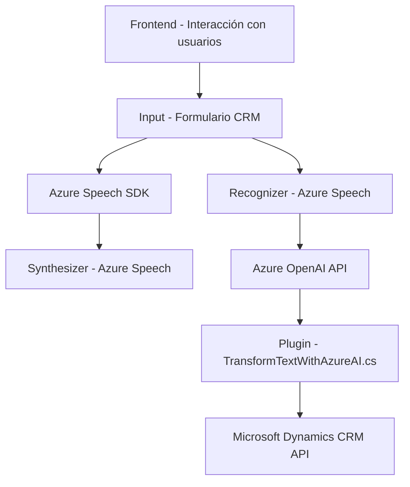

### Breve resumen técnico

El repositorio mostrado está diseñado para habilitar funcionalidades de integración con sistemas CRM de Microsoft Dynamics 365, utilizando capacidades de reconocimiento y síntesis de voz con Azure Speech SDK, además de una integración con la API de Azure OpenAI para transformación de texto. La solución añade accesibilidad y automatización avanzada mediante el uso de inteligencia artificial y servicios externos.

---

### Descripción de arquitectura

La arquitectura principal es modular, con componentes distribuidos según su propósito:
1. **Frontend:**
   - Proporciona lógica JavaScript para la interacción del usuario, mediante la manipulación de un formulario en Dynamics 365 y su integración con Azure Speech SDK.
   - Maneja reconocimiento y síntesis de voz.
2. **Backend:**
   - Incluye un plugin creado para Dynamics 365 (`TransformTextWithAzureAI.cs`), que realiza transformaciones de texto mediante la API Azure OpenAI.
3. **Patrones y diseño:**
   - **Patrón de n capas:** Separación entre las capas de presentación (interfaz), integración con el sistema (inicialización de SDK), y consumo de APIs externas.
   - **Eventos y asincronía:** Uso extensivo de callbacks y promesas en el frontend para manejar eventos como carga de SDK y reconocimiento/síntesis de voz.
   - **Plugin Architecture:** El código de backend sigue el estándar de implementación de plugins para Dynamics, con lógica encapsulada en clases y métodos específicos.

---

### Tecnologías usadas

1. **Lenguajes:**
   - **JavaScript:** Para las operaciones en el frontend.
   - **C#:** Para el desarrollo del plugin en Dynamics.
2. **Frameworks y APIs:**
   - **Azure Speech SDK:** Para reconocimiento y síntesis de voz en JavaScript.
   - **Microsoft Dynamics CRM API:** Contexto de formulario y operaciones del CRM.
   - **Azure OpenAI API:** Para transformación de texto en el backend.
3. **Dependencias externas:**
   - `System.Net.Http`, `Newtonsoft.Json`, y `System.Text.Json`, para manejo de solicitudes HTTP y estructuras JSON.
   - `Xrm.WebApi` (Dynamics API) y SDK de Azure.
4. **Diseño modular:**
   - Las funciones se distribuyen por archivos según su propósito específico, evitando redundancias y promoviendo modularidad.

---

### Diagrama Mermaid válido para GitHub Markdown

---

### Conclusión final

La solución presentada es un sistema eficiente y extensible que conecta la funcionalidad básica de formularios en Microsoft Dynamics CRM con capacidades avanzadas de inteligencia artificial y reconocimiento de voz. La arquitectura basada en n capas modulariza la lógica del frontend (JavaScript) y backend (C# con plugins Dynamics). Asimismo, el uso amplio de dependencias externas como Azure Speech SDK y Azure OpenAI API refuerza el enfoque hacia la accesibilidad y automatización. Esto lo hace apropiado para entornos empresariales con sistemas CRM que exigen interacción mejorada y procesamiento automatizado integrado con IA.