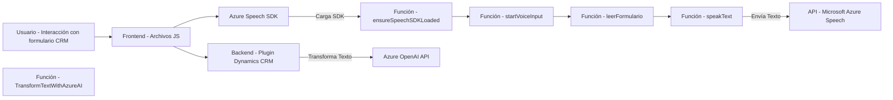

### Breve resumen técnico:

El repositorio presenta una solución compuesta que ofrece una integración entre Microsoft Dynamics CRM y las tecnologías de Azure, específicamente Azure Speech SDK y Azure OpenAI API. Las funcionalidades se dividen en dos partes principales: frontend y backend.

- El **frontend** incluye archivos JavaScript que interactúan con Dynamics CRM y Azure SDKs para procesar entradas de voz y transformar datos en voz sintetizada, así como reconocimiento de voz para ejecutar acciones en formularios.
- El **backend** implementa un plugin en C# para Dynamics CRM que transforma texto utilizando Azure OpenAI.

---

### Descripción de arquitectura:

1. **Tipo de solución**: Es un **proyecto híbrido** que mezcla:
   - Un frontend con interacciones directas entre usuarios y Dynamics CRM (con soporte para voz y comandos).
   - Un backend para lógica avanzada y extensibilidad mediante un plugin en Dynamics CRM.

2. **Arquitectura utilizada**:
   - **Frontend**: Enfoque modular, basado en funciones independientes para tareas específicas. Ofrece interacción con Dynamics CRM y Azure.
   - **Backend**: Arquitectura de Plugin Pattern, siguiendo principios de Single Responsibility en la implementación del plugin dentro de Dynamics CRM.
   - Generalmente, se puede considerar como una arquitectura n-capas en la que el frontend gestiona las interfaces de usuario y el backend maneja la lógica empresarial.

3. **Componentes claves:**
   - **Azure Speech SDK**: Procesa tanto reconocimiento de voz como síntesis de voz (text-to-speech y speech-to-text).
   - **Azure OpenAI API**: Transformación avanzada de texto mediante modelos GPT (como gpt-4o).
   - **Dynamics CRM**: Plataforma que gestiona y estructura la ejecución de formularios y el plugin en su contexto.

---

### Tecnologías usadas:

1. **Frontend**:
   - **JavaScript**: Para manejar funcionalidad de interacción con formularios y SDKs.
   - **Microsoft Azure Speech SDK**: Biblioteca dinámica para integrar speech-to-text y text-to-speech.
   - **Promise y métodos asíncronos**: Para manejar operaciones no bloqueantes.
   - **Dynamics CRM Xrm.WebApi.online**: Para integrar y manejar datos en formularios CRM.

2. **Backend**:
   - **C#:** Usado para la creación de plugins en la plataforma Dynamics CRM.
   - **Microsoft Dynamics SDK**: Framework para desarrollo de extensiones personalizadas en CRM.
   - **Azure OpenAI API**: Integra capacidades avanzadas de transformación de texto mediante modelos GPT.
   - **JSON Parsing Libraries:** Newtonsoft.Json.Linq y System.Text.Json para el manejo de datos estructurados.

---

### Diagrama Mermaid válido para GitHub Markdown:

---

### Conclusión final:

Esta solución tiene como objetivo extender las capacidades de CRM mediante servicios cognitivos en la nube. Utiliza una arquitectura n-capas que separa las responsabilidades entre un frontend modular y un backend basado en el Plugin Pattern. El uso de Azure Speech SDK para interacción hablada y Azure OpenAI para generación avanzada de texto muestra un enfoque modernizado que aprovecha servicios cloud de inteligencia artificial. Sin embargo, es fundamental que las credenciales y endpoints de servicios externos sean gestionados mediante mecanismos seguros para evitar riesgos de seguridad.