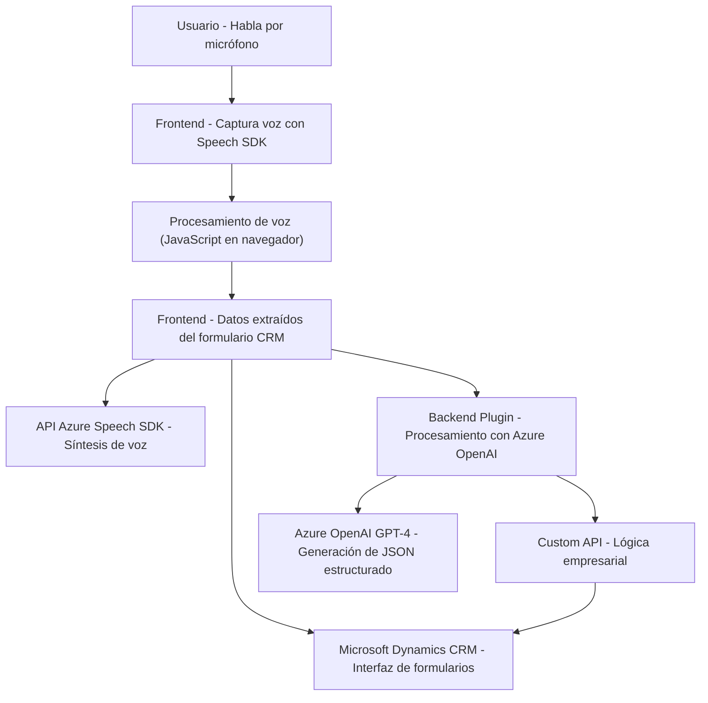

### Breve resumen técnico
El repositorio combina tres módulos fundamentales para ejecutar una solución de interacción por voz y procesamiento inteligente de texto. Los módulos integran API y servicios como Azure Speech SDK y Azure OpenAI junto con Microsoft Dynamics CRM. La solución incluye piezas claras para captura de voz del usuario, transformación de datos y actualización dinámica de formularios CRM.

### Descripción de arquitectura
La arquitectura es una combinación de **n-capas** y **modular**, separando cada tipo de funcionalidad en diferentes módulos:
1. **Frontend:** Scripts en JavaScript que manejan la interacción entre el usuario y el formulario visualizado en el navegador. Aquí se implementan la captura de voz y la síntesis de datos obtenidos del formulario en texto.
2. **Business Logic Layer:** Integración directa con formularios CRM, procesando datos transcritos y convirtiéndolos en entradas válidas para el sistema (buscando valores, actualizando atributos, etc.).
3. **Plugin en Backend:** Se utiliza el framework Microsoft Dynamics CRM (con el estándar `IPlugin`) para conectar el sistema con la inteligencia artificial de Azure a través de plugins extensibles. Esto añade capacidades avanzadas de procesamiento basado en IA utilizando Azure OpenAI.

### Tecnologías usadas
- **Frontend:**
  - JavaScript.
  - Azure Speech SDK (para síntesis de voz y reconocimiento).
  - Microsoft Dynamics API (para interacción con formularios CRM).
- **Backend:**
  - C# (implementación del plugin para Dynamics CRM).
  - Microsoft XRM SDK (contexto del CRM).
  - RESTful Integration con Azure OpenAI (GPT-4).
  - Newtonsoft.Json y System.Text.Json para operaciones con JSON.
  - HttpClient para comunicación con APIs externas.

### Dependencias o componentes externos presentes
1. **Azure Speech SDK:** Usado en frontend para síntesis y reconocimiento de voz.
2. **Azure OpenAI GPT-4:** Procesa texto según reglas definidas y genera JSON estructurado.
3. **Microsoft Dynamics CRM API:** Interacción directa con formularios.
4. **Newtonsoft.Json y System.Text.Json:** Manejo avanzado de JSON en backend.
5. **System.Net.Http:** Para realizar solicitudes hacia el endpoint de Azure OpenAI.

### Diagrama Mermaid

### Conclusión final
Se trata de una solución que integra Azure Speech SDK y OpenAI GPT-4 con Microsoft Dynamics CRM para ofrecer interacción por voz dinámica y procesamiento inteligente basado en AI. La arquitectura está diseñada para ser modular y extensible, con una clara separación entre frontend, capa de lógica empresarial y backend plugin. Es ideal para entornos empresariales que necesitan automatizar la entrada de datos en sistemas CRM mediante voz e inteligencia artificial.