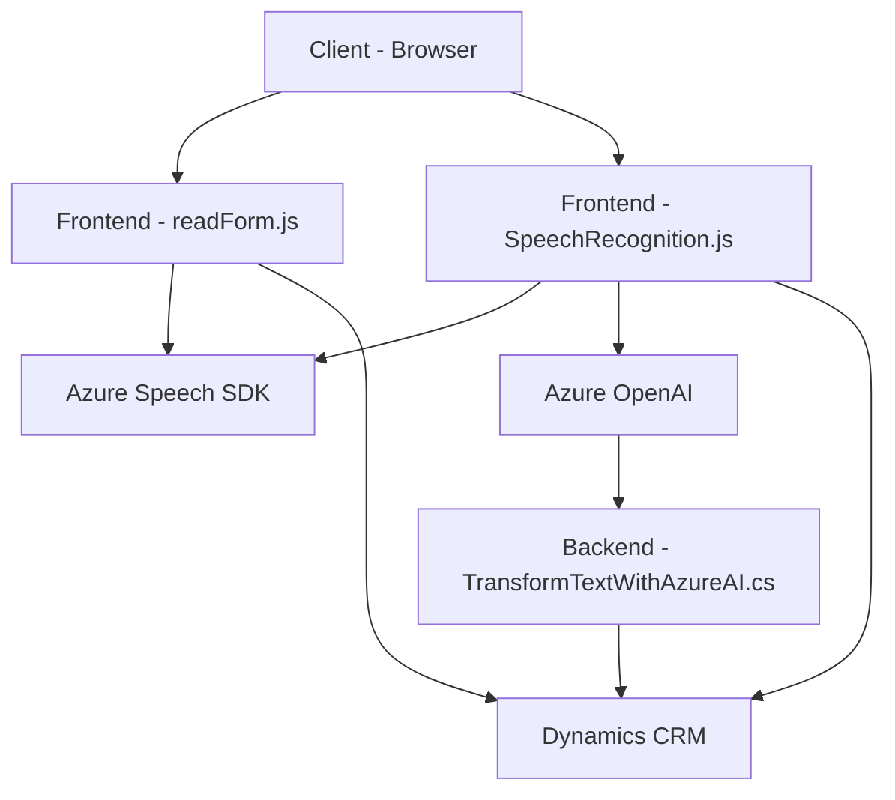

### Breve Resumen Técnico:
El repositorio contiene un conjunto de archivos que integran servicios de voz (síntesis y reconocimiento) mediante el **Azure Cognitive Services Speech SDK** y servicios de inteligencia artificial (transformación de texto) con **Azure OpenAI**. Los scripts JavaScript proporcionan lógica para interactuar con datos de formularios en Dynamics CRM, mientras que el archivo C# actúa como un plugin de Dynamics que implementa pruebas sobre transformación de texto basadas en AI.

---

### Descripción de Arquitectura:
La solución tiene características de arquitectura **distribuida de múltiples capas**:
1. **Capa de presentación (frontend)**: Lógica en `readForm.js` y `SpeechRecognition.js` para capturar datos de formularios, realizar síntesis y reconocimiento de voz, y aplicar resultados en un **formContext** de Dynamics CRM.
2. **Capa de lógica de negocio (backend)**: El plugin `TransformTextWithAzureAI.cs` actúa como intermediario entre Dynamics CRM y el servicio **Azure OpenAI**, procesando los datos transformados y devolviendo respuestas estructuradas en formato JSON.
3. **Capa de integración o servicios externos**: Interacción con APIs externas de Azure (Speech y OpenAI) utilizando el SDK de JavaScript y HTTP requests desde C#.

La solución aprovecha un enfoque modular en el frontend, descomponiendo la lógica en funciones independientes, mientras que el backend utiliza un patrón de **Servicios Orientados** y un **Plugin Pattern** estándar en Dynamics CRM.

---

### Tecnologías Usadas:
1. **Frontend:**
   - **JavaScript ES6+**: Como lenguaje base para implementar la lógica en los archivos frontend.
   - **Azure Speech SDK**: Para la síntesis y reconocimiento de voz, cargado dinámicamente desde la URL pública proporcionada por Azure.
   - **Dynamics CRM SDK**: APIs para interactuar con registros, campos y mapeos en forms de Dynamics CRM.

2. **Backend:**
   - **C# (.NET Framework)**: Implementación del plugin como parte de Dynamics CRM.
   - **Azure OpenAI**: Para servicios de transformación avanzada de texto mediante HTTP requests.
   - **Newtonsoft.Json**: Para manipulación de estructuras JSON complejas.
   - **Microsoft.Xrm.Sdk**: Para uso de los servicios de Dynamics CRM, como `IOrganizationService`.
   
3. **Integración:**
   - **Service-Oriented Communication**: Integración con servicios externos (Azure Speech SDK y Azure OpenAI).

---

### Diagrama Mermaid:

---

### Conclusión:
Esta solución representa una **integración en un ecosistema empresarial** donde se vinculan elementos de frontend interactuando con formularios dinámicos de Dynamics CRM, un backend que procesa las solicitudes mediante plugins y API externalizadas en Azure. Utiliza una **arquitectura distribuida de múltiples capas** con orientación hacia la modularidad y la integración. Se destacan patrones como el enfoque modular en frontend, event-driven execution, plugin pattern para Dynamics CRM, y comunicación orientada a servicios. 

Sin embargo, algunos detalles de seguridad, como el manejo de claves API en código fuente, podrían mejorarse con una gestión más adecuada de la configuración mediante Azure Key Vault o mecanismos similares.