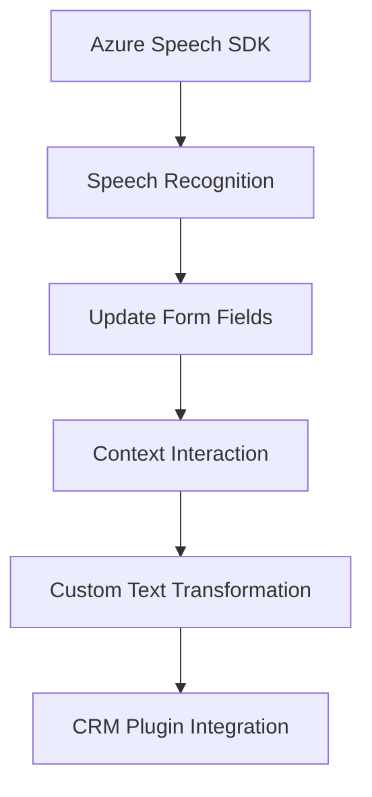

### Breve Resumen Técnico
El repositorio contiene tres componentes principales que interactúan para implementar funcionalidades avanzadas de reconocimiento de voz, síntesis, procesamiento de datos, y actualización dinámica de formularios en una aplicación basada en Microsoft Dynamics CRM. Los archivos combinan elementos de **web applications**, servicios externos como **Azure Speech SDK** y Azure OpenAI, y procesos personalizados en forma de plugins para Dynamics CRM.

---

### Descripción de Arquitectura
#### Tipo de solución:
La estructura del repositorio describe una solución híbrida:
1. **Frontend:** Manejo de reconocimiento de voz y síntesis basado en JavaScript.
2. **Backend:** Integración con Dynamics CRM mediante plugins y consumo de servicios REST como el de Azure OpenAI.

#### Tipo de arquitectura:
Aunque el código presenta fragmentos de diferentes áreas de la aplicación, la solución general es una arquitectura de **n-capas**:
- **Capa de presentación (Frontend):** JS interactuando en la interfaz web del formulario.
- **Capa lógica/servicios (Middleware):** Interacción directa con SDKs y APIs externas (Azure Speech y Azure OpenAI).
- **Capa de datos (Backend):** Manejo interno de Dynamics CRM mediante plugins con expansiones personalizadas.

Se utiliza una metodología de **event-driven programming**, especialmente en el frontend, mediante funciones que reaccionan a eventos de interacción del usuario y datos recibidos.

#### Patrones de diseño:
- **Builder:** Configuración dinámica para los servicios externos como el SDK de Azure.
- **Adapter:** Adaptación del Azure Speech SDK en las funciones frontend para sintetizar y reconocer voz.
- **MVC:** Fragmentación visible en las capas presentadas (modelo: datos del formulario, vista: UI del formulario web, controlador: función de integración entre API y operaciones).

---

### Tecnologías Usadas
1. **Frontend:**
   - **JavaScript**: Para funciones de reconocimiento y síntesis.
   - **Azure Speech SDK**: Para la conversión entre voz y texto, y para la síntesis de texto en voz.
   
2. **Backend:**
   - **C#/.NET Framework:** Plugins desarrollados para Dynamics CRM.
   - **Azure OpenAI GPT-4 API:** Para transformación avanzada del texto.

3. **Dependencias compartidas:**
   - **Microsoft Dynamics CRM SDK**: Integración con Dynamics para manipular formularios, atributos y valores.
   - **REST APIs:** Servicios externos para comunicación con Azure Speech y OpenAI.

---

### Diagrama Mermaid Válido para GitHub

---

### Conclusión Final
El repositorio implementa una solución integral que vincula la interacción de los usuarios mediante interfaces web con capacidades avanzadas de procesamiento de lenguaje natural y síntesis de voz. Utiliza el **Azure Speech SDK** para funciones frontend de reconocimiento y síntesis, y el **Azure OpenAI API** para transformar texto en el backend. La arquitectura sigue el modelo **n-capas**, con un diseño modular que separa la lógica frontend (interfaz del formulario), middleware (interacción con APIs y datos del sistema) y backend (procesamiento avanzado en plugins).

En términos de robustez y modularidad, la propuesta es altamente escalable gracias al uso de SDKs y APIs, aunque requiere configuraciones concretas en datos externos como claves de Azure y configuraciones específicas en Dynamics CRM.