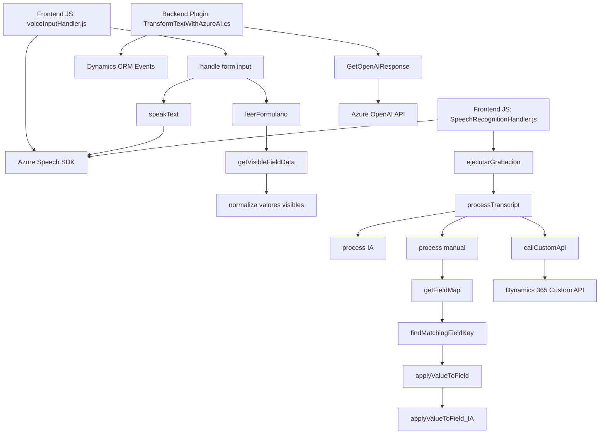

Breve resumen técnico:
El repositorio es parte de una solución híbrida centrada en la interacción con formularios dinámicos, enriquecida mediante reconocimiento de voz y transformación de texto con servicios de IA como Azure Speech SDK y Azure OpenAI. Incluye archivos en JavaScript para frontend y un plugin en C# para la integración en Dynamics CRM.

---

Descripción de arquitectura:
La solución implementa un enfoque de arquitectura modular y basada en capas, combinando características de arquitectura de plugins (en el caso de Dynamics CRM) con módulos funcionales que interactúan dinámicamente con APIs externas. Aunque se puede considerar una arquitectura de **n capas** (en base a la separación entre presentación, lógica, y conexión API), existen adaptaciones específicas con Azure OpenAI y Azure Speech SDK que la hace más funcional para entornos de microservicios SaaS como Dynamics 365.

---

Tecnologías usadas:
1. **Frontend (JS):** 
   - JavaScript (base funcional).
   - **Azure Speech SDK**: Para reconocimiento de voz y síntesis de texto.
   - Enfoque modular y dinámico mediante APIs y clases internas.
2. **Backend/Dynamics Plugin (C#):**
   - .NET (plugin desarrollado en C# para Dynamics CRM).
   - **Azure OpenAI API**: Comunicación directa con servicios de transformación de texto.
   - Dependencias como `Newtonsoft.Json`, `System.Net.Http` para solicitudes REST y manipulación de JSON.
3. **Integraciones:**
   - Dynamics 365 SDK (integración directa con `Xrm.WebApi` y `IPlugin` para tareas específicas).
   - Patrones de configuración dinámicos mediante carga de APIs externas.

---

Diagrama Mermaid:

---

Conclusión final:
Este repositorio isola funcionalidades dirigidas a mejorar la interacción entre usuarios y formularios dinámicos en plataformas empresariales como Dynamics CRM. Utiliza reconocimiento de voz (Azure Speech SDK) para entrada y síntesis; además integra procesamiento avanzado de texto mediante IA (Azure OpenAI). Los archivos JS implementan flujos frontend mediante coordinación directa con Dynamics 365, mientras que el plugin de C# aporta lógica específica para transformar datos entrantes estructurados. Aunque la arquitectura general puede considerarse **n capas**, se adapta a patrones de modularidad híbrida para soportar formularios ricos en funcionalidad dinámica y procesamiento con servicios externos (Azure).