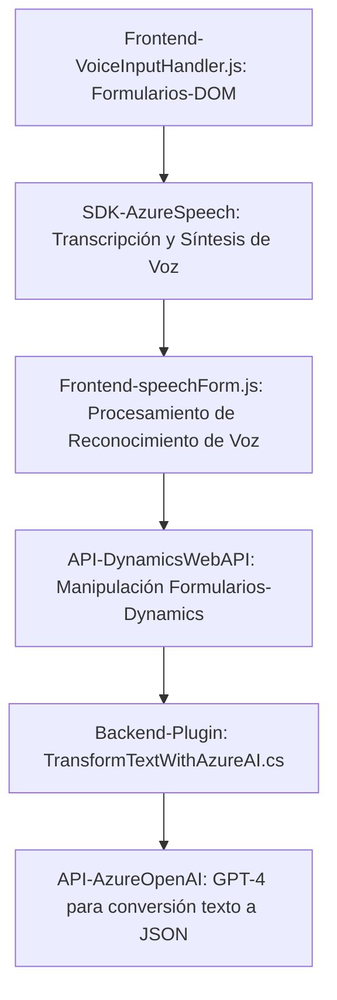

### Breve resumen técnico:
El repositorio incluye principalmente aplicaciones relacionadas con el reconocimiento y síntesis de voz, junto con un plugin para Microsoft Dynamics CRM que utiliza Azure OpenAI. Este sistema parece ser orientado a la interacción por voz y procesamiento de formularios en entornos empresariales. Se hace uso de diversas herramientas avanzadas como Azure Speech SDK, Microsoft Dynamics 365 y Azure OpenAI.

---

### Descripción de arquitectura:
- **Arquitectura General:**  
  La solución muestra características de una **arquitectura de n capas**, con separación entre la capa de presentación (arquivos JS para el frontend y interacción con formularios), la capa de negocio (procesamiento en Dynamics mediante el plugin de C#) y la capa de integración (uso de APIs de Azure Speech SDK y Azure OpenAI para síntesis y análisis).  
  Además, puede calificarse como una **arquitectura orientada a servicios (SOA)**, dado que depende de múltiples servicios externos (APIs como Azure Speech SDK y Azure OpenAI) y CRM para coordinar las operaciones.

---

### Tecnologías usadas:
1. **Frontend:**
   - **JavaScript**: Desarrollo de lógica relacionada con manejo de DOM, datos de formularios, reconocimiento y síntesis de voz.
   - **Azure Speech SDK**: Para reconocimiento de voz y síntesis de audio.
   - **Microsoft Dynamics 365 Web API**: Para llamadas interactuando con la base de datos del CRM.

2. **Backend (Plugin en C#):**
   - **Microsoft XRM SDK**: Extensión para integrar lógica personalizada en el ecosistema CRM de Dynamics.
   - **System.Net.Http**: Manejo de solicitudes HTTP hacia APIs externas.
   - **Azure OpenAI GPT (modelo GPT-4)**: Transformación de texto en JSON basado en reglas usando servicios de IA mediante API REST.
   
3. **JSON:**  
   Uso activo de la serialización y manipulación de datos JSON mediante `Json.NET` y `System.Text.Json`.

4. **Patrones de Diseño Adoptados:**
   - **Modularización:** Organización del código en funciones pequeñas para tareas específicas, mejorando la reusabilidad y mantenibilidad.  
   - **Facade Pattern:** Simplificación de procesos complejos para la interfaz de cliente (p. ej., funciones principales como `startVoiceInput`).  
   - **Integration Pattern:** Uso de servicios externos como Azure Speech SDK y Azure OpenAI dentro de las capas de presentación y lógica empresarial.

---

### Dependencias o componentes externos presentes:
1. **Azure Speech SDK**: Herramienta en el frontend para reconocimiento de voz y síntesis de texto en audio.  
2. **Microsoft Dynamics 365 Web API**: Para la interacción con los datos de formularios dentro del CRM y la ejecución de plugins.  
3. **Azure OpenAI GPT-4 Service**: Para el procesamiento de texto avanzado dentro del plugin de C#.  
4. **Newtonsoft.Json** y **System.Text.Json**: Usados para parseo y serialización/deserialización de datos en formato JSON.  
5. **System.Net.Http**: Para llamadas HTTP hacia endpoints de Azure OpenAI.  

---

### Diagrama **Mermaid**:

---

### Conclusión final:

La solución es una implementación completa de un sistema de interacción de voz que integra tecnologías emergentes como reconocimiento y síntesis de voz con procesamiento de IA. El frontend utiliza patrones básicos pero efectivos de modularización para aislar sus funciones según tareas específicas. La solución aprovecha Azure Speech SDK en el frontend y el servicio Azure OpenAI en el backend para mejorar la interacción con el usuario y procesar datos de manera avanzada. La arquitectura empleada es de **n capas**, lo que facilita su mantenimiento y escalabilidad, pero la fuerte dependencia de servicios externos puede requerir una gestión cuidadosa de conectividad y costo.