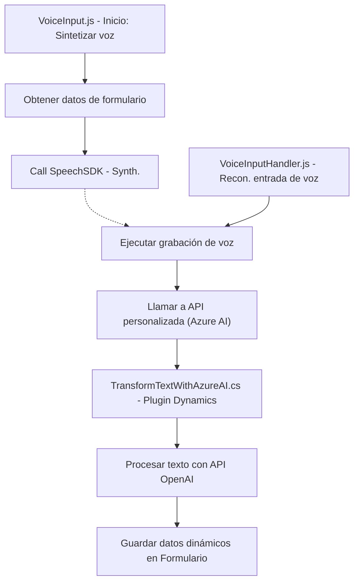

### Breve resumen técnico
El repositorio contiene tres componentes principales orientados al manejo e integración de tecnologías de voz, entrada de datos y procesamiento basado en inteligencia artificial con la plataforma **Microsoft Dynamics 365**. Utiliza **Azure Speech SDK** y **Azure OpenAI** para proporcionar funcionalidades avanzadas de síntesis de voz, reconocimiento de voz y estructuración de texto, a través de funciones y un plugin para Dynamics CRM.

---

### Descripción de arquitectura
La arquitectura es híbrida, combinando componentes distribuidos entre el frontend (JavaScript para procesamiento de formularios dinámicos y entrada/salida de voz) y el backend (plugin de C# para procesamiento avanzado en Dynamics CRM). El patrón principal es **arquitectura orientada a eventos**, donde las llamadas a APIs (Azure Speech, OpenAI) y las funciones del SDK de Dynamics se gestionan de manera modular y asincrónica para responder a operaciones específicas del flujo de trabajo.

- **Frontend (VoiceInput.js, VoiceInputHandler.js)**:
  - Implementa un conjunto de funciones organizadas para procesar la entrada de voz ligada a formularios dinámicos, manejando eventos asincrónicos y dependencias de servicios externos.
  
- **Backend (TransformTextWithAzureAI.cs)**:
  - Contiene un plugin desarrollado en C# con interacción directa con Dynamics CRM y las capacidades de procesamiento de texto estructurado mediante Azure OpenAI.

---

### Tecnologías usadas
1. **Microsoft Dynamics 365**:
   - Proporciona los datos y formularios para las interacciones del frontend.
   - Contexto dinámico (`formContext`) como conexión entre las operaciones y los datos internos.

2. **Azure Speech SDK**:
   - Reconocimiento de voz, síntesis de texto a voz.
   - Proporciona la integración con APIs de voz de Azure.

3. **Azure OpenAI API**:
   - Procesamiento y transformación avanzada de texto mediante GPT-4.
   - Generación de JSON estructurado para consumir en Dynamics CRM.

4. **JavaScript**:
   - Construcción de funciones basadas en eventos para interacción con formularios y procesamiento de entradas dinámicas.

5. **C#**:
   - Creación de un plugin para extensiones en Microsoft Dynamics 365.
   - Comunicación con servicios de Azure mediante llamadas HTTP.

6. **Patrones**:
   - **Modularización**: Las funciones y clases están delineadas por responsabilidades específicas.
   - **Integración con API**: Uso de servicios externos para funcionalidades como voz (Speech SDK) y generación de JSON (OpenAI).
   - **Orientación a eventos asincrónicos**: Funciones como `startVoiceInput` y `executeRecording` manejan flujos basados en interacción dinámica.
   - **Dependencias externas dinámicas**: Carga condicional de SDK y módulos según las necesidades del usuario.

---

### Diagrama Mermaid válido para GitHub

---

### Conclusión final
Este repositorio implementa una arquitectura híbrida con un flujo de trabajo orientado a eventos entre frontend y backend. El sistema utiliza ampliamente servicios externos (Azure Speech SDK y Azure OpenAI) y se integra directamente con Microsoft Dynamics CRM para proporcionar capacidades avanzadas de voz e inteligencia artificial. La estructura es modular y estratégica, permitiendo la extensión del sistema y fácil mantenimiento. Sin embargo, podrían mejorarse las prácticas de manejo de errores en todas las capas y garantizar una mayor optimización en ambientes productivos.