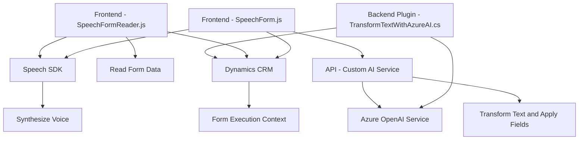

### Breve resumen técnico:
El repositorio presenta una solución que utiliza interacción por voz para la captura y síntesis de información en formularios dinámicos, con integración a servicios en la nube (Azure Speech SDK y OpenAI Service). Además, incluye un plugin que amplía la funcionalidad de Dynamics CRM para procesar texto mediante IA y transformarlo en datos estructurados.

---

### Descripción de arquitectura:
La arquitectura de la solución involucra componentes integrados con **Dynamics CRM/Power Apps** y utiliza un enfoque multinivel:
- **Frontend:** Lectura y síntesis de voz para procesar información de formularios en tiempo real.
- **Backend (Plugin Dynamics):** Comunicación con el servicio de Azure OpenAI para estructurar texto semánticamente.
- **Integración de servicios externos:** Uso de Azure Speech SDK para reconocimiento y síntesis de voz, y Azure OpenAI Service para IA.

Por tanto, la solución se basa en una **arquitectura de n capas** (frontend y plugin como capas), con integraciones a servicios externos en la nube. Utiliza patrones de desacoplamiento modular, especializando funciones por tareas.

---

### Tecnologías usadas:
1. **Frontend:**
   - **JavaScript:** Para la lógica de interacción con formularios y el manejo del SDK Azure Speech.
   - **Azure Speech SDK:** Para reconocimiento de voz y síntesis de texto.

2. **Backend (Dynamics Plugin):**
   - **C#:** Idioma para desarrollo de plugins en Dynamics CRM.
   - **Microsoft.Xrm.Sdk:** Framework para interacción con contextos de CRM/Power Apps.
   - **Azure OpenAI Service (GPT-4):** Para procesamiento semántico del texto de entrada.
   - **HttpClient:** Comunicación REST con API externas.

3. **Patrones aplicados:**
   - **Carga condicional (lazy loading):** SDK de Azure Speech cargado dinámicamente en el navegador.
   - **Service-Oriented Architecture (SOA):** Funcionalidad delegada a servicios externos e integración mediante APIs.
   - **Desacoplamiento por módulos:** Implementación de funciones separadas en frontend y backend para facilitar la reutilización e independencia.

---

### Diagrama **Mermaid** válido para GitHub:

---

### Conclusión final:
La solución integra tecnologías modernas para habilitar la interacción por voz en formularios dinámicos y procesamiento semántico mediante IA. Su arquitectura basada en **n capas** (frontend, backend y servicios externos) contribuye a la modularidad y facilidad de integración con sistemas como Dynamics CRM. El uso de Azure Speech SDK y OpenAI Service garantiza capacidades avanzadas, mientras que la división de responsabilidades en el código asegura una estructura clara y escalable.