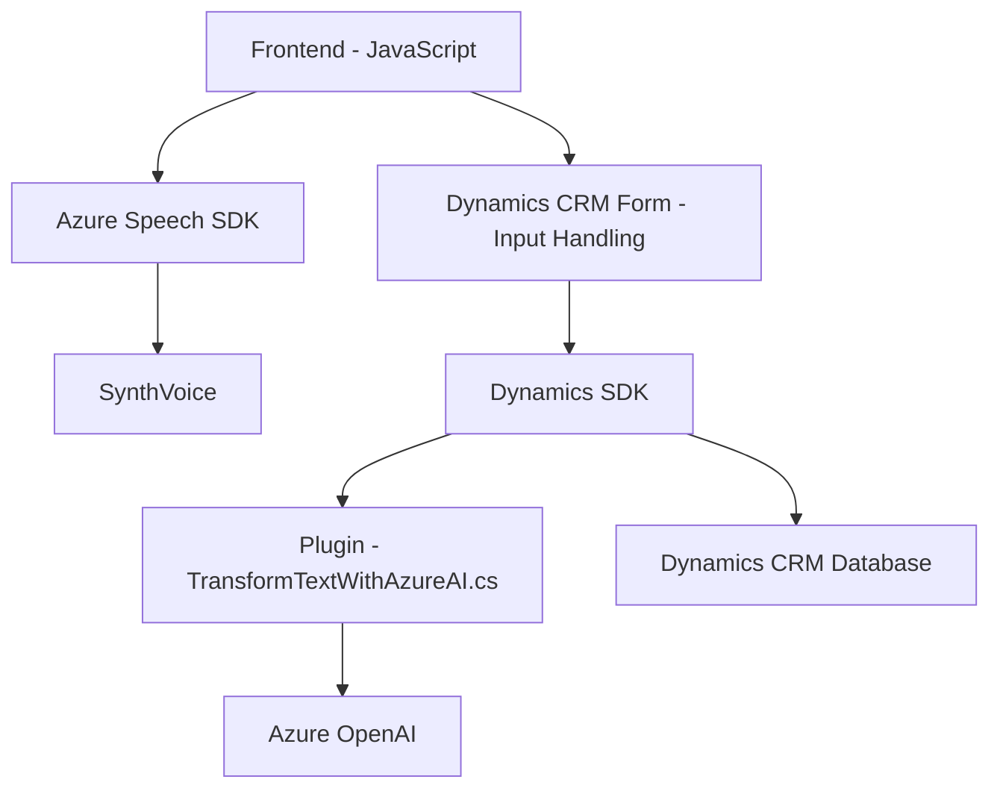

### Breve resumen técnico
El repositorio parece implementar una solución que integra **Azure Speech SDK**, **Azure OpenAI** y **Dynamics CRM** para gestionar formularios con voz y avanzar hacia la automatización mediante inteligencia artificial. Hay tres módulos principales:
1. **Frontend**: Archivos creados en JavaScript para procesar datos de formularios usando voz.
2. **Backend Plugin**: C# implementado como plugin en Dynamics CRM, empleando Azure OpenAI para estructurar datos mediante una API externa.
3. **Servicios externos**: Integraciones como Azure Speech SDK y OpenAI para síntesis de voz y procesamiento de texto.

### Descripción de arquitectura
La arquitectura general parece ser **n capas** pero con elementos distribuidos (microservicios ligeros), lo que le otorga ciertos aspectos de una **arquitectura hexagonal**. Las capas son:
- **Frontend**: Procesamiento de formulario y flujo del usuario (interacción por voz en tiempo real).
- **Middleware**: Lógica que conecta el frontend con servicios externos (Azure Speech SDK).
- **Backend**: Plugins de C# actuando como capas de extensión dentro de Dynamics CRM.
- **Servicios externos**: Sistemas como Azure OpenAI y Speech SDK que manejan la IA y la voz.

### Tecnologías usadas
1. **Lenguajes y plataformas**:
   - **Frontend**: JavaScript.
   - **Plugins backend**: C# para Dynamics CRM.
2. **Frameworks**:
   - Dynamics CRM SDK.
   - Azure Speech SDK.
   - Azure OpenAI (Chat GPT-4 para procesamiento avanzado).
3. **Patrones**:
   - **Facade**: Interacciones centralizadas del Frontend con Azure Speech SDK.
   - **Event-driven**: Activación de funcionalidades mediante eventos como grabación de voz o procesamiento de texto.
   - **Plugin Architecture**: Extensibilidad en Dynamics CRM mediante la interfaz `IPlugin`.
   - **Dependency Injection**: Clave y región de Azure se manejan explícitamente en las funciones.
   - **REST API**: Comunicación con OpenAI y servicios de búsqueda y datos de Dynamics CRM.

### Dependencias o componentes externos
- **Azure Speech SDK**: Para reconocimiento de voz y síntesis de texto a voz.
- **Azure OpenAI**: Procesamiento de texto para convertirlo en estructuras basadas en reglas.
- **Dynamics CRM SDK**: Plugins e integración mediante API como `Xrm.WebApi.online`.
- **APIs HTTP**:
  - `System.Net.Http` (C#).
  - `fetch` o similares (JavaScript).

---

### Diagrama Mermaid
El siguiente diagrama describe la interacción entre componentes:

---

### Conclusión final
La solución presentada implementa una arquitectura **n capas acoplada con microservicios**, con una clara separación entre frontend, middleware, backend y servicios externos. Las tecnologías utilizadas como **Azure Speech SDK** y **OpenAI** añaden capacidades avanzadas como síntesis de voz y procesamiento de datos utilizando IA.

Los archivos en el repositorio reflejan una alta cohesión dentro de la funcionalidad de cada módulo y uso claro de patrones de diseño como **event-driven**, **Facade** y **Dependency Injection**. Sin embargo, la dependencia en múltiples servicios externos significa que la solución requiere robustez frente a fallos y latencias en APIs.