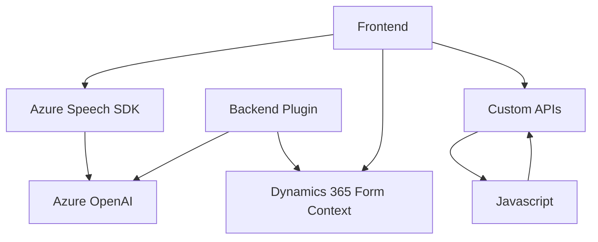

### Breve resumen técnico:
El repositorio define un conjunto de componentes que integran funcionalidades de procesamiento de formularios y voz en entornos Dynamics 365, utilizando Azure Speech SDK y Azure OpenAI. Los archivos presentan características propias de una solución híbrida orientada tanto a frontend como a backoffice mediante plugins y APIs.

---

### Descripción de arquitectura:
1. **Arquitectura General**:
   - **Tipo**: N capas (Frontend, Logística, Backend).
   - **Frontend**: Maneja la captura de voz y la síntesis con Azure Speech SDK, además de la integración con formularios de Dynamics 365 y APIs externas.
   - **Backend**: Implementa un plugin de Dynamics CRM (escrito en C#) que procesa texto con Azure OpenAI, transformándolo en objetos JSON estructurados según reglas predefinidas.

2. **Principales Capas**:
   - **Capa de presentación**: Archivos JS para interacciones con usuario mediante voz, basados en Azure Speech SDK.
   - **Capa de lógica empresarial**: La lógica incluye procesamiento de datos transcritos y reglas específicas para aplicar valores a formularios de Dynamics 365.
   - **Capa de servicios externos/API**: Azure OpenAI y APIs personalizadas para el procesamiento avanzado de texto.

---

### Tecnologías utilizadas:
1. **Frontend**:
   - **JavaScript**: Código modular para captura de voz, síntesis de texto y procesamiento de formularios.
   - **Azure Speech SDK**: Manejo de síntesis de texto a voz y transcripción de voz a texto.
   - **Dynamics 365 API**: Manipulación de datos/formularios dentro de Dynamics.
2. **Backend**:
   - **C#**: Lógica del Plugin de Dynamics CRM que interactúa con Azure OpenAI.
   - **Azure OpenAI**: Para interpretación avanzada de texto y generación de JSON.
   - **Microsoft.Xrm.Sdk**: Para ejecución dentro del entorno Dynamics CRM.
3. **Dependencias comunes**:
   - JSON serializers: Utilización de `Newtonsoft.Json` y `System.Text.Json`.
   - APIs REST: Peticiones hacia Azure OpenAI Service.

---

### Diagrama **Mermaid** válido para GitHub:

---

### Conclusión final:
El repositorio implementa una arquitectura de capas, donde el frontend maneja las interacciones con el usuario utilizando voz y formularios, y el backend encapsula las reglas de procesamiento con Dynamics CRM y Azure OpenAI. Esta integración facilita procesos de accesibilidad, manipulación de datos y enriquecimiento mediante tecnología de AWS y Microsoft. Por último, la modularidad del código permite su extensión hacia otros servicios y frameworks.