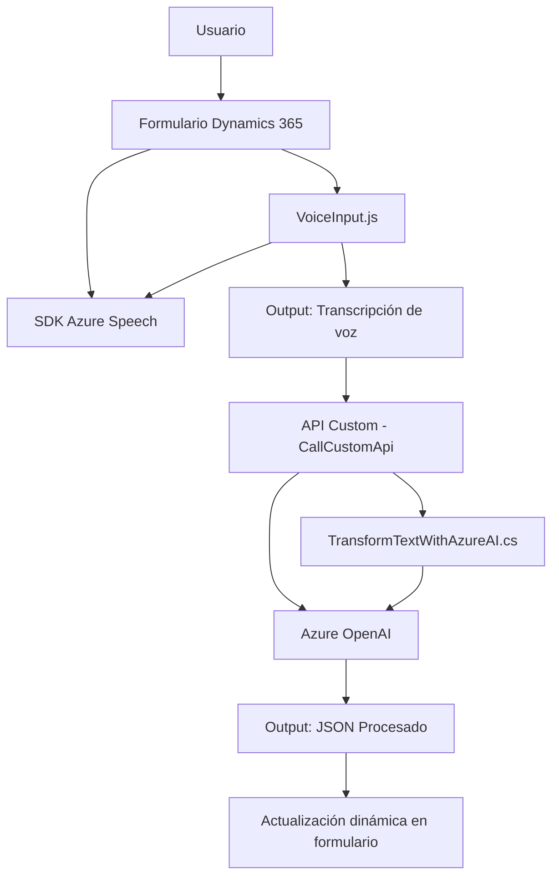

## Breve resumen técnico

El repositorio describe una solución que implementa capacidades de síntesis de voz y procesamiento de entrada hablada en formularios, además de un plugin para integrar Azure AI en la personalización de Dynamics CRM. La solución tiene componentes frontales (JavaScript) que capturan voz y la procesan mediante **Azure Speech SDK**, y una lógica de backend en C# que usa **Azure OpenAI**. Está orientada a integrarse en entornos empresariales como Dynamics 365.

---

## Descripción de arquitectura

1. **Tipo de solución**: La solución combina **frontend (JavaScript)** y **backend (C#)** para permitir interacción fluida basada en voz y procesamiento en aplicaciones empresariales, especialmente formularios de Dynamics 365.
2. **Arquitectura**:
    - **N capas**: El diseño sigue el tradicional patrón de separación por capas. 
      - Capa frontal para captura y presentación de datos.
      - Lógica en el backend (plugin) para procesamiento del texto transcrito.
      - Dependencia de servicios externos (Azure Speech SDK y Azure OpenAI).
3. **Elementos de diseño**:
   - **Event-driven architecture**: La lógica se activa mediante eventos sobre formularios en Dynamics 365.
   - **Modularidad**: Los métodos y clases están bien divididos en responsabilidades específicas.
   - **Integración externa**: Dependencias en Azure Speech SDK para procesamiento de voz y Azure OpenAI para transformación avanzada de texto.

---

## Tecnologías y frameworks utilizados

1. **Frontend (JavaScript)**:
   - **Azure Speech SDK**: Para captura y síntesis de voz.
   - Funciones JavaScript compatibles con Dynamics CRM.
   - **Xrm.WebApi.online.execute**: Para operaciones dinámicas con formularios en Dynamics.

2. **Backend (C# Plugin)**:
   - **Microsoft.Xrm.Sdk**: Para extender la funcionalidad de Dynamics CRM.
   - **System.Text.Json** y **Newtonsoft.Json.Linq**: Manejo de datos JSON.
   - **System.Net.Http**: Para comunicación con Azure OpenAI.

3. **Servicios externos**:
   - **Azure Speech SDK**: Procesamiento de entrada de voz.
   - **Azure OpenAI Service**: Procesador de texto con capacidades avanzadas basadas en IA.

---

## Diagrama Mermaid

El siguiente diagrama muestra las relaciones entre los componentes de la solución.

---

## Conclusión final

La solución es un ejemplo claro de una arquitectura **n capas** que utiliza un frontend para interacción basada en voz con Azure Speech SDK y un backend (plugin) que consume servicios de Azure OpenAI para transformar texto según reglas propias de Dynamics. La dependencia externa de Azure asegura capacidades avanzadas sin requerir procesamiento pesado local. La implementación utiliza buen manejo modular, alineándose con principios de separación de responsabilidades, y sigue patrones recomendados para integraciones en Dynamics 365.