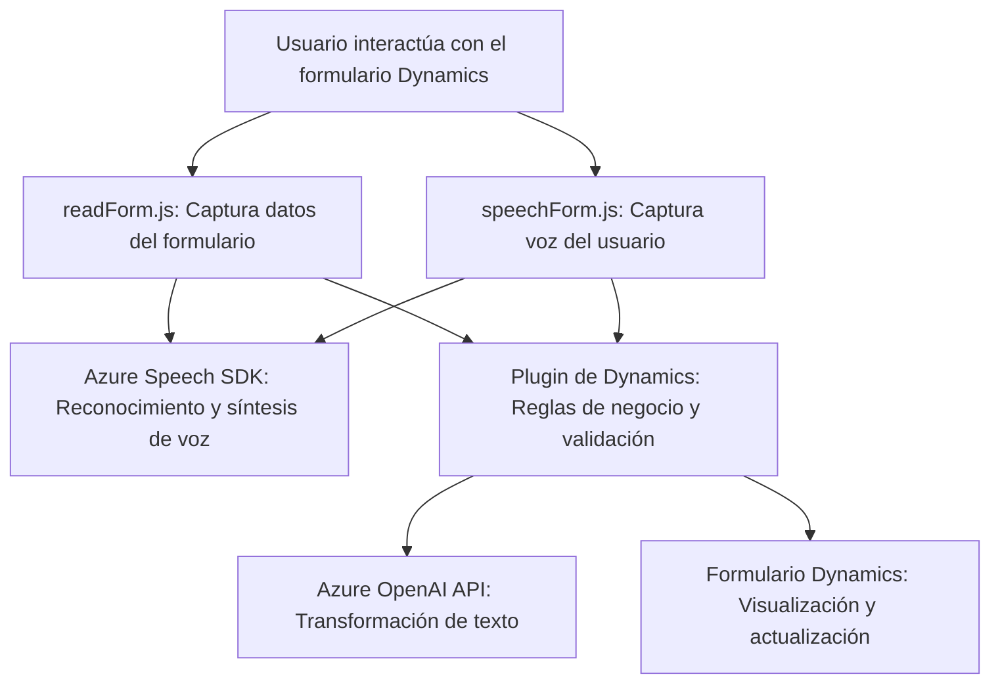

### Breve resumen técnico

La solución en el repositorio facilita la interacción de voz y texto con formularios en Dynamics 365, integrando servicios externos como **Azure Speech SDK** y **Azure OpenAI**. Está compuesta por módulos **JavaScript (frontend)** y un **plugin en C# para Dynamics CRM**, los cuales trabajan coordinadamente en la extracción, transformación y síntesis de texto.

---

### Descripción de arquitectura

La arquitectura está basada en **n capas**: 
1. **Capa de presentación:** Archivos JavaScript (`readForm.js` y `speechForm.js`) para capturar y procesar datos de voz desde el frontend.
2. **Capa de negocio:** Implementación de reglas específicas en el plugin (`TransformTextWithAzureAI.cs`) que transforma texto a través de **Azure OpenAI** según reglas predefinidas.
3. **Capa de integración externa:** Integra servicios como **Azure Speech SDK** para reconocimiento de voz y síntesis, y realiza llamadas a APIs personalizadas para preprocesamiento y lógica avanzada.

Además, se observan patrones como:
- **Service Integration:** Conexión con APIs externas para sintetizar voz y transformar texto.
- **Modularidad funcional:** Cada módulo y función tienen un propósito específico.
- Uso de **event-driven programming** y asincronía para optimizar procesos de carga y procesamiento.

---

### Tecnologías usadas

1. **Frontend:** 
   - **JavaScript.**
   - **Azure Speech SDK.**

2. **Backend:** 
   - **C# Dynamics SDK** (implementación de plugins).
   - **Azure OpenAI API** para procesamiento y transformación de texto.

3. **Integración:** 
   - APIs personalizadas para procesamiento avanzado de datos.
   - **Dynamics 365 CRM** como sistema central.

4. **Otros:** 
   - **Newtonsoft.Json.**
   - **HttpClient** para comunicación con Azure OpenAI API.

---

### Diagrama Mermaid

---

### Conclusión final

Esta solución implementa una interacción avanzada entre usuarios y formularios de **Dynamics 365**, usando reconocimiento de voz y procesamiento de texto con servicios externos como **Azure Speech SDK** y **Azure OpenAI API**. Está construida sobre una arquitectura **n capas**, con integración modular y event-driven programming, garantizando una alta cohesión y flexibilidad para futuras extensiones.