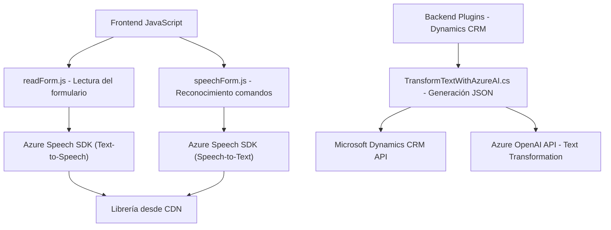

### Breve resumen técnico:
El proyecto comprende principalmente funcionalidades que integran servicios avanzados de Azure para accesibilidad, reconocimiento de voz, y procesamiento de texto en un sistema CRM (Microsoft Dynamics). Los módulos analizados se relacionan con el frontend y backend, trabajando directamente con Azure Speech SDK y Azure OpenAI para construir flujos accesibles, interactivos y con procesamiento avanzado.

---

### Descripción de arquitectura:
La solución tiene componentes que juntos conforman una arquitectura **multicapa con integración de servicios externos (cliente servidor)**. Se pueden identificar capas:
1. **Frontend JS** que gestiona la interacción directa del usuario.
2. **Backend Plugins** en C# para procesar solicitudes y ejecutar reglas comerciales basadas en Dynamics CRM.
3. **Servicios Externos**: Azure Speech SDK y Azure OpenAI manejan reconocimiento de voz y transformación inteligente de texto.

Los archivos demuestran patrones que incluyen:
- **Modularización**: Cada función y clase está diseñada para realizar tareas específicas.
- **Integración API**: Uso directo de APIs de Azure para procesamiento de voz y texto.
- **Patrones CRM Plugin**: Plugins basados en eventos para Dynamics CRM.
- **Client-Server Communication**: El backend consume servicios externos (REST APIs de Azure).

---

### Tecnologías usadas:
1. **Frontend**:
   - JavaScript (Framework ligero con capa de DOM).
   - Azure Speech SDK, cargado dinámicamente desde CDN.

2. **Backend**:
   - C# usando SDK de Dynamics CRM (`Microsoft.Xrm.Sdk`).
   - Azure OpenAI para transformación del texto.
   - Newtonsoft.Json para manejar JSON en C#.

3. **Servicios Externos**:
   - Azure Speech SDK.
   - Azure OpenAI API.
   - Dynamics CRM API y flujo web interactivo.

4. **Integración patrones**:
   - Arquitectura funcional en frontend/accesibilidad (`startVoiceInput()`).
   - Patrón Plugin tradicional en **TransformTextWithAzureAI**.

---

### Diagrama Mermaid válido para GitHub:

---

### Conclusión final:
La solución está bien diseñada para interactuar en tiempo real con usuarios utilizando tecnologías avanzadas de reconocimiento de voz y procesamiento de texto mediante servicios externos como Azure Speech SDK y Azure OpenAI. Dentro de Dynamics CRM, los plugins añaden una capa dinámica y basada en eventos. Este enfoque combina una **arquitectura multicapa** con integración API **client-server**, demostrando buenas prácticas como modularización y delegación de tareas. Es una solución optimizada para aplicaciones comerciales modernas con características de accesibilidad y dinámicas basadas en IA.