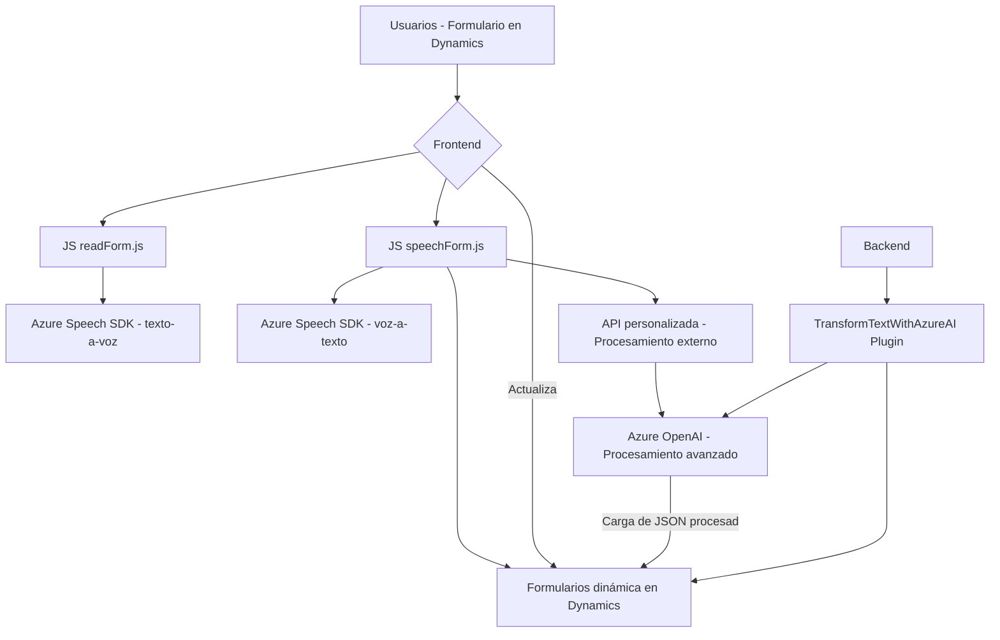

### Breve resumen técnico:
El repositorio contiene tres archivos principales que implementan una solución distribuida para la interacción entre usuarios y formularios de Dynamics CRM usando reconocimiento de voz, generación de texto sintetizado, y procesamiento de texto con Azure OpenAI. La solución se apoya en la integración con Azure Speech SDK, Dynamics CRM APIs y el servicio Azure OpenAI para ofrecer capacidades avanzadas de entrada y salida interactiva en una aplicación empresarial.

---

### Descripción de arquitectura:
La solución se basa en una arquitectura híbrida con componentes de **n capas** y **microservicios**, cada archivo desempeñando una función específica:

1. **Frontend/JavaScript (readForm.js, speechForm.js)**: Implementa lógica de procesamiento de datos del usuario y sintetización/reconocimiento de voz usando Azure Speech SDK. Estas capas controlan la interacción entre el usuario y los formularios de Dynamics.
   - Event-driven programming para gestionar eventos como el reconocimiento de voz.
   - Modular Design usando funciones separadas para la extracción y procesamiento de datos.

2. **Backend plugin (TransformTextWithAzureAI.cs)**: Se integra directamente en Dynamics CRM mediante el modelo de plugins. Este plugin actúa como un microservicio al interactuar directamente con el servicio externo de Azure OpenAI.
   - Encapsulación de la lógica de transformación y manejo de API.
   - Utiliza patrones de integración API y servicio orientado a interfaz en Dynamics CRM.

Arquitecturalmente, el sistema está dividido en client-side computing (frontend en JavaScript) y server-side functions (plugin en C#). La integración con servicios externos establece componentes distribuidos, lo que sugiere un enfoque hacia **arquitectura orientada a microservicios**, pero mantiene elementos organizativos de **arquitectura de n capas**, como la separación entre interfaces, lógica de aplicación y acceso a datos.

---

### Tecnologías usadas:
1. **Frontend**
   - **JavaScript**: Para la manipulación del DOM, procesamiento de datos de formularios y manejo de eventos.
   - **Azure Speech SDK**: Para síntesis de voz y reconocimiento a partir de audio en tiempo real.
   - **HTML**: Formato base de los formularios de entrada de datos en Dynamics CRM.

2. **Backend**
   - **C# (.NET)**: Desarrollo del plugin personalizado.
   - **Microsoft Dynamics SDK**: Para crear, modificar y obtener datos desde Dynamics CRM.
   - **Azure OpenAI**: Servicio externo integrable vía API para procesar texto y generar resultados estructurados como JSON.
   - **APIs de Dynamics CRM y XRM WebAPI**: Operaciones CRUD en los formularios empresariales.
   - **Newtonsoft.Json y System.Text.Json**: Para manejar estructuras JSON en las respuestas de la API de Azure OpenAI.

---

### Diagrama **Mermaid** válido para GitHub:

---

### Conclusión final:
La solución analizada es un sistema distribuido que combina interacción visual y de voz con procesamiento inteligente en la nube mediante integración con Azure Speech SDK, Dynamics CRM WebAPI y Azure OpenAI. Es una arquitectura híbrida que mezcla elementos de las arquitecturas de **n capas** y **microservicios**, enfocada en funcionalidades específicas para la productividad de empresas que usan sistemas CRM como Dynamics.

El código demuestra un potente uso del reconocimiento y síntesis de voz para manejar eficientemente formularios empresariales, con una coherente separación de responsabilidades y buen manejo de integración con servicios externos. Sin embargo, las dependencias y sensibilidades relacionadas con la gestión de datos y claves privadas indican áreas a reforzar en términos de seguridad y flexibilidad.