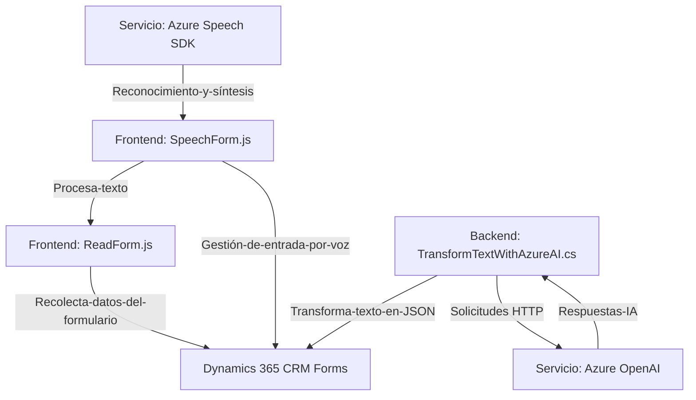

### Breve resumen técnico
La solución consiste en una integración de múltiples componentes, cuya finalidad es brindar capacidades avanzadas de entrada, procesamiento y transformación de datos en formularios dinámicos dentro de Microsoft Dynamics 365. Utiliza Azure Speech SDK para entrada por voz y síntesis de texto en voz, en conjunto con Azure OpenAI Service para la transformación de texto en JSON estructurado. El sistema emplea una arquitectura modular y desacoplada para facilitar el manejo de eventos y la interacción con servicios externos.

---

### Descripción de arquitectura
La solución tiene una arquitectura basada en **n capas**, con separación lógica entre los distintos componentes:
1. **Capa de presentación/Frontend**:
   - `readForm.js`: Recolecta datos del formulario y genera texto legible para su síntesis.
   - `speechForm.js`: Maneja la entrada por voz y gestiona el mapeo entre transcripciones y datos del formulario de Dynamics 365.
2. **Capa de integración**:
   - Uso de Azure Speech SDK para reconocimiento y síntesis de voz en tiempo real.
   - Interacción con Dynamics 365 API para la lectura y escritura en formularios.
3. **Capa de negocio/Backend**:
   - Código del Plugin (`TransformTextWithAzureAI.cs`), que emplea Azure OpenAI para transformar texto y enriquecer el flujo de datos.

La arquitectura está orientada hacia la integración de servicios externos (Azure Speech y OpenAI), utilizando patrones como event-driven y adaptación modular para facilitar la interacción con entornos dinámicos como Dynamics 365.

---

### Tecnologías usadas
1. **Frontend (JavaScript)**:
   - Uso de las APIs estándar de JavaScript para manipulación DOM y carga condicional de SDK.
   - **Azure Speech SDK**, cargado dinámicamente desde un paquete externo.
   - `Dynamics 365 Xrm.WebApi` para interacción con formularios dinámicos.
   - Modularidad para la entrada de voz, síntesis de texto y manipulación de formularios.

2. **Backend (C# Plugin)**:
   - **Microsoft Dynamics SDK**: Para la ejecución del Plugin en el entorno de Dynamics CRM.
   - **Azure OpenAI Service**: Integración con IA para enriquecimiento de datos procesados.
   - **Newtonsoft.Json** y **System.Text.Json**: Manejo eficiente de estructuras JSON y operaciones relacionadas.
   - **System.Net.Http**: Solicitudes HTTP al servicio de OpenAI.

3. **Arquitectura y patrones**:
   - **Event-Driven**: Los JavaScript se activan por eventos dentro de los formularios de Dynamics.
   - **Integration Pattern**: Fuerte integración con servicios en la nube como Azure Speech SDK y OpenAI.
   - **Bridge Pattern**: Traductor entre entrada de voz y valores actualizados en el formulario.

---

### Diagrama Mermaid

---

### Conclusión final
Este sistema es una solución modular orientada a servicios externos, diseñada específicamente para formularios dinámicos en Dynamics CRM. La combinación de tecnologías como **Azure Speech SDK** y **Azure OpenAI Service**, junto con los Plugins de Dynamics, brinda un entorno versátil para mejorar la experiencia de los usuarios al interactuar con datos, utilizando capacidades de voz e inteligencia artificial.

La arquitectura **n capas** asegura una separación de responsabilidades y facilita escalabilidad junto con posibilidades de evolución para integrar funcionalidades nuevas, como más servicios cloud o componentes de procesamiento con IA. El diseño es optimizado para ambientes corporativos integrados con servicios en la nube.