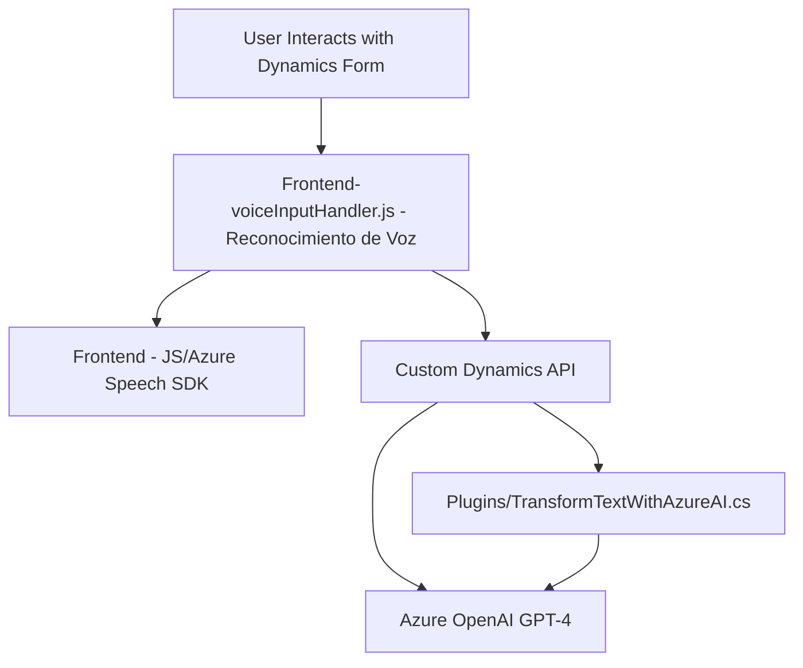

### Breve resumen técnico:
El repositorio describe la implementación de una solución que integra **reconocimiento de voz** y **procesamiento de texto con IA**. Esta solución interactúa con formularios dinámicos dentro de Microsoft Dynamics 365 mediante dos programas clave:
1. Un conjunto de archivos frontend en JavaScript para capacidades de reconocimiento de voz, síntesis de voz y manejo de datos de formularios en Dynamics 365.
2. Un plugin backend escrito en C#, que utiliza el servicio Azure OpenAI y modelos GPT-4 para transformar inputs en salidas estructuradas.

### Descripción de arquitectura:
La solución utiliza una arquitectura **basada en servicios** con enfoque de integración API y conexión directa con servicios externos (Azure Speech SDK y Azure OpenAI). Puede clasificarse como **una arquitectura N capas**:
- **Capa de presentación (frontend)**: Manejo y procesamiento de entrada de voz y datos formularios.
- **Capa de negocio (backend)**: Incluye un plugin que interactúa con Dynamics CRM y realiza inferencias AI.
- **Capa de integración**: Integración de servicios externos mediante APIs.
- **Capa de datos**: Manejo de datos estructurados en los formularios y en entornos Microsoft Dynamics CRM.

### Tecnologías, frameworks y patrones utilizados:
1. **Tecnologías frontend**:
   - **JavaScript** con Azure Speech SDK Web.  
   - Reconocimiento de voz y síntesis de texto.
   
2. **Tecnologías backend**:
   - **C# .NET Framework** (Dynamics CRM SDK).  
   - **Azure OpenAI Service (GPT-4)** para procesamiento y transformación de texto.  

3. **Patrones**:
   - **Adapter Pattern**: Mapas de atributos internos y etiquetas visibles en los campos de Dynamics CRM.
   - **Factory Pattern**: Métodos para conversión y asignación de valores a los campos del formulario.
   - **Dependency Injection** (en plugins con `IServiceProvider`).
   - **Microservicio Pattern**: Queda claro en la integración aislada del plugin con Azure OpenAI.

### Dependencias y componentes externos:
- **Para el frontend**:
  - Azure Speech SDK (`window.SpeechSDK`), importado dinámicamente vía CDN.
  - Custom API en Dynamics CRM para validar y transformar transcripciones en tiempo real.

- **Para el backend plugin**:
  - Microsoft Dynamics CRM SDK: Manejo del contexto del formulario y servicios CRM.
  - Azure OpenAI (GPT-4): Procesamiento inteligente de texto con normas JSON específicas.
  - `System.Net.Http`, `Newtonsoft.Json` y `System.Text.Json` para integrar y manejar APIs.

---

### Diagrama Mermaid:

### Conclusión final:
Este repositorio implementa una **extensión para Microsoft Dynamics 365**, fusionando capacidades de entrada y salida por voz con procesamiento avanzado de texto usando **Azure Speech SDK** y **Azure OpenAI GPT-4**. La solución está bien modularizada, consta de un frontend funcional para procesamiento en tiempo real y un backend que transforma datos utilizando normas específicas. La arquitectura está claramente basada en servicios, siguiendo los principios de **n capas** y patrones de diseño de buena separación de responsabilidades.